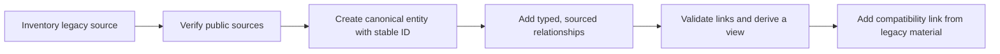

# Incremental migration plan

> **Status:** forward plan only. No record is moved, renamed, deleted, or reclassified by this document.

## Objective

Move from a location-oriented corpus to an entity-oriented knowledge system without losing evidence, breaking links, or pretending that historical reports are current facts. Migration proceeds **alongside** the existing repository: a canonical entity is created and verified first, then existing material gains an explicit compatibility link in a later scoped change.

## Constraints

- Preserve every existing path until an approved, source-backed successor and compatibility link exist.
- Migrate one factual unit at a time; do not bulk-copy prose into multiple entity records.
- Keep current v1 schemas authoritative for current records. Introduce vNext validation only with a versioned schema and deliberate mapping.
- Do not treat a discovery-list inclusion, publication history, country, reputation, or GitHub account as proof of current supervision, openings, mentorship, or accessibility.
- Keep private applicant material out of public entity migrations.
- No database, Neo4j, web application, or automatic mass extraction is in scope.

## Current structure → target structure

This map is a planning aid, not an instruction to move anything now. It makes the current role, future layer, reason, risk, priority, effort, and commit sequence explicit.

| Current structure | Target conceptual layer / retained physical namespace | Reason | Principal risk | Priority | Effort | Suggested commit sequence |
| --- | --- | --- | --- | --- | --- | --- |
| `docs/` and root governance files | Documentation / `docs/` | Keep architecture, policy, governance, and migration guidance together. | Breaking entry-point links or duplicating normative rules. | P0 | S | Add navigation/authority links only; no content move. |
| `schemas/`, `framework/`, `methodology/`, `scoring/`, `scripts/`, `templates/`, `assets/` | Platform / current physical namespaces | Give reusable contracts and tooling one conceptual home without disrupting CI or existing contracts. | Mixing immutable models with applied scorecards; breaking CI/conventional paths. | P2 | L | Document authority first; migrate one contract family at a time after compatibility shims exist. |
| `entities/` and factual portions of country/PI/group/ecosystem material | Knowledge / `entities/` plus legacy sources | Make public facts and provenance reusable without country-first duplication. | Copying stale claims or creating dual canonical authority. | P1 | XL | Seed references → pilot entities → relationships → legacy compatibility links. |
| `reports/`, `advisor-due-diligence/`, and analytical portions of dossiers | Analysis / current report and dossier namespaces | Separate dated conclusions and declared-profile interpretation from canonical facts. | Losing evidence windows or leaking personal conclusions into public knowledge. | P2 | L | Classify report roles → split one pilot dossier into fact/analysis links → preserve original. |
| `relationships/` | Workspace / `relationships/` | Keep applicant-owned process records separate from public research intelligence. | Exposing private interaction data or confusing RRM with graph relations. | P3 | M | Establish privacy/retention checks → move templates/records only after user-owned workflow review. |
| Current `views/` documentation and future derived indexes | Documentation now / Generated later, both retaining the `views/` namespace | Separate view definitions from reproducible output without pre-creating an empty generated-output tree. | Treating manually maintained lists as generated truth. | P2 | M | Define manifest/provenance → implement one deterministic view → add generated output marker. |
| `.github/` and root configuration | Root host/configuration exception | Preserve host-required paths and minimal repository configuration. | Breaking GitHub Actions or contributor tooling. | P0 | XS | Do not relocate; document the exception. |

Platform, knowledge, analysis, workspace, and generated are target **layers**, not new directory names in this PR. The authoritative physical namespace map remains in [Repository information architecture](REPOSITORY_INFORMATION_ARCHITECTURE.md#authoritative-physical-namespace-map). The architecture remains intentionally incremental: the first migration creates an entity and compatibility link, not a broad top-level rename.

## Effort scale

Effort estimates are relative implementation-and-review sizes, not promises about calendar time. Evidence discovery and source verification may dominate any estimate.

| Size | Meaning |
| --- | --- |
| XS | Documentation or inventory-only change; one narrowly scoped commit. |
| S | A small, self-contained contract or 1–3 well-sourced records. |
| M | A coherent entity cluster or view definition with validation and review. |
| L | A cross-entity network with relationship, source, and compatibility review. |
| XL | A sustained program of several independently reviewable migration PRs. |

## Priority roadmap

| Priority | Migration slice | Effort | Suggested commit slices | Exit condition |
| --- | --- | --- | --- | --- |
| P0 | Freeze architecture vocabulary and current-corpus inventory | XS–S | `docs: document repository information architecture`; `docs: inventory migration candidates` | Owners, IDs, boundaries, and legacy/source status are clear; no data moves. |
| P1 (after P0 acceptance) | Seed controlled reference entities | M | One commit for Countries/Organizations; one for Research Areas/Programming Languages | A small, sourced ID vocabulary exists for later links without creating duplicate profiles. |
| P1 | Create a pilot canonical entity cluster | M | `feat(entities): add <one ecosystem> core records`; `feat(entities): add sourced relations` | A PI/group/software/institution/ecosystem chain validates, links resolve, and all claims have evidence. |
| P1 | Add canonical records for evidence-backed anchor dossiers | L | One bounded cohort per commit, for example 2–5 PIs plus immediate groups/software | Existing anchor dossiers remain intact; each new entity has stable ID, sources, confidence, and a legacy compatibility link. |
| P1 | Map one software ecosystem end-to-end | L | Software record; maintainer/group/institution relations; funding/community relations | The documented chain is navigable without copied biographies or inferred roles. |
| P2 | Bridge the country pilot into entity records | L | Country/institution/departments; small PI/group cohort; compatibility links | Country files remain available but no longer need to be the only route to those entities. |
| P2 | Build deterministic view definitions and validation | M | `feat(views): define <view>`; `test: validate view membership and links` | Views resolve IDs, disclose freshness/unknowns, and hold no copied entity content. |
| P3 | Introduce personal filter and scoring artifacts | M | `feat(scoring): add versioned <model>`; `feat(views): add private-profile contract` | Personal and accessibility results are traceable, versioned, and isolated from public/global outputs. |
| P3 | Expand global coverage by reviewed cohort | XL | Repeated regional/ecosystem cohorts, each independently reviewable | Expansion preserves the same source, relationship, and uncertainty standards as the pilot. |

P0 architecture work is the only appropriate scope until a vNext metadata schema, validation path, and initial source inventory are accepted. After that acceptance gate, P1 begins with a small, auditable graph rather than hundreds of lightly checked records.

## Recommended migration unit

Each migration unit is a compact, independently reviewable chain:

The order matters. Do not point legacy readers at an empty entity, and do not create a view entry before its canonical entity has enough evidence to support the displayed metadata.

## Pilot sequence

The most valuable first pilot is a small software-ecosystem cluster because it exercises all target layers without requiring a country-first hierarchy.

1. **Reference concepts (P0, M).** Create a small set of sourced Country, Organization, Research Area, and Programming Language records needed by the pilot. Use stable IDs; do not infer references from names.
2. **Software and ecosystem (P1, M).** Create one canonical research-software record and one related Research Ecosystem record, including public license/governance/source evidence as available.
3. **People, groups, and hosts (P1, L).** Create only the immediate, evidence-backed maintainer/PI, group, university/organization, and project/funding records required to explain the documented chain.
4. **Relationships (P1, M).** Add typed connections with role, source, confidence, and date bounds where known. Omit ambiguous links.
5. **Legacy bridge (P1, S).** Add a clear link from the relevant existing dossier or global report to the canonical record in a separate reviewable change; do not move or delete the original.
6. **View check (P2, S).** Verify that software, ecosystem, research-area, university, country, and global views can traverse the same IDs without duplicating the records.

Existing evidence-backed material about Materials Project, AiiDA, Materials Cloud, NOMAD, AFLOW, ASE, pymatgen, Quantum ESPRESSO, and LAMMPS is a sensible discovery source for pilots, not pre-approved canonical data. Every proposed record still needs fresh source review.

## Commit discipline

Use small, semantic commits so a reviewer can identify exactly which facts, relationships, and contracts changed.

| Commit pattern | Contents | Must not be mixed with |
| --- | --- | --- |
| `docs: define <contract>` | Architecture, mapping, policy, or migration inventory | Entity facts or generated results. |
| `feat(entities): add <cohort>` | A bounded set of canonical records with evidence | Unrelated cleanup or score changes. |
| `feat(relationships): map <network>` | Typed relation assertions and evidence | New subjective rankings. |
| `feat(views): define <view>` | Query definition, display policy, validation fixture | Copied dossier text or private profile data. |
| `feat(scoring): add <model-version>` | Formula, dimensions, weights, and disclosure requirements | Retroactive changes to an immutable model. |
| `docs: link legacy <path> to canonical <id>` | Compatibility navigation after the entity is reviewed | File moves, deletes, or silent content rewrites. |

A migration PR may contain several of these commits when they form one coherent chain. It should not combine unrelated countries, ecosystems, or broad mechanical renames merely to increase volume.

## Compatibility and retirement policy

1. **Create first.** Create and validate the canonical entity before modifying any legacy page.
2. **Link, do not move.** Add a short compatibility link from the existing report, dossier, or country page only after the canonical record is reviewed.
3. **Preserve provenance.** Keep original citations, dates, interpretations, and limitations visible in their historical context. Do not silently replace a report's conclusion with new metadata.
4. **Avoid dual authority.** Once a canonical record owns a mutable public fact, update that record; legacy material should point to it for current status.
5. **Retire only with evidence.** A future removal or archive decision requires coverage verification, link checks, source preservation, and an explicit deprecation notice. It is out of scope for initial migration phases.

## Definition of done for each migration PR

- Every new canonical record has a stable ID, controlled entity type, lifecycle fields, source references, confidence, and an appropriate review date.
- Every relationship points to an existing ID, uses a valid predicate, and does not infer a role or inverse assertion without evidence.
- New facts are not duplicated into views, reports, or country pages.
- Volatile facts include a current source and review-by date; unknowns remain unknown.
- Legacy content remains reachable and unchanged except for explicit compatibility links approved in that PR.
- Markdown links, schema/metadata validation, relationship resolution, and view determinism pass their relevant checks.
- Personal/accessibility information is absent from global/public data and score outputs.

## Explicit non-goals for the first migration waves

- Backfilling every historical report into a graph.
- Producing a complete global ranking or declaring who is accepting students.
- Inferring mentorship, visas, funding access, language, or work style from country or institutional prestige.
- Replacing human editorial review with scraping or automatic entity creation.
- Removing the current country-oriented corpus before its evidence has a reviewed, canonical successor.

The migration remains successful if it is slow, evidence-bounded, and reversible. A small, correct network that supports several views is more valuable than a large duplicate index.
