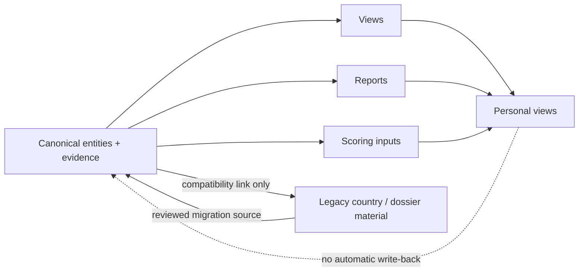

# Repository boundaries

> **Status:** architecture policy. It defines ownership and allowed data flow; it does not move, delete, or rewrite current content.

## Why boundaries matter

The repository can be both human-readable and automation-friendly only if every kind of information has a clear owner. Without boundaries, the same PI, lab, opening, or score will be copied into a country page, a report, a shortlist, and a software page until those copies drift apart.

The central boundary is simple: **canonical entities own public facts; every other layer links to or derives from them.**

## Namespace contracts

| Namespace | Allowed | Prohibited | Source of truth |
| --- | --- | --- | --- |
| `entities/` | One canonical Markdown record per first-class entity; normalized IDs; sourced metadata and relationship assertions | Applicant notes, duplicated entity bodies, generated rankings, private interaction records | The canonical record for its entity. |
| `views/` | Query definitions, facets, display rules, deterministic derived links, freshness policy | Copied dossiers, manually maintained entity facts, private constraints in public views | Canonical entities and their relationships. |
| `reports/` | Dated evidence syntheses, comparisons, clearly labeled interpretation, and source registers scoped to a report package | A second canonical entity profile, an unsourced current-status claim, or a reusable canonical source store | The report's bounded evidence window; factual corrections flow to entities. |
| `scoring/` | Versioned model contracts, formulas, weights, interpretation rules | A universal prestige ranking, silent model changes, applicant-private score data as a global field | The named immutable model version. |
| `relationships/` | Applicant-owned preparation, consent-aware contact work, notes, follow-up, and action records | Unconsented personal information as public entity evidence; automatic publication of private interactions | The record owner and the relationship-management policy. |
| `countries/` | Existing country-oriented evidence, pilot analyses, geographic context, compatibility links | The only canonical home of a globally reusable PI, group, software project, or ecosystem | Existing legacy material until linked canonical records exist. |
| `research-leaders/`, `principal-investigators/`, `research-groups/`, `ecosystems/` | Existing indexes, dossiers, and discovery material retained during transition | Silent conversion into vNext canonical records without IDs, sources, and schema validation | Their present files until future migration creates `entities/` records. |
| `docs/` | Architecture, governance, methodology, policies, decisions, and migration guidance | Live entity inventories, personal shortlists, or duplicated report findings | The relevant normative document. |
| `schemas/`, `framework/`, `methodology/`, `templates/`, `scripts/` | Validation shapes, reusable templates, definitions, and deterministic support tooling | Authoritative editorial conclusions or unsourced data import | The versioned contract or script specification. |

## Hard separation rules

### Canonical fact vs. derived presentation

- A public factual claim about a named PI, group, institution, software project, or ecosystem belongs in one canonical entity record with evidence.
- A view may display a name, selected metadata, canonical link, and derived inclusion reason. It may not duplicate the entity narrative, source table, or full relationship list.
- A report may interpret a finite evidence set, but it must identify its date and evidence boundary. It cannot become a competing canonical source for a mutable fact.
- Reverse relationships are derived from documented forward assertions or a declared build step. They are not copied by hand into every target record.

### Objective evidence vs. subjective decision support

- Evidence, confidence, source IDs, and review dates are public research metadata when responsibly sourced.
- Research fit, software fit, career ROI, and mentorship fit are applicant-specific interpretations and belong in a declared personal scoring profile.
- International mobility, language barriers, funding access, admissions eligibility, remote feasibility, and similar accessibility factors are personal, time-bound feasibility inputs.
- **Accessibility must never change a global/public score, ordering, or entity record.** It may affect only a personal shortlist, current-target view, or other explicitly personal output.

### Public research intelligence vs. applicant-owned operations

- `relationships/` can contain preparation and contact workflow because it is owned by the applicant, not by an entity profile.
- Private messages, personal finances, health, immigration status, and personal constraints must not be copied into canonical public entities, public reports, or global views.
- A private interaction may suggest a research task, but a public entity claim still requires independently citable public evidence and normal editorial review.

### Current vs. historical information

- Current roles, open positions, admissions status, funding calls, repository activity, and collaboration policies are volatile assertions. They need an evidence source, `checked_at`, and `review_by` date.
- Old reports and legacy country pages remain historically useful. They must not be silently read as proof of current availability.
- A missing field means unreviewed or unavailable evidence; it must not be converted into `no`, a low score, or an exclusion unless a query explicitly requires a known value.

## Permitted data flow

Allowed flow is read/derive/cite. A correction discovered in a report, a view, or a personal workflow must be reviewed and then applied to the canonical record with an appropriate source; it cannot be synchronized automatically.

## Boundary checks for pull requests

Before accepting a change, reviewers should ask:

1. Does this add a public fact about a real entity? If so, is there one canonical owner and a source?
2. Does a view only store query/presentation logic and links, rather than copied prose or manual facts?
3. Does a report label its evidence window, interpretation, confidence, and uncertainty?
4. Does the proposed score identify its model version, input evidence, coverage, and profile ownership where personal?
5. Could accessibility, private data, or a user preference leak into a global result? If yes, reject or separate it.
6. Is a volatile assertion dated and scheduled for review?
7. Does the change preserve existing source material rather than moving or renaming it prematurely?

## Escalation rule

When a proposed file fits more than one namespace, choose the narrowest owner:

- canonical public fact → `entities/`;
- reusable contract or policy → `docs/`, `schemas/`, `methodology/`, or `framework/`;
- query over existing facts → `views/`;
- bounded editorial conclusion → `reports/`;
- applicant-specific or private operational material → `relationships/` or a private personal view.

If none applies, do not add the information until its entity, evidence, and privacy boundary are defined. This is preferable to creating a convenient but ambiguous duplicate.

Related contracts: [Entity model](architecture/entity-model.md), [Relationships](architecture/relationships.md), [Views](../views/README.md), [Personalization](personalization.md), and [Scoring](scoring.md).
