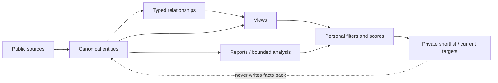
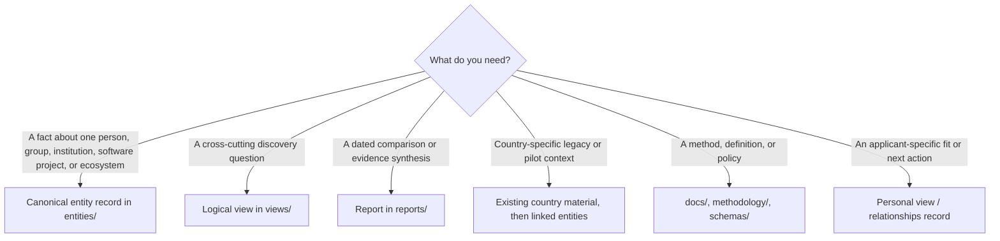
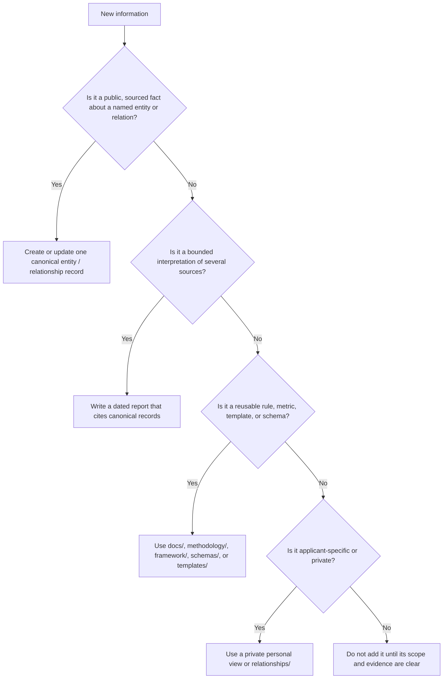

# Repository information architecture

> **Status:** target architecture. This document changes no records, paths, schemas, or generated output.

## Purpose

Research Landscape is organized around reusable research entities, not around countries or one-off reports. The information architecture answers three questions:

1. Where does a fact live once?
2. How can several readers discover the same fact from different starting points?
3. Which layer is allowed to turn evidence into an analysis, a score, or a personal action?

The answer is a Markdown-first, document-backed knowledge graph: canonical entity records own public facts; typed relationships connect them; views organize them; reports and personal tools consume them without becoming duplicate data stores.

## Target layers

| Layer | Primary question | Authoritative location | Produces | Must not contain |
| --- | --- | --- | --- | --- |
| Entry and orientation | Where should a reader start? | `README.md`, `docs/` | Navigation, scope, contributor guidance | Canonical copies of entity dossiers. |
| Canonical entities | What is this real-world thing? | `entities/` | One Markdown record per PI, group, university, software project, ecosystem, and other first-class entity | Personal preferences, derived view lists, or unsupported inverse relationships. |
| Evidence and provenance | Why is a claim defensible and how current is it? | Entity frontmatter/body, source registers, methodology | Citations, source IDs, confidence, evidence window, review date | Rankings inferred from missing evidence. |
| Relationship graph | How do entities connect? | Stable ID fields and typed relationship assertions in canonical records | Sourced, time-aware graph edges | Embedded copies of the target entity. |
| Views and navigation | Which existing entities match a question? | `views/` | Reproducible filters, facets, canonical links, derived indexes | Entity profiles, manually maintained facts, or user-private data. |
| Analysis and reports | What bounded conclusion follows from a stated evidence set? | `reports/` | Dated reports, comparisons, source-aware interpretation | A second canonical profile that must be kept in sync. |
| Decision and scoring | How does a declared profile weigh evidence? | `scoring/`, `docs/scoring.md`, `docs/personalization.md` | Versioned models, transparent personal results | Prestige rankings or accessibility-adjusted global results. |
| Geographic and legacy material | What location-oriented evidence already exists? | `countries/`, current topical directories | Historical/pilot context and migration sources | The permanent canonical home for a cross-cutting entity. |
| Applicant-owned operations | What should one applicant do next? | `relationships/`, private personal views | Contact preparation, tasks, private notes, time-bounded targets | Public entity facts derived only from private correspondence. |
| Contracts and automation | How is content shaped, checked, and generated? | `schemas/`, `framework/`, `methodology/`, `templates/`, `scripts/` | Schemas, templates, definitions, validators | Editorial truth, user decisions, or unreviewed generated assertions. |



The arrows are intentionally one-way for derivation. A personal shortlist, a generated view, or a report may reveal a correction that needs review, but it cannot silently overwrite the canonical record.

## Simplified future conceptual layers

The target deliberately reduces the long-term repository to six **conceptual** content layers. These are not proposed literal root-directory names: the authoritative physical namespace map remains the next section, so the existing vNext `entities/`, `views/`, and related contracts remain coherent. This is a design map only; no path is created, moved, or renamed in this change.

| Conceptual layer | Owns | Current material that belongs to the layer |
| --- | --- | --- |
| Documentation | Orientation, architecture, policy, governance, and migration guidance | `docs/`, root governance documents, and current view-definition documentation. |
| Platform | Schemas, reusable templates, metrics, scoring contracts, scripts, and shared assets | `schemas/`, `framework/`, `methodology/`, `scoring/`, `scripts/`, `templates/`, and `assets/`. |
| Knowledge | Canonical entities, controlled concepts, evidence/provenance, and retained legacy source material | `entities/` plus the factual portions of `countries/`, group/PI/ecosystem material. |
| Analysis | Dated reports, comparisons, discovery queues, report-scoped source registers, and applicant-specific evidence interpretations | `reports/`, `advisor-due-diligence/`, and dossier analysis portions. |
| Workspace | Applicant-owned interaction and decision-process records | `relationships/` and future private personal overlays. |
| Generated | Reproducible projections that can be regenerated from declared inputs | Future populated views and other deterministic outputs; no generated-output directory is needed until an actual generator exists. |

`.github/` remains a root-level host integration by convention, and root configuration files such as `.gitignore` remain root-level configuration. A repository-wide `archive/` is intentionally not proposed today: lifecycle archives stay inside the layer that owns the material, such as `workspace/relationships/archived/`.

This is deliberately less normalized than an ideal graph storage layout. Its purpose is to make a new contributor answer “what kind of artifact is this?” before choosing a directory. A reusable cross-report source record becomes canonical knowledge only when a future source/evidence entity contract exists; until then, `reports/global-sources.md` is report-package support, not a competing canonical source store.

## Authoritative physical namespace map

```text
README.md                         entry point and project scope
docs/                             architecture, policy, method, and migration rules
entities/                         canonical vNext entity homes
  principal-investigators/        one PI per canonical record
  research-groups/                one named group/center per canonical record
  universities/                   institutions and direct host context
  countries/                      geographic endpoints and filters
  research-areas/                 controlled topical concepts
  research-software/              software artifacts and projects
  ecosystems/                     evidence-bounded research networks
  conferences/ funding/ ...       other first-class entity types
views/                            query definitions and derived navigation surfaces
reports/                          dated, bounded analyses and comparisons
scoring/                          immutable scoring-model contracts
relationships/                   applicant-owned relationship-management material
countries/                        existing geographic corpus; retained during migration
schemas/ framework/ methodology/  contracts, templates, metric definitions, validation support
```

`entities/` is the destination for canonical facts in the target architecture. The current `countries/`, `research-leaders/`, `principal-investigators/`, `research-groups/`, and `ecosystems/` paths remain valid evidence and navigation sources until a later migration deliberately creates and links canonical equivalents.

## Authority rules

| Information kind | Owner | Consumers |
| --- | --- | --- |
| A PI's current public affiliation, research area, software connection, or source confidence | Canonical PI record and its sourced relationship assertion | Views, reports, score inputs, legacy pages. |
| A software license, maintainer relation, or language | Canonical software record and sourced relationship assertion | Ecosystem, research-area, university, and software views. |
| Country, city, institution, or department display name | The referenced canonical location/organization record | All related views; relationships use stable IDs. |
| A dated conclusion about several records | Report that cites the canonical records and sources | Readers and personal decision tools. |
| Formula, normalization, and default weights | Versioned scoring model | Score calculation and report disclosure. |
| One applicant's priorities, constraints, contact history, or next action | Private personal view or `relationships/` record | That applicant's decision process only. |

When two files appear to own the same factual claim, the canonical entity is the repair point. A report or legacy page should cite or link to it rather than evolve a competing copy.

## Reader navigation tree



The same entity may be reached from several branches, but its facts remain in one canonical record. For example, a software-connected PI can be discovered through an ecosystem, a research-area filter, a university view, or a country facet without receiving four different profiles.

## Contributor placement decision tree



## Common placements

| I have created… | It belongs in… | Why |
| --- | --- | --- |
| A new advisor report | `reports/` when it is a dated, bounded conclusion; a canonical PI fact goes to `entities/principal-investigators/` once migration permits. | Reports own interpretation; entities own reusable facts. |
| An ADR | `docs/adr/`. | ADRs record architectural decisions and their rationale. |
| A research-group analysis | `reports/` for the conclusion, with future public facts owned by `entities/research-groups/`. | Analysis must not become a competing group profile. |
| Personal meeting notes | The relevant `relationships/active/<record>/meeting-notes.md` workspace record. | Private interaction context never becomes public entity evidence. |
| A reusable metric definition | `methodology/metrics/`. | Metrics are platform/method contracts, not reports. |
| A generic report or entity starter | `templates/` or `framework/`, according to its declared artifact type and schema version. | Templates must not be completed analyses or personal work. |

## Architecture constraints

- No database, Neo4j deployment, or web application is introduced by this architecture.
- Markdown and YAML frontmatter remain the reviewable interchange format; Git history remains the audit trail.
- Countries are relationship endpoints and filters, not the primary organization of global research intelligence.
- Views never duplicate entities. They refer to canonical stable IDs and only derive membership, presentation, and ordering.
- Accessibility and private constraints affect only personal views; they must never affect a global or public ranking.
- Existing material is not moved or renamed in this architecture phase. Future migrations create a canonical record first, validate it, then add links deliberately.

For the target entity contract, see [Entity-oriented knowledge model](architecture/entity-model.md) and [Relationship model](architecture/relationships.md). For view and score boundaries, see [Views](../views/README.md), [Personalization](personalization.md), and [Scoring](scoring.md).

## Five-minute architecture check

| Question | Target answer | Where a contributor verifies it |
| --- | --- | --- |
| Can I understand the repository in five minutes? | Yes: start here, select the artifact type in the placement tree, then follow its layer contract. | This guide, [repository boundaries](REPOSITORY_BOUNDARIES.md), and the root README. |
| Can every top-level directory be explained in one sentence? | Yes for the target; current legacy exceptions are explicitly inventoried rather than hidden. | [Repository audit](../reports/repository-audit.md) and [responsibility matrix](../reports/responsibility-matrix.md). |
| Does each directory have one responsibility? | The target does. The current exceptions are temporary, named migration sources with a one-owner destination. | [Boundary analysis](../reports/boundary-analysis.md) and [migration plan](MIGRATION_PLAN.md). |
| Will the structure survive 5,000 more documents? | Yes if new public facts enter `knowledge/` once, derived outputs remain derived, and private work stays in `workspace/`. | The owner, data-flow, and view rules in this document. |

If a proposed file cannot pass this check, it needs a clearer scope or should not be added yet.
