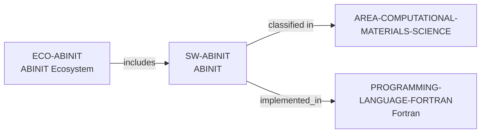

# ABINIT ecosystem vertical slice

> **Status:** reviewed Quality Gate 3 vertical slice, reviewed 2026-07-13.

## Purpose and scope

This slice adds the ABINIT software suite and its distinct ecosystem record,
reusing the existing controlled Fortran language and Computational Materials
Science area. It records only directly published DFT/materials scope, GPLv3
distribution, Fortran-based development, and public learning/contribution
surfaces.

## Canonical graph



## Evidence boundaries

| Dimension | Canonical evidence | Boundary |
| --- | --- | --- |
| Software scope | ABINIT describes a DFT package for electronic structure and material properties in molecules and periodic solids. | No performance, method-suitability, or complete-feature conclusion follows. |
| Openness | The project presentation and license page establish GNU GPL distribution, with the latter publishing GPLv3. | No blanket statement is made for every ancillary artifact or result. |
| Implementation | The developer overview identifies Fortran90 in the ABINIT developer environment. | It is a software implementation relation—not a skill, policy, or requirement claim. |
| Ecosystem surface | Public sources identify packages, tutorials, schools/workshops, discussion routes, Git/GitLab, and an open contribution philosophy. | These do not promise access, response, review, support, mentoring, or membership. |

## Deliberate omissions

- No developer, maintainer, reviewer, organization, consortium, funder,
  school, event, package, data table, utility, method, or user is separately
  modeled without dedicated evidence.
- No lifecycle state is inferred from public source-control pages.
- No claim is made about quality, performance, support, openings, mentoring,
  admissions, funding, or applicant fit.

## View reachability

The public software and ecosystem views expose ABINIT. The following AND query
returns the exact four-source-path ABINIT result:

```bash
python3 scripts/research_landscape.py discover-software \
  --area AREA-COMPUTATIONAL-MATERIALS-SCIENCE \
  --language PROGRAMMING-LANGUAGE-FORTRAN \
  --ecosystem ECO-ABINIT \
  --open-source yes
```

The output is evidence discovery, not a suitability, quality, or career
recommendation.

The review record is in [ABINIT ecosystem vertical slice
review](../reports/abinit-ecosystem-vertical-slice-review.md).
