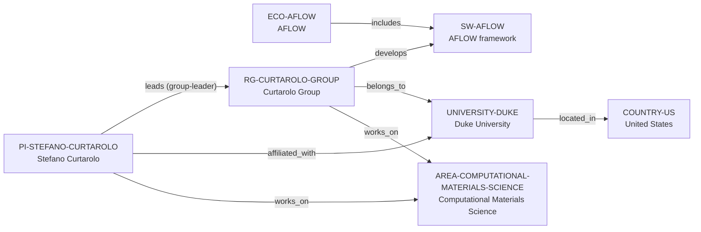

# AFLOW–Curtarolo vertical slice

> **Status:** fourth reviewed vNext vertical slice, reviewed 2026-07-12.

## Purpose and scope

This bounded Quality Gate 1 slice adds an AFLOW–Curtarolo–Duke chain from the
Anchor Cohort. It applies the established ecosystem/software distinction to a
case where the public AFLOW materials-data and web context must be distinguished
from both the distinct AFLOW software framework and its distributed contributor
network.

`ECO-AFLOW` represents the public web/data ecosystem and `SW-AFLOW` the
GPL-licensed framework. The Curtarolo Group is the documented Duke research
unit for group-level framework development; no Center, Department,
Organization, consortium roster, project, or funding record is created in this
pass.

## Canonical graph

| Role | Canonical record | Scope |
| --- | --- | --- |
| Research ecosystem | [`ECO-AFLOW`](../entities/ecosystems/aflow.md) | The public AFLOW web/data ecosystem. |
| Research software | [`SW-AFLOW`](../entities/research-software/aflow.md) | The distinct AFLOW framework and source repository. |
| Principal investigator | [`PI-STEFANO-CURTAROLO`](../entities/principal-investigators/stefano-curtarolo.md) | Public Duke affiliation, group leadership, and research-area links. |
| Research group | [`RG-CURTAROLO-GROUP`](../entities/research-groups/curtarolo-group.md) | The named Duke-hosted research group. |
| University | [`UNIVERSITY-DUKE`](../entities/universities/duke-university.md) | The direct University host. |
| Country | [`COUNTRY-US`](../entities/countries/united-states.md) | Existing geographic endpoint reused by Duke. |
| Research area | [`AREA-COMPUTATIONAL-MATERIALS-SCIENCE`](../entities/research-areas/computational-materials-science.md) | Existing controlled area reused by the PI and research unit. |

## Contract and evidence checks

| Rule | Result in this slice |
| --- | --- |
| Distinct identities | `ECO-AFLOW` captures the public web/data ecosystem; `SW-AFLOW` captures the licensed framework. Neither record is a substitute for the other. |
| Accepted direct-host rule | `RG-CURTAROLO-GROUP` has `institution_id: UNIVERSITY-DUKE`, no `organization_id`, and a matching `belongs_to` assertion. |
| Framework development | The group-to-framework edge is asserted only on `RG-CURTAROLO-GROUP`, whose public materials page identifies the group as the framework's development context. |
| Evidence before inference | Reviewed records and assertions use record-local `SRC-*` keys resolved in their Evidence tables. |
| One-way relationships | The graph has eight evidence-bearing assertions; no inverse assertion is hand-entered. |
| Legacy preservation | The existing AFLOW/Curtarolo reports and v1 anchor dossier retain their own scope and ID. |

## Deliberate omissions

- No direct PI-to-AFLOW development or maintenance claim is inferred from the
  group relationship.
- No claim is made that the Curtarolo Group or Duke exclusively owns, develops,
  hosts, or maintains AFLOW.
- No Center, AFLOW-consortium, Department, project, funding-programme,
  publication, or additional-person record is created without a separately
  reviewed scope.
- The group job page is used only for group identity, host, and research-scope
  evidence; this slice makes no claim about current vacancies or eligibility.
- No mentoring, admissions, language, funding, ranking, or applicant-fit claim
  is derived from the documented research relationships.

## View reachability

No generated view output is added. The documented graph supports these future
traversals without copying profiles into views:

| View family | Traversal |
| --- | --- |
| Global | Reviewed `ECO-AFLOW`, `SW-AFLOW`, `PI-STEFANO-CURTAROLO`, and `RG-CURTAROLO-GROUP` are available when a generator implements the declared query. |
| University and country | `RG-CURTAROLO-GROUP` → `UNIVERSITY-DUKE` → `COUNTRY-US`. |
| Research area | `PI-STEFANO-CURTAROLO` or `RG-CURTAROLO-GROUP` → `works_on` → `AREA-COMPUTATIONAL-MATERIALS-SCIENCE`. |
| Ecosystems and software | `ECO-AFLOW` → `includes` → `SW-AFLOW` ← `develops` ← `RG-CURTAROLO-GROUP`. |

The review and validation record is in
[AFLOW–Curtarolo vertical slice review](../reports/aflow-curtarolo-vertical-slice-review.md).
