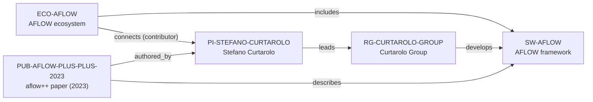

# AFLOW ecosystem-intelligence vertical slice

> **Status:** reviewed Quality Gate 3 vertical slice, reviewed 2026-07-12.

## Purpose and scope

This Quality Gate 3 slice deepens the existing AFLOW–Curtarolo–Duke canonical
cluster rather than creating a parallel profile. It adds the official 2023
`aflow++` publication and enriches the existing software and ecosystem records
with source-backed framework/API paths, a bounded contributor connection, and
installation/documentation context.

The graph remains intentionally sparse. Official sources support AFLOW's
high-throughput DFT and data-informatics purpose, its framework/web-ecosystem
distinction, public database queries, source/install/documentation paths, the
existing Curtarolo Group framework-development relation, and a documented
Stefano Curtarolo contributor listing. They do not establish an exhaustive
current maintainer, contributor, consortium, dependency, partner, or funding
graph.

## Canonical graph

## QG3 coverage matrix

| Required ecosystem dimension | Canonical evidence in this slice | Boundary |
| --- | --- | --- |
| Purpose and scientific scope | AFLOW documentation describes high-throughput materials discovery using DFT and data informatics. | This does not establish every scientific application, algorithm, or database property. |
| Architecture | The framework and web/data ecosystem remain separate canonical records; documentation exposes source, installation, generated-code documentation, data APIs, and application context. | Public interfaces and software components are not recast as an implementation, deployment, security, or dependency graph. |
| Programming language | The key technical paper identifies `aflow++` as a C++ framework. | No `programming_language_ids` value is added: the vNext Language entity contract is absent. |
| Maintainers and core contributors | Official framework documentation lists Stefano Curtarolo as a contributor, yielding a bounded `ECO-AFLOW → connects → PI-STEFANO-CURTAROLO` assertion. | The contributor listing is not an exhaustive current maintainer roster, maintenance assignment, reviewer role, or governance claim. |
| Institutions and groups | Existing Curtarolo Group, Duke, and PI records preserve independently reviewed group development and host relations. | The group relation is not exclusive development, and the ecosystem link does not duplicate it. |
| Key publication | `PUB-AFLOW-PLUS-PLUS-2023` has date, DOI, one reviewed author relation, and a direct framework description. | Other authors are not created simply to complete the paper’s author list. |
| Funding | No direct funding-programme relationship is added. | Publication acknowledgements and broad institutional context are insufficient to infer an AFLOW funding edge in the frozen graph. |
| GitHub and contribution workflow | `SW-AFLOW.repository_url` and official documentation expose public source, installation, and code-documentation paths. | Source availability does not promise support, review, acceptance, mentoring, or contributor status. |
| Community and user journey | Official AFLUX/REST documentation supports property-based data queries/downloads; AFLOW School content provides dated learning context. | No current user/community size, school schedule, access guarantee, or support commitment is inferred. |
| Career relevance | Canonical sources expose learning surfaces in DFT/data informatics, C++ source, installation, documentation, reproducible API queries, and the technical paper. | No employment, admission, contributor-status, supervision, or outcome recommendation is claimed. |
| Dependencies and related ecosystems | The established framework/ecosystem split and group development relation remain canonical; documentation names web/API surfaces in prose. | The frozen schema lacks safe dependency/community entity types and an ecosystem-to-ecosystem predicate, so no speculative edge is added. |

## Typical user journey

The documented upstream path is: obtain the AFLOW source and follow the
installation/code documentation; use the AFLOW web/data ecosystem or AFLUX/REST
interfaces to query and download property-filtered materials data; then consult
the technical literature for framework context. This is a source-backed product
journey, not an assertion of access, result quality, support, or acceptance of a
contribution.

## Deliberate omissions

- No Programming Language, Community, API endpoint, data product, dependency,
  database, workflow, package, external contributor, or detailed Maintainer node
  is created without the required canonical entity and relationship contract.
- No complete author list, maintainer roster, contributor list, code-review
  role, consortium roster, or employment claim is inferred from a paper,
  documentation page, or source repository.
- No funding programme, award amount, current funding, opening, mentoring,
  admissions, language, ranking, or applicant-fit conclusion is made.
- No generated view, recommendation, or manual ecosystem ranking is added.

## View reachability

No generated view output is added. The enriched canonical graph supports these
future traversals without copied facts:

| View family | Traversal |
| --- | --- |
| Research software | `SW-AFLOW` ← `includes` ← `ECO-AFLOW`; `PUB-AFLOW-PLUS-PLUS-2023` → `describes` → software. |
| Research ecosystem | `ECO-AFLOW` → `includes` → software; → `connects` → a documented contributor. |
| Research group and University | `RG-CURTAROLO-GROUP` → `develops` → software; → `belongs_to` → `UNIVERSITY-DUKE`. |
| Publication | `PUB-AFLOW-PLUS-PLUS-2023` → `authored_by` → `PI-STEFANO-CURTAROLO`; → `describes` → software. |
| Country and research area | Existing group-host and PI research-area routes remain derivable without duplicating records. |

The review and validation record is in [AFLOW ecosystem-intelligence vertical
slice review](../reports/aflow-ecosystem-intelligence-vertical-slice-review.md).
