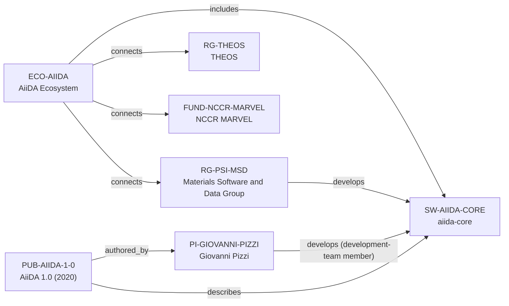

# AiiDA ecosystem-intelligence vertical slice

> **Status:** first reviewed Quality Gate 3 vertical slice, reviewed 2026-07-12.

## Purpose and scope

This Quality Gate 3 slice deepens the existing AiiDA canonical cluster instead
of creating a parallel profile. It adds the key AiiDA 1.0 publication, records
the public NCCR MARVEL support connection, and enriches the canonical AiiDA
software and ecosystem records with architecture, community, contribution,
user-journey, and career-relevant learning context.

The resulting graph remains intentionally sparse. Official sources support
PSI, THEOS, Giovanni Pizzi, NCCR MARVEL, `aiida-core`, Materials Cloud context,
and an AiiDA 1.0 publication. They do not justify an exhaustive maintainer,
contributor, dependency, partner, plugin, or career-outcome graph.

## Canonical graph

## QG3 coverage matrix

| Required ecosystem dimension | Canonical evidence in this slice | Boundary |
| --- | --- | --- |
| Purpose and scientific scope | `SW-AIIDA-CORE` documents computational-science workflow automation, management, sharing, reproducibility, and provenance. | Does not make AiiDA a universal solution for every discipline or workflow. |
| Architecture | Canonical software and ecosystem records describe the workflow engine, provenance graph, ORM/storage, plugins, compute interfaces, and sharing routes. | Detailed upstream implementation remains in upstream docs, not duplicated here. |
| Programming language | Sources identify AiiDA as Python infrastructure. | No `programming_language_ids` value is added: the vNext Language entity contract is still absent. |
| Maintainers and core contributors | The AiiDA Team page lists Pizzi in the development team, supporting a bounded `PI-GIOVANNI-PIZZI → develops → SW-AIIDA-CORE` role; the AiiDA 1.0 publication also records Pizzi as an author. | Neither source is converted into an exhaustive current maintainer roster, an individual maintenance assignment, review authority, or contribution-frequency claim. |
| Institutions and groups | PSI/MSD and THEOS are existing separate canonical records with evidence-bearing ecosystem links. | Bosch and other partners remain unmodeled until their own identity and relationship review. |
| Key publication | `PUB-AIIDA-1-0` has DOI, date, software description, and one reviewed author relation. | Other authors are not created merely to populate the record. |
| Funding | `ECO-AIIDA → connects → FUND-NCCR-MARVEL` is supported by AiiDA acknowledgements. | It is not proof of exclusive or current funding. |
| GitHub and contribution workflow | `SW-AIIDA-CORE.repository_url` and its evidence point to the project-owned repository, issues, pull requests, discussions, and Contributor wiki. | Public contribution channels do not promise review, acceptance, or mentoring. |
| Community and user journey | Official ecosystem, registry, tutorials, and sharing documentation support the core → plugins → compute → workflows → sharing journey. | Plugin counts, individual components, and community roles are dynamic and separately reviewable. |
| Career relevance | Canonical records expose workflow, provenance, plugin, source-contribution, tutorial, and HPC-facing learning surfaces. | No employment, admission, contributor-status, or outcome recommendation is claimed. |
| Dependencies and related ecosystems | Materials Cloud is linked as a cross-reference in canonical AiiDA context. | The frozen schema lacks safe canonical dependency/community entity types and an ecosystem-to-ecosystem predicate; no unsupported graph edge is added. |

## Typical user journey

The documented upstream path is: install `aiida-core`; add plugins for the
needed codes; connect local or remote compute resources; execute calculations
and workflows while retaining provenance; then share data and provenance through
Materials Cloud or use AiiDAlab for browser-facing workflows. This is a source-
backed system journey, not an assertion about every user, plugin, or host.

## Deliberate omissions

- No additional Programming Language, Community, dependency, Bosch, AiiDAlab,
  Quantum Mobile, plugin, scheduler, external contributor, or detailed
  Maintainer node is created without the required canonical entity and
  relationship contract. The later ADR 0007 implementation separately adds
  the sourced `aiida-core --implemented_in--> Python` assertion.
- No complete author list, current AiiDA development-team roster, contributor
  list, code-review role, or employment claim is inferred from a publication or
  repository.
- No funding amount, current award, opening, mentoring, admissions, language,
  ranking, or applicant-fit conclusion is made.
- No generated view, recommendation, or manual ecosystem ranking is added.

## View reachability

No generated view output is added. The enriched canonical graph supports these
future traversals without copied facts:

| View family | Traversal |
| --- | --- |
| Research software | `SW-AIIDA-CORE` ← `develops` ← `RG-PSI-MSD` and `PI-GIOVANNI-PIZZI` (development-team member); `PUB-AIIDA-1-0` → `describes` → software. |
| Research ecosystem | `ECO-AIIDA` → `includes` → software; → `connects` → groups, PI, organization, and funding programme. |
| Funding | `ECO-AIIDA` → `connects` → `FUND-NCCR-MARVEL` → funder organization. |
| Publication | `PUB-AIIDA-1-0` → `authored_by` → `PI-GIOVANNI-PIZZI`; → `describes` → `SW-AIIDA-CORE`. |
| Country and University | Existing group-host routes remain derivable through PSI and THEOS without duplicating their records. |

The review and validation record is in
[AiiDA ecosystem-intelligence vertical slice review](../reports/aiida-ecosystem-intelligence-vertical-slice-review.md).
