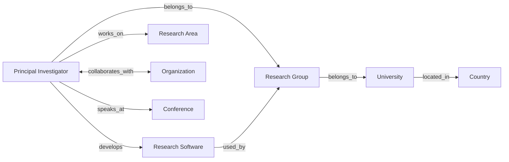
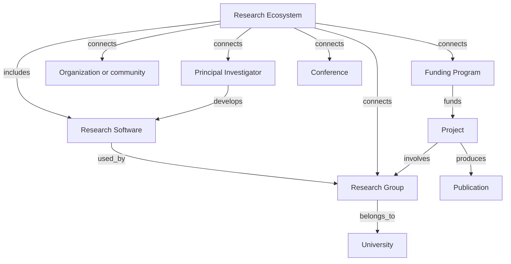

# Relationship model

> **Status:** vNext architecture. This document specifies relationship semantics and evidence rules; it does not add a database, modify current schemas, or migrate existing records.

## Purpose

Relationships turn independent Markdown records into a lightweight knowledge graph. A relationship is a directional, typed, evidence-bounded assertion from one stable entity ID to another. The relationship name says what is known; its evidence, dates, role, and confidence say how well and for when it is known.

The graph must remain human-reviewable in Git:

- use IDs, not repeated entity attributes or copied profiles;
- use the narrowest predicate that the evidence supports;
- omit unknown claims instead of inferring them from proximity, co-authorship, or a shared institution;
- preserve historical relationships with dates instead of overwriting them; and
- let views calculate documented inverse links rather than storing the same assertion twice.

This is the vNext companion to the current [relationship contract](../data-model/relationships.md) and [entity model](entity-model.md). The proposed [`entity-vnext.schema.json`](../../schemas/entity-vnext.schema.json) defines `relationship_assertions` for new v2 entity records, while existing relationship arrays and v1 schemas continue to govern current records.

## Relationship assertion shape

Simple, stable relationships can be represented by a typed ID field on the subject record. For example, the current schema family already uses `affiliation_ids`, `group_ids`, `research_area_ids`, `language_ids`, and `participant_ids`.

```yaml
---
schema_version: 2
id: PI-EXAMPLE-001
entity_type: principal-investigator
name: Example Principal Investigator
status: draft
created_at: 2026-07-11
updated_at: 2026-07-11
last_review: 2026-07-11
confidence: unassessed

# Canonical relation endpoints, not copied objects.
affiliation_ids: [ORG-EXAMPLE]
research_group_ids: [GRP-EXAMPLE]
research_area_ids: [AREA-MATERIALS-INFORMATICS]
software_ids: [SW-EXAMPLE]
source_ids: []
---
```

When a relationship needs its own dates, role, source, or scope, a new v2 entity record uses a `relationship_assertions` entry. It must not be added to records validated by a v1 schema.

```yaml
relationship_assertions:
  - predicate: develops
    target_id: SW-EXAMPLE
    role: lead-maintainer
    start_date: 2023-01-01
    end_date: null
    source_ids: [SRC-EXAMPLE-002]
    confidence: high
    evidence_window: 2026-07
```

### Required assertion fields

| Field | Meaning |
| --- | --- |
| `predicate` | Controlled relationship verb from this document. |
| `target_id` | Stable ID of the object entity. |
| `source_ids` | Evidence records supporting this particular claim. |
| `confidence` | Evidence quality, not a score for either endpoint. |
| `role` | Optional qualifier such as `lead-maintainer`, `principal-investigator`, `speaker`, or `participant`. |
| `start_date`, `end_date` | Optional ISO dates or ranges for time-bounded claims. |
| `evidence_window` | Optional period in which the assertion was known to apply. |
| `notes` | Optional editorial limitation that a renderer may expose. |

`source_ids` and `confidence` on an entity can support broadly applicable metadata, but a material relationship should carry its own evidence once relation assertions are implemented. Do not use `null` to imply a missing entity; `end_date: null` only means an ongoing end date is not known.

## Core relationship vocabulary

The first eight predicates implement the required cross-cutting links. The table names the canonical direction; inverse labels are for generated views, not a command to enter a second assertion.

| Subject | Predicate | Object | Inverse display label | Typical cardinality | Evidence notes |
| --- | --- | --- | --- | --- | --- |
| Principal Investigator | `belongs_to` | Research Group | `has_member` | many-to-many over time | Use for documented group membership or leadership; qualify leadership with `role`. |
| Research Group | `belongs_to` | University | `hosts` | many-to-one at a point in time, many-to-many historically | A department may be the immediate host; retain that link separately. |
| University | `located_in` | Country | `has_university` | many-to-one | Country is context and a filter, not an ownership namespace. |
| Principal Investigator | `develops` | Research Software | `developed_by` | many-to-many | Use only for public development, maintenance, authorship, or credited stewardship evidence. |
| Principal Investigator | `works_on` | Research Area | `worked_on_by` | many-to-many | A public topic statement, project, or scholarly output can support the claim. |
| Principal Investigator | `collaborates_with` | Organization | `collaborates_with` | many-to-many | Symmetric in meaning; record it once with time and scope when possible. |
| Principal Investigator | `speaks_at` | Conference | `features_speaker` | many-to-many | Event/edition and date matter; speaking is not ongoing membership. |
| Research Software | `used_by` | Research Group | `uses` | many-to-many | Usage does not establish authorship, maintenance, endorsement, or formal affiliation. |

The following relationships complete the first-class entity model.

| Subject | Predicate | Object | Typical cardinality | Notes |
| --- | --- | --- | --- | --- |
| Department | `belongs_to` | University | many-to-one at a point in time | `faculty_id` remains optional because institutions differ. |
| Research Group | `belongs_to` | Department or Organization | many-to-one at a point in time | Keep the university relationship if publicly known; do not infer it from a country. |
| Organization | `located_in` | Country | many-to-one or many-to-many | Use a dated relationship for multi-site organizations. |
| Principal Investigator | `affiliated_with` | University, Department, or Organization | many-to-many over time | Broader than group membership; aligns with current `affiliation_ids`. |
| Principal Investigator | `leads` | Research Group or Project | many-to-many over time | Use role-qualified evidence; not every group member is a leader. |
| Research Group | `works_on` | Research Area | many-to-many | A group-level research focus can differ from each individual's interests. |
| Research Group | `participates_in` | Research Ecosystem or Project | many-to-many | Use for a documented participant, contributor, or partner role. |
| Research Ecosystem | `connects` | Principal Investigator, Research Group, Research Software, Organization, Funding Program, Conference, or Project | many-to-many | Requires a public, meaningful ecosystem connection; it is not a loose topical tag. |
| Research Ecosystem | `includes` | Research Software | many-to-many | Use when software is part of the named ecosystem's public identity. |
| Funding Program | `funds` | Project | many-to-many | Preserve funder, program, award/call, dates, and evidence when available. |
| Project | `involves` | Principal Investigator, Research Group, University, or Organization | many-to-many | Qualify roles such as `coordinator`, `partner`, or `participant`. |
| Project | `uses` or `develops` | Research Software | many-to-many | Select the predicate that matches the evidence. |
| Project | `works_on` | Research Area | many-to-many | Record the specific scope rather than a broad inferred category. |
| Project | `produces` | Publication | many-to-many | Acknowledgement or project metadata should support this link. |
| Publication | `authored_by` | Principal Investigator | many-to-many | The reverse of a PI's `authors` display link. |
| Publication | `addresses` | Research Area | many-to-many | Topics may be supplied by the record or a documented classifier. |
| Publication | `describes` | Project or Research Software | many-to-many | Do not assume a software mention proves development. |
| Conference | `covers` | Research Area | many-to-many | A series may cover several areas; editions may be narrower. |
| Conference | `hosted_by` | Organization or University | many-to-many | Separate organizer from physical venue when evidence distinguishes them. |
| Research Area | `broader_than` | Research Area | many-to-many, acyclic within a chosen taxonomy | The inverse is `narrower_than`; avoid uncontrolled synonym loops. |

## Canonical PI, group, university, and software path



The diagram deliberately keeps `belongs_to` separate from `affiliated_with`, `leads`, and `hosts`. A person can be affiliated with a university without belonging to a particular group; a group can be hosted by a department even when a university is the institutional context.

## Ecosystem and software navigation path

Research ecosystems are central navigation nodes because they make the chain from software to real research environments inspectable: software, maintainers, groups, universities, communities, funding, contributors, and career-relevant activity all retain separate identities.



An ecosystem connection must say *how* an entity participates when the evidence supports a role: maintainer, contributor, project partner, workshop organizer, funding recipient, or user. The ecosystem's graph does not imply that every connected person is employed by the same organization or that every software user is a contributor.

## Relationship integrity rules

1. **Endpoint validity.** Every `target_id` must resolve to one canonical entity of the declared object type; stale IDs are retired, never repurposed.
2. **Predicate validity.** Use only a documented predicate and legal subject/object pair. Add a new predicate through an architecture and schema review, not as a one-off free-form verb.
3. **Direction and inverse handling.** Store the canonical direction once. A future build may generate an inverse view only from documented predicate pairs; it must not infer unrelated reverse facts.
4. **Evidence before convenience.** A coauthor, GitHub follower, shared country, or nearby topic is not alone sufficient evidence of collaboration, maintenance, membership, or software use.
5. **Time awareness.** Roles, affiliations, funding, and conference appearances change. Add `start_date`, `end_date`, and `evidence_window` when the temporal boundary affects interpretation.
6. **No duplicate relationship copies.** The same relationship does not need to be manually maintained on both endpoints or repeated in a country view, report, and entity record.
7. **No negative inference.** Omitting `accepting_phd`, `used_by`, or `collaborates_with` does not mean the opposite is true.
8. **Scope and privacy.** Store public research and organizational facts only. Do not encode private contact information, sensitive attributes, or speculative career conclusions as graph edges.

## Current-schema bridge

The current repository is already schema-backed, but its fields are narrower than this target relationship model. The bridge below prevents architecture documentation from being mistaken for an unversioned data change.

| Current field or entity | vNext relationship interpretation | Action in this architecture-only change |
| --- | --- | --- |
| `advisor.affiliation_ids` | PI `affiliated_with` Organization/University/Department | Continue using the current field for current advisor records. |
| `advisor.group_ids` | PI `belongs_to` Research Group | Continue using the current field; do not rename `advisor` to PI yet. |
| `lab.organization_id`, `lab.department_id` | Research Group `belongs_to` Organization/Department | Preserve existing host semantics. |
| `university.country_id` | University `located_in` Country | Preserve existing field and use it to build country filters. |
| `research_area_ids`, `language_ids`, `participant_ids`, `author_ids` | Typed links to research areas, languages, project participants, and authors | Continue to validate with their current schemas. |
| `relationship_assertions` | Rich dated/role-qualified relation records | Defined by the proposed vNext schema; use only for v2 entity records, not v1 records. |

The current schemas use `unevaluatedProperties: false`, so target-only keys such as `relationship_assertions`, `software_ids`, or `programming_language_ids` must not be added to existing validated records until their respective schemas have been versioned and expanded. This preserves the architecture-only, no-migration boundary.
