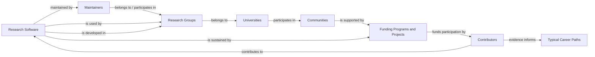
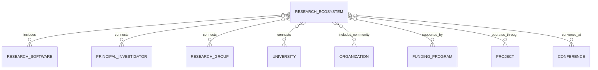

# Software ecosystem architecture

Research software is a navigation surface for the whole research landscape, not merely a list of repositories. A software ecosystem record connects the social, institutional, technical, and funding context that makes a project sustainable and useful. This document defines that traversal without introducing a database or duplicating entity facts in views.

## Canonical navigation chain

The central traversal is:

```text
Software → Maintainers → Research Groups → Universities → Communities → Funding → Contributors → Typical Career Paths
```

The arrows express evidence-backed relationships, not a universal hierarchy or a required one-to-one path. A project can have maintainers outside an academic group; a community can span institutions and funders; and a contributor can participate without being a maintainer. Missing information is omitted rather than inferred.



`Typical Career Paths` is a derived view, not a first-class entity in this phase. It summarizes documented, non-deterministic transitions (for example, contributor → maintainer → research-software engineer) and must link back to evidence-bearing entities. It must never imply that a particular job outcome is guaranteed.

## Entity roles and relationship IDs

The model keeps one fact in one canonical entity record. Relationship fields hold stable IDs, never copied names, biographies, organization descriptions, or funding amounts. The vNext field names and values are defined in [metadata.md](metadata.md); relationship predicates and inverse-view rules belong in [relationships.md](relationships.md).

| Chain edge | Entity records involved | Relationship-ID field(s) | Evidence to record |
| --- | --- | --- | --- |
| Software → Maintainers | Research Software; Principal Investigator or Organization | `maintainer_ids` | Project governance, `CODEOWNERS`, official team page, release authority, or maintainer declaration. |
| Maintainers → Research Groups | Principal Investigator; Research Group | `research_group_ids` | Current official group roster or public affiliation. |
| Research Groups → Universities | Research Group; University or Organization | `institution_id` (and, during v1 compatibility, `organization_id` / `department_id`) | Group or host-institution page. |
| Universities → Communities | University/Organization; Organization or Research Ecosystem | `community_ids`, `ecosystem_ids` | Formal membership, consortium, event, or governance evidence. |
| Communities → Funding | Organization/Research Ecosystem; Funding Program; Project | `funding_program_ids`, `project_ids` | Funder award record, grant acknowledgement, or programme documentation. |
| Funding → Contributors | Funding Program/Project; Principal Investigator, Research Group, or Organization | `contributor_ids`, `participant_ids` | Award participants, funded role, or project team evidence. |
| Contributors → Career Paths | Contributor-role evidence; derived view | no canonical career-path ID in this phase | Public role history and an explicitly documented derivation method. |

`maintainer` and `contributor` are roles, not new person entity types. In vNext, their IDs normally identify a `principal-investigator` or `organization`; an external account that cannot be reconciled to a first-class entity remains in `external_ids` with a source citation until it can be resolved. This prevents creating speculative duplicate people records.

## Ecosystem record as an integration point

A Research Ecosystem may group several projects that share a technical community or governance context (for example, a software platform and its affiliated tools). It is not a replacement for the software records within it.



An ecosystem record may reference `software_ids`, `maintainer_ids`, `research_group_ids`, `institution_ids`, `community_ids`, `funding_program_ids`, `project_ids`, and `conference_ids` when each assertion is publicly evidenced. The IDs are indexes into canonical records; they are not a second copy of those records' metadata.

## Traversal rules

1. Start from a specific Research Software record or Research Ecosystem record, not from a country directory.
2. Follow only direct, cited relationships. A software repository owned by a university does not by itself establish that every group at that university develops the software.
3. Preserve time: maintainership, affiliation, funding, and contribution can expire. Record date bounds in relationship evidence when available.
4. Treat participation as many-to-many. Software may have many maintainers and groups; groups and institutions can take part in many communities and funding programmes.
5. Keep roles distinct. `maintained_by`, `developed_by`, `used_by`, `funded_by`, and `contributed_to` should not be collapsed into a generic association.
6. Do not infer an inverse assertion in a source record. A documented view or build step may calculate inverse navigation, but the original claim remains anchored at the cited record.

## Evidence and freshness

Software ecosystems change quickly. Each material relationship should have a source, retrieval date, confidence, and, where available, a start and end date. Prefer official repository governance, release documentation, institutional profiles, funder award records, conference sites, and project documentation. Commit activity and social profiles can support discovery, but should not alone establish an employment, funding, or supervisory relationship.

When a connection cannot be substantiated, omit it and describe the gap in the Markdown body. A sparse graph is preferable to a dense graph of inferred links.

## Future views

Views consume the graph; they do not become a second source of truth. Examples include:

- software → active maintainers → currently affiliated groups;
- ecosystem → participating institutions → funding programmes;
- contributor role history → evidence-bounded career-path patterns; and
- research area → software → groups → principal investigators.

The same relationship IDs can support country, university, research-area, and personal-shortlist views while retaining the entity record as the canonical place to update facts.
