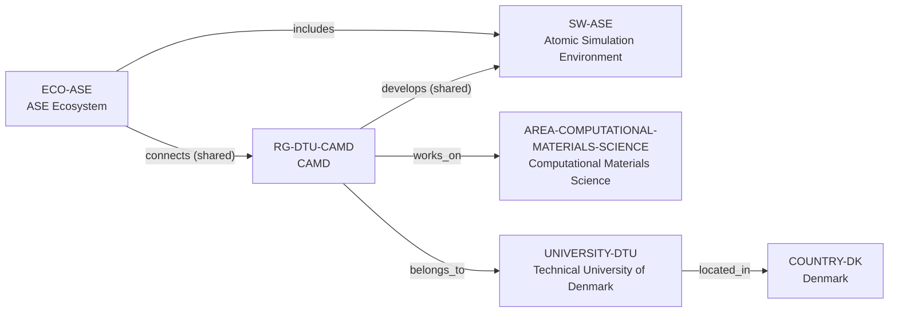

# ASE–DTU CAMD vertical slice

> **Status:** eleventh reviewed vNext vertical slice, reviewed 2026-07-12.

## Purpose and scope

This bounded Quality Gate 1 slice records the Atomic Simulation Environment
(ASE) as a research-software artifact, its named ecosystem, and its reviewed
DTU Computational Atomic-scale Materials Design (CAMD) group connection. It
adds Denmark and the Technical University of Denmark (DTU) to provide the
direct University-host path required for CAMD.

The slice remains software-first. DTU's CAMD research page explicitly lists
development of ASE as group work, while the ASE documentation independently
describes the software and its LGPL-2.1-or-later license. Neither source
provides an exhaustive current maintainer roster or a suitable principal-
investigator identity for this bounded claim, so no person record is created.

## Canonical graph

| Role | Canonical record | Scope |
| --- | --- | --- |
| Research software | [`SW-ASE`](../entities/research-software/ase.md) | Atomistic-simulation Python tools, public documentation, and LGPL-2.1-or-later license. |
| Research ecosystem | [`ECO-ASE`](../entities/ecosystems/ase.md) | Separate ecosystem node that includes ASE and records the bounded CAMD connection. |
| Research group | [`RG-DTU-CAMD`](../entities/research-groups/dtu-camd.md) | DTU-hosted group, Computational Materials Science work, and shared ASE-development relation. |
| University | [`UNIVERSITY-DTU`](../entities/universities/technical-university-of-denmark.md) | Direct University host for CAMD. |
| Country | [`COUNTRY-DK`](../entities/countries/denmark.md) | Geographic endpoint for DTU. |
| Research area | [`AREA-COMPUTATIONAL-MATERIALS-SCIENCE`](../entities/research-areas/computational-materials-science.md) | Existing controlled area reused by CAMD. |

## Contract and evidence checks

| Rule | Result in this slice |
| --- | --- |
| Accepted direct-host rule | `RG-DTU-CAMD` has `institution_id: UNIVERSITY-DTU`, no `organization_id`, and a matching evidence-bearing `belongs_to` assertion. |
| Software versus ecosystem | ASE is a separate research-software record; `ECO-ASE` is not used to imply ownership, governance, or exhaustive participation. |
| Group versus individual software role | DTU publicly supports a group-level ASE-development relation. No person-to-software edge or maintainer roster is inferred. |
| Evidence before inference | Reviewed records and assertions use record-local `SRC-*` keys resolved in their own Evidence tables. |
| Scope discipline | GPAW, other ASE ecosystem projects, and individual researchers remain out of graph scope absent separate reviewed identities and relationships. |

## Deliberate omissions

- No principal-investigator, software maintainer, contributor, project, funder,
  participant, or additional organization record is created from the available
  sources.
- No claim is made that CAMD exclusively develops, hosts, governs, or maintains
  ASE, or that every contributor belongs to CAMD.
- No linked code, plugin, calculator, database, method, or ecosystem member is
  turned into a canonical node without independent review.
- No claim is made about supervision capacity, mentoring, admissions, funding,
  language, ranking, or applicant fit.

## View reachability

No generated view output is added. The documented graph supports these future
traversals without copying profiles into views:

| View family | Traversal |
| --- | --- |
| Global | Reviewed `SW-ASE`, `ECO-ASE`, and `RG-DTU-CAMD` are available when a generator implements the declared query. |
| Country | `RG-DTU-CAMD` → `UNIVERSITY-DTU` → `COUNTRY-DK`. |
| Research area | `RG-DTU-CAMD` → `works_on` → `AREA-COMPUTATIONAL-MATERIALS-SCIENCE`. |
| Research software | `RG-DTU-CAMD` → `develops` → `SW-ASE`; `ECO-ASE` → `includes` → `SW-ASE`. |

The review and validation record is in
[ASE–DTU CAMD vertical slice review](../reports/ase-dtu-vertical-slice-review.md).
