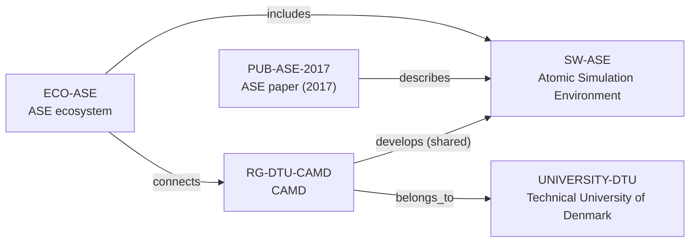

# ASE ecosystem-intelligence vertical slice

> **Status:** reviewed Quality Gate 3 vertical slice, reviewed 2026-07-12.

## Purpose and scope

This Quality Gate 3 slice deepens the existing Atomic Simulation Environment
(ASE)–CAMD–DTU cluster rather than creating a parallel profile. It adds ASE's
2017 technical publication and enriches the existing software and ecosystem
records with source-backed calculator architecture, Python/CLI/GUI user paths,
GitLab contribution workflow, and public support-community context.

The graph remains intentionally sparse. First-party sources support ASE as an
open Python environment for atomistic simulation, its public GitLab repository,
calculator interface, command-line and GUI surfaces, and development/community
routes. Existing records separately support the CAMD group development relation
and DTU host path. The evidence does not justify an exhaustive maintainer,
contributor, calculator, plugin, code, funding, or partner graph.

## Canonical graph

## QG3 coverage matrix

| Required ecosystem dimension | Canonical evidence in this slice | Boundary |
| --- | --- | --- |
| Purpose and scientific scope | ASE documentation describes Python tools and modules for setting up, manipulating, running, visualizing, and analyzing atomistic simulations. | This does not prove every code interface, method, application, or user outcome. |
| Architecture | Documentation describes a modular `Atoms`/calculator interface and workflow methods; calculators provide energies, forces, and sometimes stresses to atomistic workflows. | Modules, calculators, and external codes stay upstream technical context, not newly modeled dependencies or components. |
| Programming language | Project and paper sources identify ASE as Python. | No `programming_language_ids` value is added: the vNext Language entity contract is absent. |
| Maintainers and core contributors | Development documentation and public GitLab surface document contribution and review routes. | They do not prove a complete current maintainer/contributor roster, review assignment, or governance model. |
| Institutions and groups | Existing CAMD and DTU records preserve the separately reviewed shared group development and direct-host path. | CAMD is not made the sole host, owner, or development group. |
| Key publication | `PUB-ASE-2017` has date, DOI, and a direct software-description relation. | No author relation is created without separately reviewed canonical author identities. |
| Funding | No typed funding relationship is added. | Publication grant metadata and group context are insufficient to infer current ASE funding in the frozen graph. |
| Repository and contribution workflow | `SW-ASE.repository_url` identifies the public GitLab source; documentation supports branches, merge requests, review, test, and documentation guidance. | Public contribution routes do not promise acceptance, review, mentoring, employment, or account access. |
| Community and user journey | Documentation supports Python, CLI, and GUI use; contact pages support mailing-list, Matrix chat, forum, issue, and merge-request routes. | No current community size, response expectation, individual support, or event schedule is inferred. |
| Career relevance | Canonical sources expose learning surfaces in Python, atomistic workflows, code interfaces, GitLab collaboration, testing, documentation, and reproducible scientific software practice. | No employment, admission, contributor-status, supervision, or outcome recommendation is claimed. |
| Dependencies and related ecosystems | The group development relation and public calculator interface are documented in canonical prose. | The frozen schema lacks safe dependency/community entity types and an ecosystem-to-ecosystem predicate, so no speculative related-software edge is added. |

## Typical user journey

The documented upstream path is: create or read an `Atoms` structure; attach a
calculator to evaluate energies, forces, and related properties; use Python,
the `ase` command-line tool, or GUI to build structures, run calculations, and
analyse results; then use GitLab merge requests and public community channels
to propose or discuss changes. This is a source-backed product journey, not a
guarantee that any external calculator, submission, or support request will be
accepted.

## Deliberate omissions

- No Programming Language, Community, calculator, external-code, dependency,
  database, workflow, package, detailed Maintainer, or external contributor
  node is created without a canonical entity and relationship contract.
- No publication author, complete maintainer roster, contributor list,
  code-review role, or employment claim is inferred from a bibliography,
  repository, or contribution guidance.
- No funding programme, award amount, current funding, opening, mentoring,
  admissions, language, ranking, or applicant-fit conclusion is made.
- No generated view, recommendation, or manual ecosystem ranking is added.

## View reachability

No generated view output is added. The enriched canonical graph supports these
future traversals without copied facts:

| View family | Traversal |
| --- | --- |
| Research software | `SW-ASE` ← `includes` ← `ECO-ASE`; `PUB-ASE-2017` → `describes` → software. |
| Research ecosystem | `ECO-ASE` → `includes` → software; → `connects` → documented group. |
| Research group and University | `RG-DTU-CAMD` → `develops` → software; → `belongs_to` → `UNIVERSITY-DTU`. |
| Publication | `PUB-ASE-2017` → `describes` → `SW-ASE`; author links await separately reviewed identities. |
| Country and research area | Existing group-host and research-area routes remain derivable without duplicating records. |

The review and validation record is in [ASE ecosystem-intelligence vertical
slice review](../reports/ase-ecosystem-intelligence-vertical-slice-review.md).
