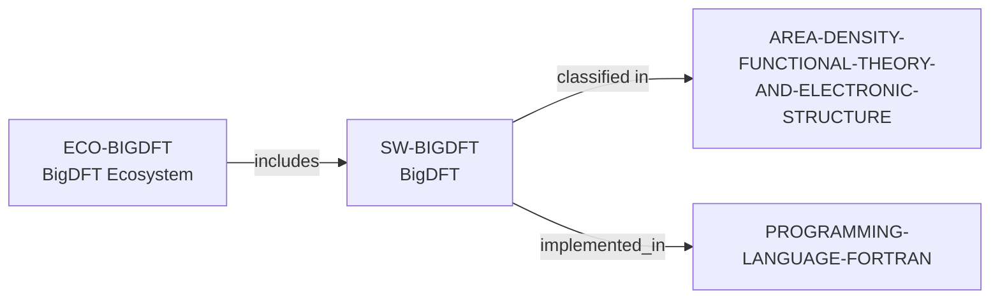

# BigDFT ecosystem vertical slice

> **Status:** reviewed vertical slice, reviewed 2026-07-13.

This slice adds separate BigDFT software and ecosystem records, reusing the
controlled Fortran, Computational Materials Science, and DFT/Electronic
Structure records. It establishes only public DFT scope, package-specific GPLv2
licensing, a Fortran implementation path, and public project surfaces.

Documented suite composition and integrations remain prose because no safe
dependency predicate exists. Public source and participation routes do not
establish contributor roles, support, mentoring, quality, performance,
funding, admissions, or applicant fit.

The review record is in [BigDFT ecosystem vertical slice review](../reports/bigdft-ecosystem-vertical-slice-review.md).
