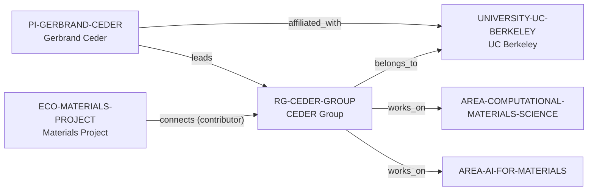

# CEDER Group intelligence vertical slice

> **Status:** reviewed vertical slice, 2026-07-12.

## Purpose and scope

This slice adds UC Berkeley, the Computational and Experimental Design of
Emerging Materials Research Group (CEDER), and Gerbrand Ceder as a bounded
AI-for-Materials and Computational Materials Science cluster. It also records
the group's public Materials Project contribution from the same UC Berkeley
source, without treating that statement as software ownership or a complete
collaboration graph.

## Canonical graph

## Evidence and boundaries

| Dimension | Canonical evidence | Boundary |
| --- | --- | --- |
| Direct host and PI | UC Berkeley identifies the group within its Materials Science and Engineering context and identifies Ceder as a professor. | LBNL is not added as a second group host. |
| Computational materials | UC Berkeley describes computational/high-throughput materials work. | No complete methods, project, publication, or facility inventory is created. |
| AI for Materials | UC Berkeley and CEDER sources describe AI/ML and autonomous materials experimentation. | This is not an AI capability, model-quality, or autonomous-lab performance score. |
| Materials Project | UC Berkeley states that the group contributes extensively to Materials Project. | The edge does not establish exclusive ownership, every contributor, or individual software maintenance. |

## Deliberate omissions

- No current opening, admission, funding, compensation, supervision, mentoring,
  working-language, or applicant-fit claim is made.
- No LBNL host, Department, laboratory, software, facility, project, funder,
  collaborator, publication, team-member, or alumni entity is inferred.
- No prestige, outcome, research-quality, or ecosystem-completeness ranking is
  calculated or implied.
