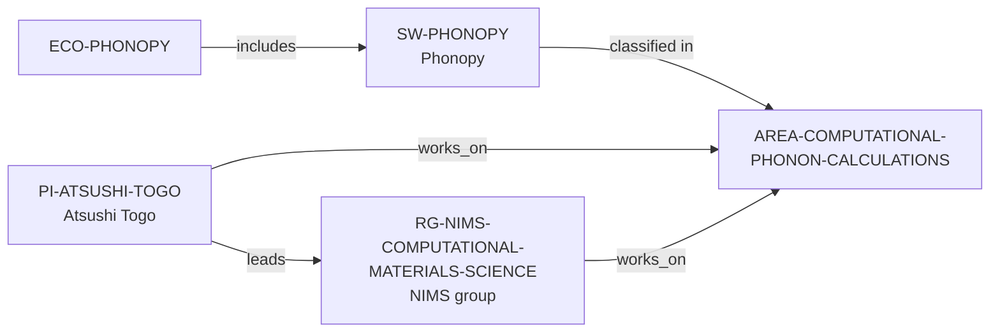

# Computational Phonon Calculations area

> **Status:** reviewed controlled-area increment, reviewed 2026-07-13.

This increment adds `AREA-COMPUTATIONAL-PHONON-CALCULATIONS` as a topic-first,
non-comparative discovery route. It classifies only Phonopy, the NIMS
Computational Materials Science Group, and Atsushi Togo, because each record's
own reviewed evidence explicitly describes phonon calculations.



The public dynamic discovery surfaces are:

```bash
python3 scripts/research_landscape.py discover-groups \
  --area AREA-COMPUTATIONAL-PHONON-CALCULATIONS
python3 scripts/research_landscape.py discover-pis \
  --area AREA-COMPUTATIONAL-PHONON-CALCULATIONS
python3 scripts/research_landscape.py discover-software \
  --area AREA-COMPUTATIONAL-PHONON-CALCULATIONS --open-source yes
```

These queries return documented paths, not a ranking of problems, methods,
groups, advisors, ecosystems, or environments. The review record is in the
[Computational Phonon Calculations area review](../reports/computational-phonon-calculations-area-review.md).
