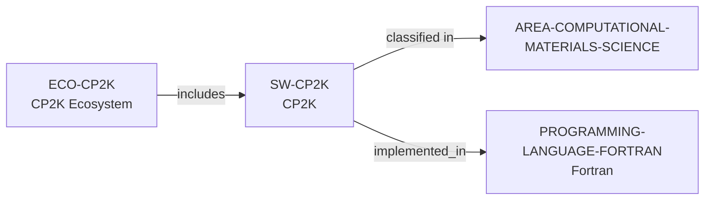

# CP2K ecosystem vertical slice

> **Status:** reviewed Quality Gate 3 vertical slice, reviewed 2026-07-13.

## Purpose and scope

This slice adds the distinct CP2K software package, CP2K ecosystem, and a
controlled Fortran language record. It establishes only the directly sourced
software purpose, GPL openness, Fortran implementation, and public
contribution/learning surfaces. It intentionally introduces no person,
institution, funder, or complete developer-community record.

## Canonical graph



## Evidence boundaries

| Dimension | Canonical evidence | Boundary |
| --- | --- | --- |
| Software scope | The public project repository describes quantum-chemistry and solid-state-physics simulation capabilities, including materials and periodic systems. | No conclusion is made about performance, method suitability, or every CP2K feature. |
| Openness and delivery | Official project sources identify GPL availability, public releases, Git development, and installation paths. | The public source does not promise current support, availability, or a particular environment. |
| Implementation language | The repository explicitly identifies Fortran 2008; the ISO record provides a controlled Fortran language identity. | This is a software implementation fact only, not a group-wide language policy or person-level skill claim. |
| Contribution surface | Project guidance documents forks, pull requests, formatting, tests, CI, manuals, dashboard, and public discussions. | These routes do not promise acceptance, review, response, mentoring, or membership. |

## Deliberate omissions

- No individual developer, maintainer, reviewer, employer, institution,
  funding, package, subproject, library, interface, method, benchmark, event,
  or user is modeled without separately reviewed evidence.
- No lifecycle state is inferred from repository activity; the software
  discovery output deliberately displays `not documented` for this dimension.
- No claim is made about quality, scaling, correctness, support, openings,
  mentorship, admissions, or applicant fit.

## View reachability

The public software and ecosystem views expose the canonical records. The
interactive query below requires four independently documented facts and
returns CP2K with each matching source path:

```bash
python3 scripts/research_landscape.py discover-software \
  --area AREA-COMPUTATIONAL-MATERIALS-SCIENCE \
  --language PROGRAMMING-LANGUAGE-FORTRAN \
  --ecosystem ECO-CP2K \
  --open-source yes
```

This is evidence discovery, not a language-based suitability, quality, or
career recommendation.

The review record is in [CP2K ecosystem vertical slice
review](../reports/cp2k-ecosystem-vertical-slice-review.md).
