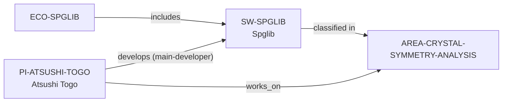

# Crystal Symmetry Analysis area

> **Status:** reviewed controlled-area increment, reviewed 2026-07-13.

This increment adds `AREA-CRYSTAL-SYMMETRY-ANALYSIS` as a precise,
non-comparative discovery topic. It classifies only Spglib and Atsushi Togo,
because their reviewed Spglib evidence explicitly describes crystal-symmetry
analysis and a current main-developer role.

The public topic paths are available through `discover-pis --area` and
`discover-software --area`; the absence of a group result means no reviewed
group-level crystal-symmetry claim is made. Results are evidence discovery, not
a ranking of problems, methods, software, advisors, or environments.

The review record is in the [Crystal Symmetry Analysis area review](../reports/crystal-symmetry-analysis-area-review.md).
