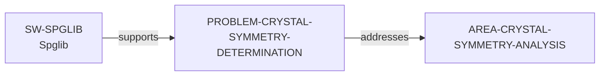

# Crystal Symmetry Determination problem slice

> **Status:** reviewed evidence-bounded increment, reviewed 2026-07-13.

`PROBLEM-CRYSTAL-SYMMETRY-DETERMINATION` makes a narrowly defined
computational challenge discoverable: determining crystal symmetry operations
and identifying a space group from a structure. The official Spglib
documentation is evidence for both the problem scope and the direct
`SW-SPGLIB → supports → PROBLEM-CRYSTAL-SYMMETRY-DETERMINATION` path.

Run `python3 scripts/research_landscape.py discover-problems` to inspect this
source-identified support path alongside other reviewed problems. That command
is a catalog, not a ranking of importance, novelty, tractability, methods,
software, or researcher fit. The review record is in the [Crystal Symmetry
Determination problem review](../reports/crystal-symmetry-problem-vertical-slice-review.md).
