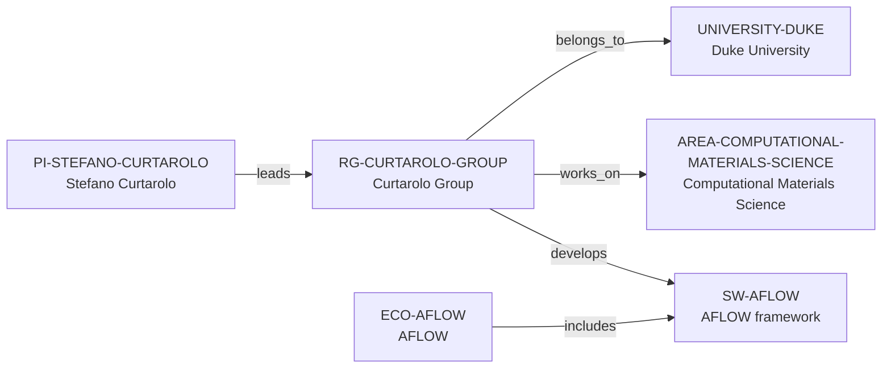

# Curtarolo Group intelligence vertical slice

> **Status:** third reviewed Quality Gate 4 Research Group Intelligence slice, reviewed 2026-07-12.

## Purpose and scope

This Quality Gate 4 slice deepens the existing Curtarolo Group record without
creating a duplicate lab profile, personnel directory, publication database, or
career ranking. It captures first-party evidence for research programs, AFLOW’s
public software and learning surfaces, visible role categories, publication
pattern, virtual-seminar context, selected public alumni examples, and explicit
funding/collaboration/mentoring limits.

The public group site presents computational materials research centred on
high-entropy ceramics, phase stability, crystallographic symmetry and
prototyping, autonomous property prediction, and metallic glasses. It documents
AFLOW’s high-throughput DFT, source, binary, API, web, and workshop surfaces.
Those surfaces do not establish a complete programming stack, maintenance
roster, hardware allocation, collaboration graph, grant ledger, or group-wide
supervision practice.

## Canonical graph

The slice adds no speculative people, alumni, funding, collaboration, project,
facility, code, or industry nodes. Existing canonical records retain the graph;
the group record gains only evidence-bounded context.

## QG4 coverage matrix

| Required group dimension | Canonical evidence in this slice | Boundary |
| --- | --- | --- |
| Research themes | The group identifies high-entropy ceramics, phase stability, symmetry/prototyping, autonomous property prediction, and metallic glasses. | These are stated group programs, not a complete topic taxonomy or every member’s work. |
| Scientific software maturity | The group identifies AFLOW as a framework it developed for autonomous high-throughput DFT and materials-property calculations, with modules and public data-access surfaces. | This does not establish a lifecycle rating, individual maintenance, uptime, or governance model. |
| Programming stack | First-party sources describe DFT, thermodynamics, machine learning, structural analysis, and API/source distribution. | They do not establish a reliable group-wide language policy; no programming-language identifiers are inferred. |
| Software ecosystem participation | The existing `RG-CURTAROLO-GROUP → develops → SW-AFLOW` relation remains supported by the group’s AFLOW page. | Group-level development does not create an exclusive-ownership or individual-role claim. |
| Open-source activity | The group’s AFLOW page states that AFLOW is open source and points to source, binaries, and workshop material. | This is AFLOW’s public software surface, not a general claim about every group project or its code-review practice. |
| Students, postdocs, and staff | The people page publicly displays research-professor, postdoctoral, graduate, visiting-graduate, adjunct, and scientific-editor roles. | It is not a complete headcount, employment ledger, or basis for bulk person records. |
| Funding | The group homepage displays external logos, but the reviewed sources do not provide a reliable award-by-award group funding record. | No funder, programme, award, amount, or funding edge is inferred. |
| Infrastructure | Public sources describe high-throughput DFT, AFLOW modules, web tools, APIs, and a materials database. | They do not prove dedicated hardware, allocation, access conditions, availability, or support commitments. |
| Major projects | AFLOW and the named research programs form durable discovery context. | Research topics and software modules are not new Project entities without separately reviewed identity and relationship evidence. |
| International and industry collaboration | The public roster includes a visiting graduate student and adjunct affiliations. | No complete international, institutional, industry, or partner-collaboration graph is claimed. |
| Publication patterns | The group’s public chronological page lists dated research outputs, including 2026 entries. | No count, productivity, quality, attribution, or causal metric is calculated. |
| Mentorship evidence | The group publicizes seminars and workshop material. | This is not evidence of individual mentoring, supervision, admissions practice, or training outcomes. |
| Career outcomes | The people page gives selected alumni examples with stated subsequent roles. | No placement rate, causal claim, typical outcome, or guarantee is inferred. |

## Evidence-bounded research environment

The public research page makes the technical environment unusually legible: it
connects first-principles thermodynamics, DFT, machine learning, structural
analysis, disorder modelling, and high-throughput methods to named materials
programs. The AFLOW page then describes a public route from this research to
open-source software, source and binary installation, web tools, APIs, schools,
and workshop materials.

The people and publications pages help a prospective researcher distinguish
visible role categories and an active public research record from unsupported
assumptions about capacity, culture, or success. Selected alumni destinations
are diligence examples only; they do not support a placement statistic or a
claim that the group caused any particular outcome.

## Deliberate omissions

- No individual member, alum, collaborator, funder, industry partner, project,
  facility, code module, or workflow is created without separate identity and
  relationship evidence.
- No current-opening, admission, compensation, funding, supervision capacity,
  language, applicant-fit, or group-wide mentoring claim is made.
- No claim about AFLOW’s maintenance roster, release process, code review,
  license administration, or every group member’s software role is inferred.
- No group-wide publication-quality, management, culture, collaboration, or
  career-outcome rating is calculated or implied.

## View reachability

No generated view output is added. The enriched group record supports these
future evidence-led traversals without copied facts:

| View family | Traversal |
| --- | --- |
| Research group | `RG-CURTAROLO-GROUP` → Duke host, computational-materials area, PI leader, and AFLOW framework. |
| Software ecosystem | Curtarolo Group → AFLOW framework ← AFLOW ecosystem, retaining the ecosystem/software distinction. |
| People and roles | Existing PI leadership plus source-backed visible role categories; individual records require separate review. |
| Career and learning diligence | Source-backed public seminar/workshop context and selected alumni examples, each preserving its scope limits. |

The review and validation record is in [Curtarolo Group intelligence vertical
slice review](../reports/curtarolo-group-intelligence-vertical-slice-review.md).
