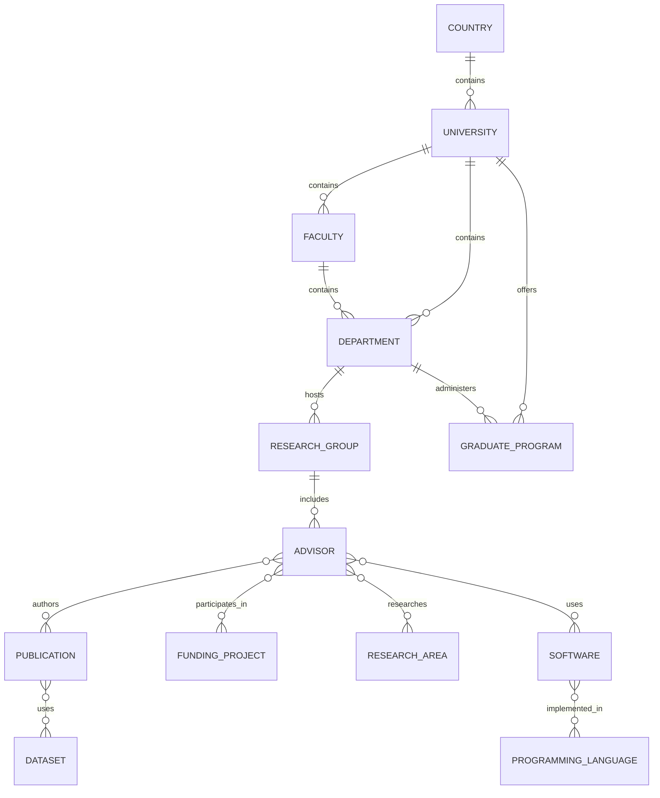

# Entity model

Research Landscape models public research environments as named entities connected by stable identifiers. An entity document is a human-readable Markdown record with YAML frontmatter validated by its JSON Schema. An entity's `id`, `entity_type`, `name`, `status`, `created_at`, and `updated_at` are required everywhere; relationships are ID references, never embedded copies of another entity's attributes.

## Common fields

| Field | Required | Purpose |
| --- | --- | --- |
| `schema_version` | Yes | Metadata contract version, initially `1`. |
| `entity_type` | Yes | Controlled entity type. |
| `id` | Yes | Immutable, project-issued stable ID. |
| `name` | Yes | Canonical public name. |
| `status` | Yes | `draft`, `reviewed`, `published`, or `retired`. |
| `created_at`, `updated_at` | Yes | ISO 8601 dates. |
| `aliases`, `external_ids`, `source_ids` | No | Discovery and reconciliation aids. |
| `evidence_window`, `confidence`, `notes` | No | Scope and editorial context. |

## First-class entities

| Entity | Purpose | Required domain fields | Optional fields and principal relationships |
| --- | --- | --- | --- |
| Country | National context and hierarchy root. | `country_code` | `iso_numeric`, `region`; contains universities. |
| University | Degree-granting or research institution. | `country_id` | `ror`, `website`; contains faculties and programs. |
| Faculty | University academic subdivision. | `university_id` | `website`; contains departments. |
| Department | Academic unit. | `university_id` | `faculty_id`, `website`; contains groups and programs. |
| Research Group | Named research unit, lab, or center. | `organization_id` | `department_id`, `website`; contains advisors. |
| Advisor | Publicly identified academic supervisor or research lead. | `affiliation_ids` | `orcid`, `roles`, `group_ids`; authors publications and participates in projects. |
| Graduate Program | Structured graduate offering. | `university_id`, `degree_level` | `department_id`, `url`; is offered by a university/department. |
| Publication | Scholarly output. | `title`, `publication_date`, `publication_type` | `doi`, `openalex_id`, `author_ids`; is authored by advisors. |
| Funding Project | Publicly described funded research activity. | `title`, `funder_name`, `start_date` | `award_id`, `end_date`, `participant_ids`; has participants. |
| Research Area | Controlled, reusable subject concept. | `label` | `parent_id`, `external_ids`; classifies people, groups, publications, and software. |
| Programming Language | Reusable software-language concept. | `label` | `website`, `external_ids`; is used by software and advisors when evidenced. |
| Software | Research-relevant software artifact. | `name` | `repository_url`, `license`, `language_ids`; is used or produced by entities. |
| Dataset | Research dataset artifact. | `name` | `doi`, `repository_url`, `license`; is used or produced by entities. |

`organization_id` on a research group refers to its immediate accountable host (usually a department or university); `department_id` is retained when that more specific relation is known.

## Entity graph

## Cardinality and lifecycle

Relationships are many-to-many unless shown as containment. A record may be retired but its ID is never reused. Changes of name or affiliation update fields and temporal evidence; they do not change identity. See [stable identifiers](stable-identifiers.md) and the [relationship model](relationships.md).
