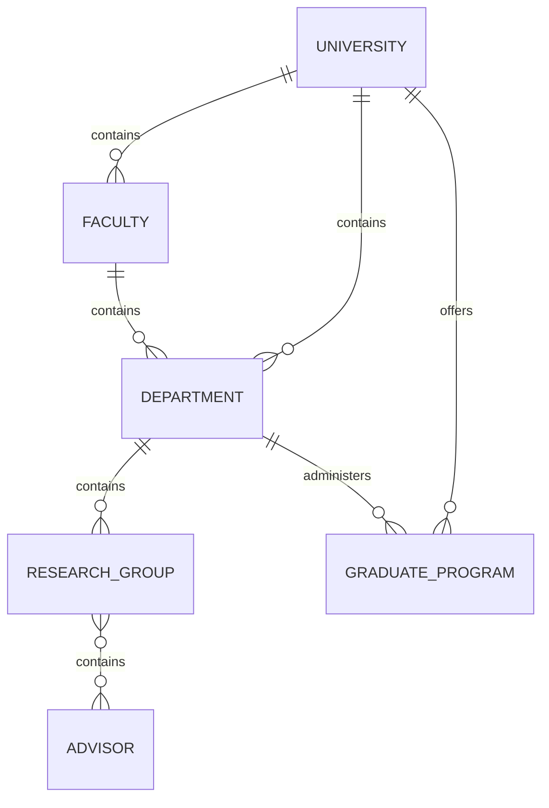
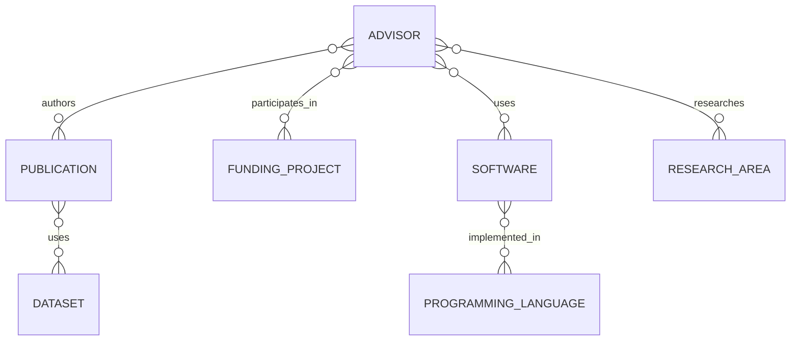

# Relationship model

Relationships are directional, typed assertions between stable IDs. Their evidence belongs in the source document or a future relation record; an ID reference alone means “asserted by this document at its stated confidence,” not an immutable fact. Use the narrowest accurate predicate and record time bounds when relevant.

## Canonical predicates

| Subject | Predicate | Object | Cardinality |
| --- | --- | --- | --- |
| Country | `contains` | University | one-to-many |
| University | `contains` | Faculty, Department | one-to-many |
| Faculty | `contains` | Department | one-to-many |
| Department | `contains` | Research Group | one-to-many |
| Research Group | `contains` | Advisor | many-to-many over time |
| University / Department | `offers` / `administers` | Graduate Program | one-to-many |
| Advisor | `authors` | Publication | many-to-many |
| Advisor | `participates_in` | Funding Project | many-to-many |
| Advisor / Group / Publication | `researches` / `is_about` | Research Area | many-to-many |
| Advisor / Group / Publication | `uses` | Software or Dataset | many-to-many |
| Software | `implemented_in` | Programming Language | many-to-many |

## Containment and affiliation

Containment describes organizational structure, not employment. `affiliation_ids` on an advisor records the public affiliations relevant to a report; `group_ids` records research-group participation. A faculty relationship is optional because institutions do not use a uniform faculty structure.

## Rules

- Use IDs in relationship arrays; do not duplicate full objects.
- Do not infer inverse claims unless the inverse record is evidenced or generated by a documented build step.
- A relationship may carry `role`, `start_date`, `end_date`, `source_ids`, and `confidence` in a future relation schema.
- Unknown relationships are omitted; absence is never a negative assertion.
