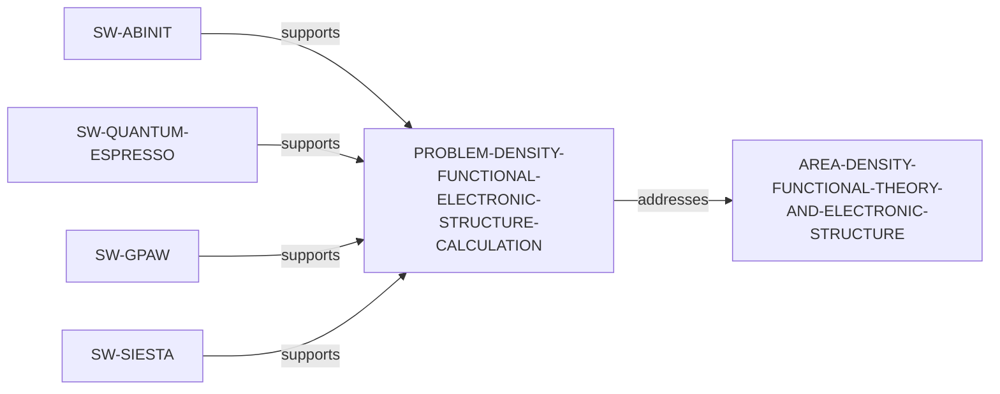

# Density-Functional Electronic-Structure Calculation problem slice

> **Status:** reviewed evidence-bounded increment, reviewed 2026-07-13.

`PROBLEM-DENSITY-FUNCTIONAL-ELECTRONIC-STRUCTURE-CALCULATION` makes a bounded
first-principles calculation challenge discoverable: obtaining electronic
structure for molecules, solids, or materials with density-functional methods.
Official documentation provides four separate direct software-support paths; it
does not establish that functional, basis, pseudopotential, numerical-method,
or software choices are comparable or best.

Run `python3 scripts/research_landscape.py discover-problems` to inspect these
source-identified paths. It is a catalog, not a ranking of importance,
novelty, tractability, methods, software, or researcher fit. The review record
is in the [Density-Functional Electronic-Structure Calculation problem review](../reports/density-functional-electronic-structure-problem-vertical-slice-review.md).
