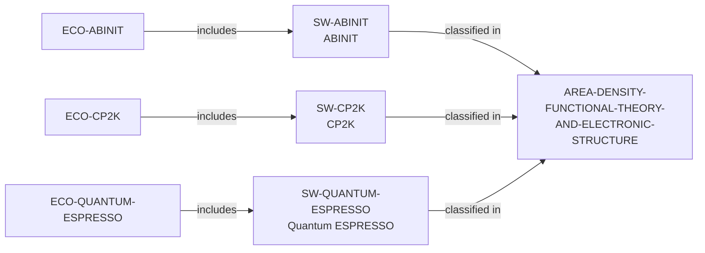

# Density-Functional Theory and Electronic Structure area

> **Status:** reviewed controlled-area increment, reviewed 2026-07-13.

## Purpose and scope

This increment adds the controlled `AREA-DENSITY-FUNCTIONAL-THEORY-AND-ELECTRONIC-STRUCTURE`
label to make a precise public discovery route across existing open
electronic-structure software ecosystems. It classifies only ABINIT, CP2K,
and Quantum ESPRESSO because each record's own reviewed source explicitly
describes DFT or electronic-structure calculations in its documented scope.

## Canonical graph



## Evidence boundaries

| Software | Direct basis for classification | Boundary |
| --- | --- | --- |
| ABINIT | Official material describes DFT electronic-structure calculations for molecules and periodic solids. | No conclusion about every ABINIT utility, method, workflow, or result. |
| CP2K | Official repository describes DFT methods in its quantum-chemistry and solid-state atomistic-simulation package. | No claim that every CP2K method is a DFT or electronic-structure workflow. |
| Quantum ESPRESSO | Official project material describes electronic-structure calculations based on DFT, plane waves, and pseudopotentials. | No claim that every module, interface, or user has the same scope. |

## Deliberate omissions

- No research group, PI, university, organization, dataset, publication, or
  project is classified merely because it is adjacent to one of these software
  ecosystems.
- No broader/narrower taxonomy relation is asserted between this controlled
  area and Computational Materials Science.
- The label does not measure method quality, accuracy, performance, project
  currency, support, ranking, or applicant fit.

## Discovery reachability

The public recommendation query
`ecosystems-density-functional-theory-and-electronic-structure` exposes the
three included-software paths, with exact source identifiers. Software-first
discovery is available through:

```bash
python3 scripts/research_landscape.py discover-software \
  --area AREA-DENSITY-FUNCTIONAL-THEORY-AND-ELECTRONIC-STRUCTURE \
  --open-source yes
```

Both commands are evidence discovery, not a claim that the results are
comparable, complete, technically superior, or suitable for a specific user.

The review record is in [Density-Functional Theory and Electronic Structure
area review](../reports/density-functional-theory-and-electronic-structure-area-review.md).
