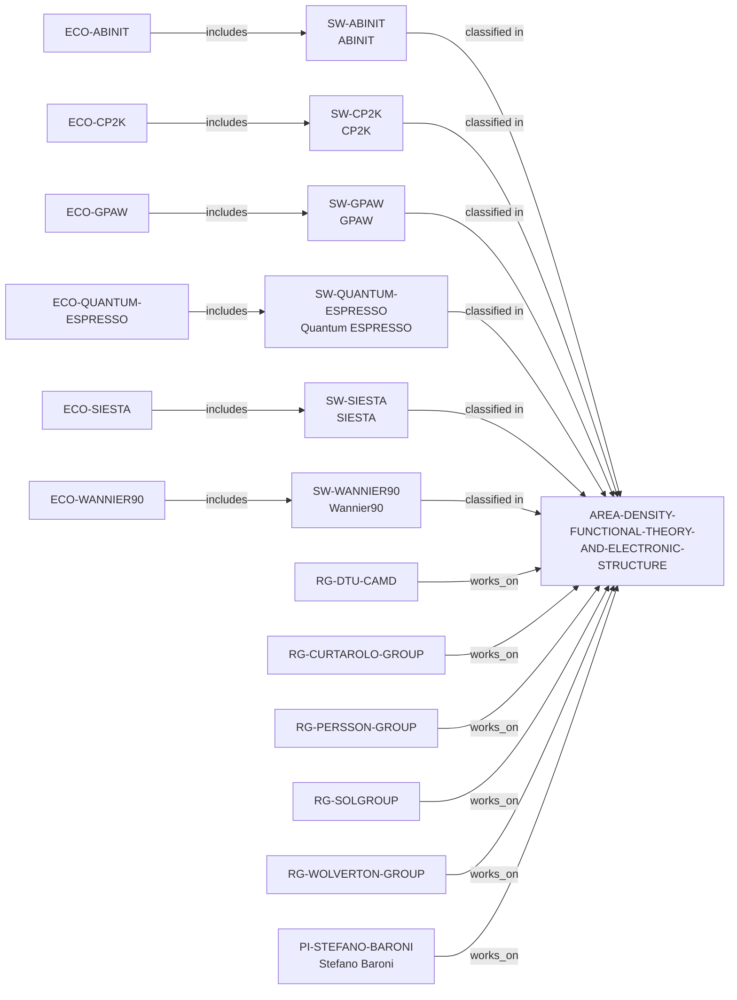

# Density-Functional Theory and Electronic Structure area

> **Status:** reviewed controlled-area increment, reviewed 2026-07-13.

## Purpose and scope

This increment adds the controlled `AREA-DENSITY-FUNCTIONAL-THEORY-AND-ELECTRONIC-STRUCTURE`
label to make a precise public discovery route across existing open
electronic-structure software ecosystems and directly documented research
groups and PIs. It classifies only ABINIT, CP2K, GPAW, Quantum ESPRESSO, SIESTA,
Wannier90, CAMD, Curtarolo Group, Persson Group, SOLgroup, Wolverton Research
Group, and Stefano Baroni because each record's own reviewed source explicitly
describes DFT or electronic-structure calculations in its documented scope.

## Canonical graph



## Evidence boundaries

| Software | Direct basis for classification | Boundary |
| --- | --- | --- |
| ABINIT | Official material describes DFT electronic-structure calculations for molecules and periodic solids. | No conclusion about every ABINIT utility, method, workflow, or result. |
| CP2K | Official repository describes DFT methods in its quantum-chemistry and solid-state atomistic-simulation package. | No claim that every CP2K method is a DFT or electronic-structure workflow. |
| GPAW | Official documentation describes a DFT Python code based on PAW and ASE. | No claim that every GPAW feature, configuration, or workflow has the same scope. |
| Quantum ESPRESSO | Official project material describes electronic-structure calculations based on DFT, plane waves, and pseudopotentials. | No claim that every module, interface, or user has the same scope. |
| SIESTA | Official source and reference material describe first-principles electronic-structure calculations using DFT. | No claim that every SIESTA component, extension, or workflow has the same scope. |
| Wannier90 | Official project material describes Wannier-function generation and electronic properties of materials. | No claim that every interface, related code, or workflow has the same scope. |

| Group | Direct basis for classification | Boundary |
| --- | --- | --- |
| CAMD | DTU describes development of electronic-structure methods and DFT uncertainty quantification. | No claim covers all CAMD projects or shared software. |
| Curtarolo Group | Group evidence describes autonomous DFT calculations and DFT research. | No individual AFLOW-maintenance or universal-method claim. |
| Persson Group | The group explicitly identifies DFT among its research methods. | No claim covers every project, member, or artifact. |
| SOLgroup | Group sources identify DFT/beyond-DFT code and DFT research. | No complete method, software, or individual-role claim. |
| Wolverton Group | Group research documentation describes DFT and high-throughput DFT. | No claim covers all OQMD work or members. |

| PI | Direct basis for classification | Boundary |
| --- | --- | --- |
| Stefano Baroni | His SISSA CV identifies density-functional theory among his scientific interests. | No claim covers every project, publication, course, or Quantum ESPRESSO contribution. |

## Deliberate omissions

- No university, organization, dataset, publication, or project is classified
  merely because it is adjacent to one of these software ecosystems, groups, or
  PIs. Direct-host universities are only surfaced through existing
  evidence-bearing group-host paths.
- No broader/narrower taxonomy relation is asserted between this controlled
  area and Computational Materials Science.
- The label does not measure method quality, accuracy, performance, project
  currency, support, ranking, or applicant fit.

## Discovery reachability

The public recommendation queries
`ecosystems-density-functional-theory-and-electronic-structure`,
`groups-density-functional-theory-and-electronic-structure`,
`principal-investigators-density-functional-theory-and-electronic-structure`,
and `universities-hosting-density-functional-theory-and-electronic-structure-groups`
expose exact source identifiers. The ecosystem query returns six
software-inclusion paths and the existing ASE–CAMD, Materials Project–Persson
Group, and OQMD–Wolverton Group paths; these are distinct relations, not a
claim of shared ownership. Software-first discovery is available through:

```bash
python3 scripts/research_landscape.py discover-software \
  --area AREA-DENSITY-FUNCTIONAL-THEORY-AND-ELECTRONIC-STRUCTURE \
  --open-source yes
```

Both commands are evidence discovery, not a claim that the results are
comparable, complete, technically superior, or suitable for a specific user.

The review record is in [Density-Functional Theory and Electronic Structure
area review](../reports/density-functional-theory-and-electronic-structure-area-review.md).
