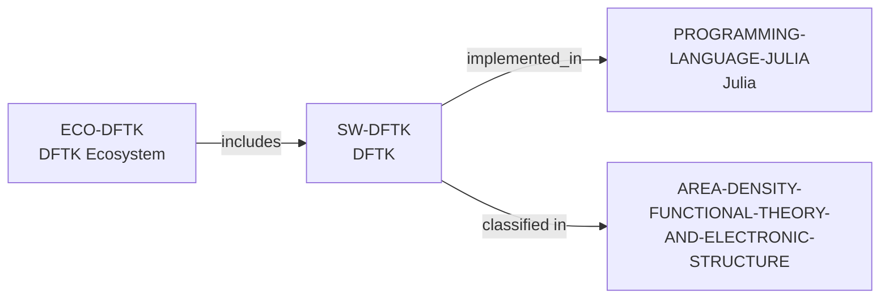

# DFTK and Julia ecosystem vertical slice

> **Status:** reviewed vertical slice, reviewed 2026-07-13.

This slice adds controlled Julia, DFTK software, and DFTK ecosystem records. It
establishes only MIT-licensed Julia plane-wave DFT scope, documented public
source and participation routes, and direct Computational Materials Science and
DFT/Electronic Structure classifications.

## Evidence boundaries

| Dimension | Canonical evidence | Boundary |
| --- | --- | --- |
| Software scope, language, and license | Official DFTK repository and documentation | No claim about performance, method completeness, or correctness. |
| Participation | Public issues, pull requests, tutorials, and developer setup | These routes do not promise access, review, response, support, or mentoring. |
| Language | Official Julia source and DFTK's explicit Julia description | An implementation path is not a person-skill or group-language claim. |

No contributor, maintainer, institution, funder, dependency, external
integration, lifecycle, support, quality, admissions, or applicant-fit edge is
inferred. The review record is in [DFTK and Julia ecosystem vertical slice review](../reports/dftk-julia-ecosystem-vertical-slice-review.md).
