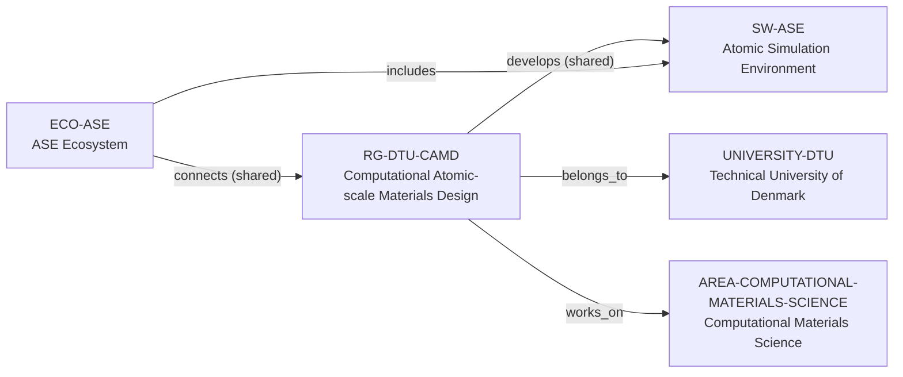

# DTU CAMD intelligence vertical slice

> **Status:** seventh reviewed Quality Gate 4 Research Group Intelligence slice, reviewed 2026-07-12.

## Purpose and scope

This Quality Gate 4 slice deepens the existing Computational Atomic-scale
Materials Design (CAMD) record without creating a duplicate section profile,
people registry, project catalog, or software catalog. It captures first-party
evidence for section research leadership, CAMPOS/ASE software context,
Python-interface/GPL information, technical programs, a sub-group project
route, and a tightly bounded funding statement.

CAMD’s public section page describes a bridge from fundamental atomic materials
description to applications and identifies four named sub-group leaders. The
software and research pages describe Python-interface CAMPOS programs, shared
ASE tools, open-source GPL licensing, electronic-structure methods, databases,
ML screening, global optimization, and DFT uncertainty. The documented VILLUM
grant applies to one named CAMD sub-group project, not to all CAMD work.

## Canonical graph

The slice creates no speculative people, software, project, funder,
collaborator, facility, or industry nodes. Existing canonical records retain
the graph; the group record gains evidence-bounded context only.

## QG4 coverage matrix

| Required group dimension | Canonical evidence in this slice | Boundary |
| --- | --- | --- |
| Research themes | CAMD describes atomic-scale materials design plus four public sub-group areas; reviewed subpages add methods, 2D/quantum materials, defects, energy materials, databases, ML, optimization, and uncertainty. | These are section/sub-group scope, not every member’s topic or a complete taxonomy. |
| Scientific software maturity | CAMPOS is a collection of atomic-scale programs with shared ASE tools; CAMD identifies ASE/GPAW development and open code/database links. | No lifecycle rating, individual maintenance roster, or exclusive ownership is inferred. |
| Programming stack | CAMPOS programs have Python interfaces. | This is a software-collection property, not a group-wide language policy; no programming-language identifier is inferred. |
| Software ecosystem participation | Existing shared CAMD → ASE development and ASE ecosystem connection remain canonical. | Other named codes/databases are not made into entities or relationships without separate review. |
| Open-source activity | DTU states CAMPOS programs are GNU GPL and invites participation in use/development. | No license or governance claim is generalized to every CAMD project or external tool. |
| Students, postdocs, and staff | CAMD publicly names four sub-group leaders. | The reviewed staff page does not yield a stable detailed roster; no headcount or bulk person entities are inferred. |
| Funding | A Computational Quantum Materials sub-group page identifies a VILLUM Foundation grant for a named project. | It is not a CAMD-wide funding ledger, award relationship, amount claim for the section, or proof of current capacity. |
| Infrastructure | Software, databases, computational methods, and projects are publicly described. | No dedicated hardware, allocation, access, availability, or support commitment is inferred. |
| Major projects | A named data-driven functional-2D-materials project and BSc/MSc project routes are public. | They do not establish a current opening, a canonical Project entity, eligibility, funding, or supervision capacity. |
| International and industry collaboration | The reviewed group pages do not establish a complete partner or industry inventory. | No collaboration graph is inferred. |
| Publication patterns | CAMD has a public publication route, but the reviewed static page does not furnish a bounded section-level publication record. | No publication count, quality, productivity, attribution, or causal metric is made. |
| Mentorship evidence | A sub-group page publicly offers BSc/MSc project routes. | This is a discovery route, not individual mentoring, supervision quality, admissions, or capacity evidence. |
| Career outcomes | No reviewed first-party CAMD source supplies alumni outcomes. | No placement rate, causal claim, typical outcome, or guarantee is inferred. |

## Evidence-bounded research environment

CAMD’s public material shows a broad software-centric computational environment
that spans method development, atomistic simulation, electronic structure,
databases, machine learning, global optimization, and uncertainty
quantification. CAMPOS makes the programming and open-source surface concrete:
its programs have Python interfaces, share ASE tools, use GPL licensing, and
invite community participation.

The section’s sub-group structure makes it important not to over-generalize.
The named VILLUM project, open-code links, and BSc/MSc routes are reliable
signals for a particular sub-group’s activity, not section-wide funding,
availability, or supervision commitments. The live DTU pages remain the source
for a current project or role decision.

## Deliberate omissions

- No individual member, alum, collaborator, funder, industry partner, project,
  facility, codebase, database, or workflow is created without separate identity
  and relationship evidence.
- No live opening, admission, compensation, funding, supervision capacity,
  language, or applicant-fit claim is made.
- No claim that CAMD exclusively develops, owns, governs, licenses, or maintains
  ASE, GPAW, CAMPOS, databases, or every named resource is inferred.
- No group-wide publication-quality, management, culture, mentoring-quality,
  collaboration, or career-outcome rating is calculated or implied.

## View reachability

No generated view output is added. The enriched group record supports these
future evidence-led traversals without copied facts:

| View family | Traversal |
| --- | --- |
| Research group | `RG-DTU-CAMD` → DTU host and computational-materials area. |
| Software ecosystem | CAMD → shared ASE development ← ASE ecosystem, with CAMPOS context in the group record. |
| Research and project diligence | Source-backed sub-group programs and project routes, with live availability explicitly excluded. |
| Funding diligence | One source-bounded VILLUM project statement, preserving its sub-group scope. |

The review and validation record is in [DTU CAMD intelligence vertical slice
review](../reports/dtu-camd-intelligence-vertical-slice-review.md).
