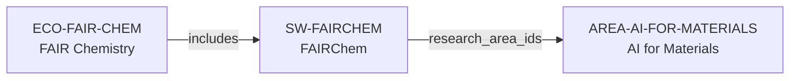

# FAIR Chemistry ecosystem-intelligence vertical slice

> **Status:** reviewed vertical slice, 2026-07-12.

## Purpose and scope

This slice adds one public AI-for-Materials ecosystem and its distinct software
artifact: FAIR Chemistry (`ECO-FAIR-CHEM`) and FAIRChem (`SW-FAIRCHEM`). It
uses the official documentation and central public repository to establish an
evidence-bounded route from the existing AI for Materials area to a documented
machine-learning software surface.

## Canonical graph

## Evidence and boundaries

| Dimension | Canonical evidence | Boundary |
| --- | --- | --- |
| Purpose | Official documentation presents machine-learning models for materials science and quantum chemistry, with materials and catalysis application surfaces. | It does not prove every model's suitability, benchmark result, or research outcome. |
| Software | The official central repository identifies `fairchem` as the software surface for data, models, demos, and applications. | No package/module, model, dataset, or checkpoint is separately modeled in this slice. |
| Open source | The repository states that `fairchem` is MIT licensed. | Model and checkpoint terms may vary; no blanket license is inferred. |
| AI-for-Materials relation | Documentation directly names ML models for materials science and related applications. | The relation does not claim every AI-for-Materials method or group uses FAIRChem. |
| Open Catalyst context | Documentation preserves legacy Open Catalyst model/dataset context. | No separate project, dataset, person, institution, or funder node is created without a dedicated slice. |

## Deliberate omissions

- No team-member, contributor, Meta/CMU, host, publication, model, dataset,
  benchmark, funding, or partner relation is inferred.
- No programming-language entity is created; ADR 0007 remains the prerequisite
  for controlled language discovery.
- No claim is made about model quality, support, access, review, employment,
  mentorship, openings, admissions, or personal fit.

## Reachability

The generated Research Areas view reaches FAIRChem from AI for Materials via
its canonical metadata. The generated Ecosystems and Research Software views
reach the same two records through the sourced `includes` relationship. These
are navigation paths, not an ecosystem ranking or a claim of completeness.
