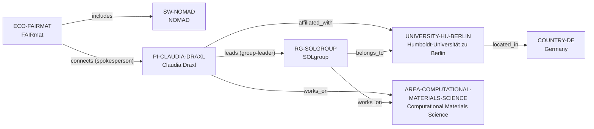

# FAIRmat–Draxl vertical slice

> **Status:** eighth reviewed vNext vertical slice, reviewed 2026-07-12.

## Purpose and scope

This bounded Quality Gate 1 slice resolves the Claudia Draxl anchor into a
current, evidence-first German graph. It adds Germany, Humboldt-Universität zu
Berlin, SOLgroup, Claudia Draxl, the NOMAD software artifact, and the FAIRmat
research-data infrastructure ecosystem.

The slice keeps the software-versus-ecosystem distinction explicit: NOMAD is
the reviewed software record, while FAIRmat is the federated infrastructure
ecosystem that publicly describes itself as developing the infrastructure for
the NOMAD Laboratory. FAIRmat’s current spokesperson relationship is recorded
from the ecosystem to Draxl; it is not inflated into exclusive ownership,
maintenance, or governance of NOMAD.

## Canonical graph

| Role | Canonical record | Scope |
| --- | --- | --- |
| Principal investigator | [`PI-CLAUDIA-DRAXL`](../entities/principal-investigators/claudia-draxl.md) | Current Humboldt-Universität zu Berlin affiliation, SOLgroup leadership, and computational-materials connection. |
| Research group | [`RG-SOLGROUP`](../entities/research-groups/solgroup.md) | The named Humboldt-Universität zu Berlin solid-state-theory group. |
| University | [`UNIVERSITY-HU-BERLIN`](../entities/universities/humboldt-university-berlin.md) | Direct University host for SOLgroup. |
| Country | [`COUNTRY-DE`](../entities/countries/germany.md) | Geographic endpoint for the University. |
| Research software | [`SW-NOMAD`](../entities/research-software/nomad.md) | The open research-data-management software artifact. |
| Research ecosystem | [`ECO-FAIRMAT`](../entities/ecosystems/fairmat.md) | A federated materials research-data infrastructure, distinct from NOMAD software. |
| Research area | [`AREA-COMPUTATIONAL-MATERIALS-SCIENCE`](../entities/research-areas/computational-materials-science.md) | Existing controlled area reused by the PI and group. |

## Contract and evidence checks

| Rule | Result in this slice |
| --- | --- |
| Accepted direct-host rule | `RG-SOLGROUP` has `institution_id: UNIVERSITY-HU-BERLIN`, no `organization_id`, and a matching evidence-bearing `belongs_to` assertion. |
| Software versus ecosystem | `SW-NOMAD` is a software artifact with repository/license evidence; `ECO-FAIRMAT` is a distinct research-data infrastructure ecosystem with a bounded `includes` relationship. |
| PI role direction | FAIRmat’s `connects → PI-CLAUDIA-DRAXL` assertion carries the current spokesperson role; the PI record does not duplicate a reverse relationship. |
| Evidence before inference | Reviewed records and assertions use record-local `SRC-*` keys resolved in their own Evidence tables. |
| Legacy preservation | The v1 Draxl dossier remains a dated applicant-oriented analysis and points to, but is not merged into, the canonical PI record. |

## Deliberate omissions

- No group-wide NOMAD development, maintenance, ownership, or governance claim
  is inferred from SOLgroup’s public research description.
- No FAIR-DI, NOMAD CoE, NOMAD HUB, funder, project, participant, or
  institution record is created merely from the documented organizational
  history.
- No claim is made that FAIRmat is the exclusive host, owner, funder, or
  developer of NOMAD.
- No claim is made about current openings, supervision capacity, mentoring,
  admissions, funding, language, ranking, or applicant fit.

## View reachability

No generated view output is added. The documented graph supports these future
traversals without copying profiles into views:

| View family | Traversal |
| --- | --- |
| Global | Reviewed `PI-CLAUDIA-DRAXL`, `RG-SOLGROUP`, `SW-NOMAD`, and `ECO-FAIRMAT` are available when a generator implements the declared query. |
| Country and University | `RG-SOLGROUP` → `UNIVERSITY-HU-BERLIN` → `COUNTRY-DE`. |
| Research area | PI or group → `works_on` → `AREA-COMPUTATIONAL-MATERIALS-SCIENCE`. |
| Software and ecosystem | `ECO-FAIRMAT` → `includes` → `SW-NOMAD`; `ECO-FAIRMAT` → `connects` → PI. |

The review and validation record is in
[FAIRmat–Draxl vertical slice review](../reports/fairmat-draxl-vertical-slice-review.md).
