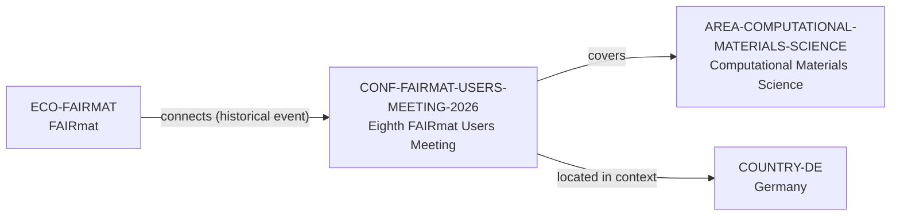

# FAIRmat Users Meeting vertical slice

> **Status:** fifth reviewed Quality Gate 2 vertical slice, reviewed 2026-07-12.

## Purpose and scope

This bounded Quality Gate 2 slice introduces the first canonical Conference
record: the completed Eighth FAIRmat Users Meeting. It links a time-bounded
FAIRmat community event to the existing FAIRmat ecosystem and Computational
Materials Science area, while retaining the event as a separate entity rather
than copying event detail into the ecosystem or software records.

The record does not represent a permanent conference series, a current event,
or an attendance, speaker, host, or career-outcome roster. Its only claims are
the completed June 2026 event identity, published scope, location context, and
the direct FAIRmat connection.

## Canonical graph

| Role | Canonical record | Scope |
| --- | --- | --- |
| Conference/event | [`CONF-FAIRMAT-USERS-MEETING-2026`](../entities/conferences/fairmat-users-meeting-2026.md) | Completed June 2026 users meeting in Berlin. |
| Research ecosystem | [`ECO-FAIRMAT`](../entities/ecosystems/fairmat.md) | Existing ecosystem with a cited historical event connection. |
| Research area | [`AREA-COMPUTATIONAL-MATERIALS-SCIENCE`](../entities/research-areas/computational-materials-science.md) | Existing controlled area reached through the event’s documented computational-workflow scope. |
| Country | [`COUNTRY-DE`](../entities/countries/germany.md) | Existing geographic context for the Berlin event. |

## Contract and evidence checks

| Rule | Result in this slice |
| --- | --- |
| Event identity | The record has an official event page, event kind, start date, country, city, and sources confirming it took place in June 2026. |
| Ecosystem relation | FAIRmat records the one-way `connects → CONF-FAIRMAT-USERS-MEETING-2026` assertion with an explicit historical-event limitation. |
| Area relation | The event records `covers → AREA-COMPUTATIONAL-MATERIALS-SCIENCE` from its stated NOMAD-supported experimental and computational workflow scope. |
| Location context | Germany and Berlin are event metadata only; no country hierarchy or institution-host relation is inferred. |
| Evidence before inference | Each record and assertion resolves record-local `SRC-*` keys in its own Evidence table. |

## Deliberate omissions

- No participant, attendee, speaker, organizer, host institution, individual
  talk, workshop, plugin, project, funder, publication, or programme record is
  created from the event schedule.
- No ongoing annual-series, future-event, current opportunity, mentorship,
  admissions, funding, language, ranking, or applicant-fit claim is made.
- No conclusion is made that every FAIRmat or NOMAD user attended or that every
  participant maintains software, belongs to a group, or shares an affiliation.
- No generic event calendar or manually maintained conference view is added.

## View reachability

No generated view output is added. The canonical graph supports these future
traversals without copying event details into views:

| View family | Traversal |
| --- | --- |
| Global | Reviewed `CONF-FAIRMAT-USERS-MEETING-2026` is eligible when a generator implements the declared query. |
| Conference | `CONF-FAIRMAT-USERS-MEETING-2026` owns its date, location, scope, and sources. |
| Research ecosystem | `ECO-FAIRMAT` → `connects` → the completed event. |
| Research area | Event → `covers` → `AREA-COMPUTATIONAL-MATERIALS-SCIENCE`. |
| Country | Event metadata `country_id: COUNTRY-DE` supports a country filter without copied event content. |

The review and validation record is in
[FAIRmat Users Meeting vertical slice review](../reports/fairmat-users-meeting-vertical-slice-review.md).
