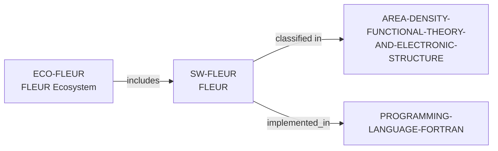

# FLEUR ecosystem vertical slice

> **Status:** reviewed Quality Gate 3 vertical slice, reviewed 2026-07-13.

FLEUR is recorded as distinct MIT-licensed Fortran software and an ecosystem
participation surface. Official project material supports only all-electron
DFT/electronic-structure scope, public source/build/test/documentation routes,
and a contribution invitation; it does not justify people, institution, funder,
or maintainer records.



The documented Git, build, automated-test, documentation, tutorial, forum, and
developer routes are learning/contribution surfaces—not promises of review,
acceptance, support, mentoring, membership, or access.

```bash
python3 scripts/research_landscape.py discover-software \
  --area AREA-DENSITY-FUNCTIONAL-THEORY-AND-ELECTRONIC-STRUCTURE \
  --language PROGRAMMING-LANGUAGE-FORTRAN \
  --ecosystem ECO-FLEUR --open-source yes
```

This is evidence discovery, not a quality or career recommendation. See the
[review](../reports/fleur-ecosystem-vertical-slice-review.md).
