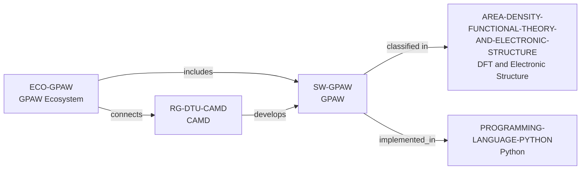

# GPAW ecosystem vertical slice

> **Status:** reviewed Quality Gate 3 vertical slice, reviewed 2026-07-13.

## Purpose and scope

This slice adds separate GPAW software and ecosystem records and extends the
existing CAMD development path to the documented GPAW code. It establishes only
the directly sourced DFT/PAW/ASE scope, GPL openness, Python implementation,
CAMD development context, and public installation/contribution surfaces.

## Canonical graph



## Evidence boundaries

| Dimension | Canonical evidence | Boundary |
| --- | --- | --- |
| Software scope | GPAW documentation identifies a DFT Python code based on PAW and ASE. | No conclusion is made about performance, suitability, or every GPAW method. |
| Openness and delivery | The public license and installation documentation provide GPL and source/release routes. | Public code does not promise support, availability, or a particular environment. |
| CAMD connection | DTU CAMD explicitly identifies GPAW development as group work. | The relation is neither exclusive ownership nor a person-level maintenance claim. |
| Contribution surface | GPAW documents development setup, tests, merge requests, CI, issue, mailing-list, and chat routes. | Those routes do not promise membership, acceptance, review, response, mentoring, or access. |

## Deliberate omissions

- No developer, maintainer, reviewer, institution, funder, package,
  subproject, dependency, benchmark, event, or user is modeled without a
  separately reviewed identity and relationship.
- The code's documented dependence on ASE remains prose context: the frozen
  predicate set has no safe software-dependency edge.
- No claim is made about quality, activity, scaling, correctness, support,
  openings, mentorship, admissions, or applicant fit.

## View reachability

The public software and ecosystem views expose the canonical records. This
interactive query requires four independently documented facts and returns
GPAW with each matching source path:

```bash
python3 scripts/research_landscape.py discover-software \
  --area AREA-DENSITY-FUNCTIONAL-THEORY-AND-ELECTRONIC-STRUCTURE \
  --language PROGRAMMING-LANGUAGE-PYTHON \
  --ecosystem ECO-GPAW \
  --open-source yes
```

This is evidence discovery, not a language-based suitability, quality, or
career recommendation.

The review record is in [GPAW ecosystem vertical slice
review](../reports/gpaw-ecosystem-vertical-slice-review.md).
