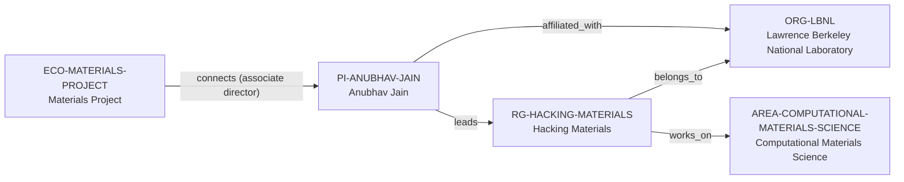

# Hacking Materials intelligence vertical slice

> **Status:** fourth reviewed Quality Gate 4 Research Group Intelligence slice, reviewed 2026-07-12.

## Purpose and scope

This Quality Gate 4 slice deepens the existing Hacking Materials record without
creating a parallel lab profile, people registry, project catalog, or career
ranking. It captures first-party evidence for research themes, community
software work, collaboration modality, public role categories, research-process
material, documented computing context, a software-specific funding statement,
and bounded participation information.

The current group page frames the research environment around theory,
high-performance computing, AI, open community data/software infrastructure,
and translation of computational hypotheses with experimental and autonomous
labs. It names Materials Project, FORUM-AI, data-driven synthesis, DuraMAT, and
open-source workflow/crystal-structure tools as research areas. This establishes
stated group scope, not ownership, governance, a complete collaborator network,
or a new project/software entity for each label.

## Canonical graph

The slice creates no speculative people, alumni, project, software, funder,
collaborator, facility, or industry nodes. Existing canonical records retain
the factual graph; the group record gains evidence-bounded context only.

## QG4 coverage matrix

| Required group dimension | Canonical evidence in this slice | Boundary |
| --- | --- | --- |
| Research themes | The group states energy-relevant materials research through theory, HPC, AI, data/software infrastructure, data-driven synthesis, and durability analytics. | These are stated group areas, not a complete topic taxonomy or every member’s work. |
| Scientific software maturity | The site describes community data/software infrastructure and open-source workflow/crystal-structure tooling; AMSET documentation identifies group-led development. | This does not establish a lifecycle rating, governance model, uptime, or every member’s software role. |
| Programming stack | Group materials reference AI, literature/database mining, and Python tooling only within cited workflow examples. | No reliable group-wide language policy or programming-language identifier is inferred. |
| Software ecosystem participation | The existing PI-level Materials Project connection remains the canonical relationship; the group site names Materials Project among its research areas. | Jain’s PI role is not promoted to group-wide governance, maintenance, or ownership. |
| Open-source activity | The group identifies open-source workflow/crystal-structure tools and describes FORUM-AI as open source; AMSET has a public contributor/development page. | No claim covers all group outputs, licenses, review process, or contributor rights. |
| Students, postdocs, and staff | The current group page publicly labels PI, postdoctoral, PhD-candidate, undergraduate, and alumni categories. | It is not a complete employment ledger, headcount, or basis for bulk person entities. |
| Funding | AMSET documentation names a DOE Early Career funding context for AMSET; the group page describes external participation/funding routes. | No group-wide grant ledger, active award, amount, or funding-program edge is inferred. |
| Infrastructure | The public handbook identifies NERSC, NREL Eagle, and Lawrencium as the group’s main computing resources and describes coordination/access context. | The handbook reports it was last updated two years ago, so no current allocation, capacity, availability, or access guarantee is made. |
| Major projects | Materials Project, FORUM-AI, data-driven synthesis, DuraMAT, and AMSET appear in first-party material. | A named area or software mention does not automatically justify a new Project or Software record. |
| International and experimental collaboration | The group says it collaborates with experimental and autonomous labs; AMSET documentation lists external contributors. | No complete collaborator, institution, international, industry, or partner graph is claimed. |
| Publication patterns | The group routes readers to external publication profiles and publishes recent research updates. | No internal publication inventory, count, quality score, or productivity measure is made. |
| Mentorship evidence | The linked handbook documents onboarding, communication, graduate-study guidance, presentation/writing practices, and a paper-development process. | It is process material, not a measured mentoring outcome, universal practice, current guarantee, or supervision-capacity claim. |
| Career outcomes | The public site has an alumni section and publishes a dated student achievement/update. | It provides no placement-rate, causal, typical-outcome, or outcome-guarantee evidence. |

## Evidence-bounded research environment

This group’s current public material connects technical research with a visible
open-science and translation surface: data and software infrastructure,
high-throughput workflows, experimental/autonomous-lab collaboration, and
public-facing software documentation. The public team and alumni sections make
role categories discoverable without converting people into canonical records.

Its public handbook is unusually useful for diligence because it records
onboarding, communication channels, graduate-study advice, paper-development
guidance, computing systems, and resource coordination. Since the handbook says
it was last updated two years ago, its contents remain explicitly time-bounded.
They are evidence of documented process, not proof that an individual will
receive a specific resource, supervisory approach, career outcome, or current
opening. The live group page is the authoritative route for any opportunity
question on the day it is asked.

## Deliberate omissions

- No individual member, alum, collaborator, funder, industry partner, project,
  facility, software package, or workflow is created without separate identity
  and relationship evidence.
- No live opening, eligibility decision, admission, compensation, funding,
  supervision capacity, language, or applicant-fit claim is made.
- No group-wide Materials Project, FORUM-AI, DuraMAT, AMSET, or other software
  ownership, governance, maintenance, license, or individual-contributor claim
  is inferred from the listed research areas or documentation.
- No group-wide mentoring-quality, publication-quality, management, culture,
  collaboration, or career-outcome rating is calculated or implied.

## View reachability

No generated view output is added. The enriched group record supports these
future evidence-led traversals without copied facts:

| View family | Traversal |
| --- | --- |
| Research group | `RG-HACKING-MATERIALS` → Berkeley Lab host, computational-materials area, and PI leader. |
| Ecosystem diligence | Existing PI-level Materials Project connection plus group-level public software and data-infrastructure context. |
| People and process | Existing PI leadership plus source-backed public role categories and documented, time-bounded process material. |
| Infrastructure and opportunity diligence | Handbook-based computing context and live-site participation routes, each preserving access and time limitations. |

The review and validation record is in [Hacking Materials intelligence vertical
slice review](../reports/hacking-materials-intelligence-vertical-slice-review.md).
