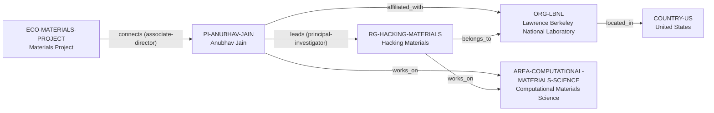

# Hacking Materials–Berkeley Lab vertical slice

> **Status:** sixth reviewed vNext vertical slice, reviewed 2026-07-12.

## Purpose and scope

This bounded Quality Gate 1 slice resolves the existing Anubhav Jain anchor
into a canonical Berkeley Lab chain. It introduces the named Hacking Materials
research group and its PI record, reusing the existing Berkeley Lab,
United States, Computational Materials Science, and Materials Project records.

The current group page supports the group’s identity, Berkeley Lab context,
leadership, and stated theory/HPC/AI methods. Berkeley Lab's faculty profile
separately supports Jain's Materials Project associate-director role. Those
facts are represented as group and PI relationships without treating every
listed research theme as a software, project, funding-programme, or ownership
claim.

## Canonical graph

| Role | Canonical record | Scope |
| --- | --- | --- |
| Research ecosystem | [`ECO-MATERIALS-PROJECT`](../entities/ecosystems/materials-project.md) | Existing ecosystem, extended only with Jain’s official associate-director connection. |
| Principal investigator | [`PI-ANUBHAV-JAIN`](../entities/principal-investigators/anubhav-jain.md) | Berkeley Lab affiliation, Hacking Materials leadership, and computational-materials research. |
| Research group | [`RG-HACKING-MATERIALS`](../entities/research-groups/hacking-materials.md) | The named Berkeley Lab-hosted group. |
| Organization | [`ORG-LBNL`](../entities/organizations/lawrence-berkeley-national-laboratory.md) | Existing non-university direct host. |
| Country | [`COUNTRY-US`](../entities/countries/united-states.md) | Existing geographic endpoint. |
| Research area | [`AREA-COMPUTATIONAL-MATERIALS-SCIENCE`](../entities/research-areas/computational-materials-science.md) | Existing controlled area reused for the group’s stated field. |

## Contract and evidence checks

| Rule | Result in this slice |
| --- | --- |
| Accepted direct-host rule | `RG-HACKING-MATERIALS` has `organization_id: ORG-LBNL`, no `institution_id`, and a matching evidence-bearing `belongs_to` assertion. |
| PI versus group evidence | Jain’s individual Materials Project associate-director connection is a PI-to-ecosystem relation; it is not inferred as a group-wide governance or maintenance role. |
| Evidence before inference | Reviewed records and assertions use record-local `SRC-*` keys resolved in their own Evidence tables. |
| Existing identity reuse | LBNL, United States, Computational Materials Science, and Materials Project are reused rather than duplicated. |
| Legacy preservation | The v1 anchor dossier remains a dated applicant-oriented analysis and links to, but is not merged into, the canonical PI record. |

## Deliberate omissions

- No FORUM-AI project, funding-programme, participant, or governance record is
  created from its mention on the profile.
- No group-wide Materials Project, software development, maintenance, or
  ownership relation is inferred from Jain’s individual associate-director role.
- No separate record is created for each stated research theme, application,
  database, or prospective collaboration.
- No claim is made about current openings, supervision capacity, mentoring,
  admissions, funding, language, ranking, or applicant fit.

## View reachability

No generated view output is added. The documented graph supports these future
traversals without copying profiles into views:

| View family | Traversal |
| --- | --- |
| Global | Reviewed `PI-ANUBHAV-JAIN` and `RG-HACKING-MATERIALS` are available when a generator implements the declared query. |
| Country | `RG-HACKING-MATERIALS` → `ORG-LBNL` → `COUNTRY-US`. |
| Research area | PI or group → `works_on` → `AREA-COMPUTATIONAL-MATERIALS-SCIENCE`. |
| Ecosystem | `ECO-MATERIALS-PROJECT` → `connects` → `PI-ANUBHAV-JAIN` with the bounded associate-director role. |

The review and validation record is in
[Hacking Materials–Berkeley Lab vertical slice review](../reports/hacking-materials-vertical-slice-review.md).
