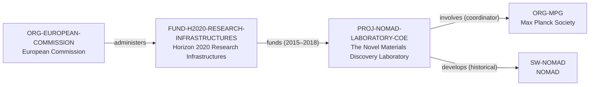

# Horizon 2020–NoMaD funding vertical slice

> **Status:** fourth reviewed Quality Gate 2 vertical slice, reviewed 2026-07-12.

## Purpose and scope

This bounded Quality Gate 2 slice completes an evidence-backed funding path for
the existing completed NoMaD Laboratory project. It adds the European Commission
and the Horizon 2020 — Research Infrastructures funding-program record, then
records the dated programme-to-project award relation shown by CORDIS.

The scope is historical. Horizon 2020 ended in 2020 and the NoMaD Laboratory
project ended in 2018; neither record is used to imply a current call, current
NOMAD funding, an individual award decision, or a complete EU funding graph.

## Canonical graph

| Role | Canonical record | Scope |
| --- | --- | --- |
| Funder organization | [`ORG-EUROPEAN-COMMISSION`](../entities/organizations/european-commission.md) | European Commission programme-administration context. |
| Funding programme | [`FUND-H2020-RESEARCH-INFRASTRUCTURES`](../entities/funding/horizon-2020-research-infrastructures.md) | Historical Horizon 2020 research-infrastructure funding context for the specific project. |
| Project | [`PROJ-NOMAD-LABORATORY-COE`](../entities/projects/nomad-laboratory-coe.md) | Existing completed 2015–2018 NoMaD Laboratory project. |
| Coordinating organization | [`ORG-MPG`](../entities/organizations/max-planck-society.md) | Existing project coordinator, not a proxy for all project partners. |
| Research software | [`SW-NOMAD`](../entities/research-software/nomad.md) | Existing software record with the separately bounded project-development connection. |

## Contract and evidence checks

| Rule | Result in this slice |
| --- | --- |
| Funder identity | `ORG-EUROPEAN-COMMISSION` is a distinct Organization record, not a country or stand-in for every EU body. |
| Funding-program identity | `FUND-H2020-RESEARCH-INFRASTRUCTURES` has a funder endpoint, official programme website, and explicit historic period. |
| Funding assertion | The programme records the canonical `funds → PROJ-NOMAD-LABORATORY-COE` assertion with CORDIS evidence and project dates. |
| One-way storage | The project uses `funding_program_ids` for its normalized endpoint but does not duplicate an inverse `funds` assertion. |
| Scope discipline | The historical award is not used to infer present funding, a current call, or a full EU project portfolio. |

## Deliberate omissions

- No European country, EU institution, executive agency, grant agreement,
  call, budget, award amount, beneficiary, or programme-wide project roster is
  created beyond the documented entities required for this relation.
- No claim is made that the European Commission directly administered every
  award action or that any specific current team received the funding.
- No current funding, project availability, opening, mentoring, admissions,
  language, ranking, or applicant-fit claim is made.
- No relationship is inferred from shared Horizon branding or broad topical
  similarity alone.

## View reachability

No generated view output is added. The canonical graph supports these future
traversals without copying funding details into views:

| View family | Traversal |
| --- | --- |
| Global | Reviewed Commission and Horizon 2020 funding-program records are eligible when a generator implements the declared query. |
| Funding | `ORG-EUROPEAN-COMMISSION` → `administers` → `FUND-H2020-RESEARCH-INFRASTRUCTURES` → `funds` → `PROJ-NOMAD-LABORATORY-COE`. |
| Project | `PROJ-NOMAD-LABORATORY-COE.funding_program_ids` resolves the historic programme endpoint. |
| Research software | Funding programme → project → historical `develops` → `SW-NOMAD`, without inferring current maintenance or financial support. |

The review and validation record is in
[Horizon 2020–NoMaD funding vertical slice review](../reports/horizon-2020-nomad-funding-vertical-slice-review.md).
