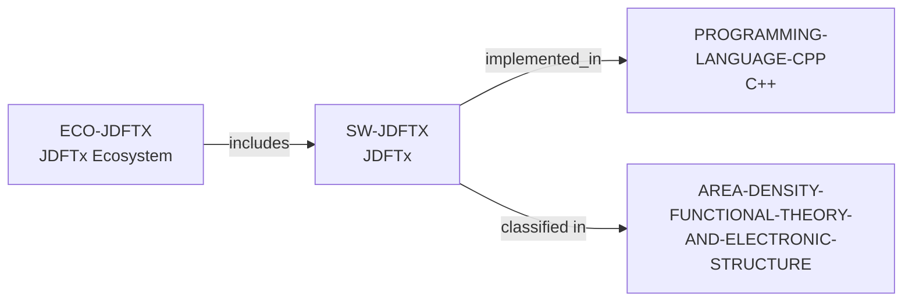

# JDFTx ecosystem vertical slice

> **Status:** reviewed vertical slice, reviewed 2026-07-13.

This slice adds separate JDFTx software and ecosystem records. It reuses the
controlled C++, Computational Materials Science, and DFT/Electronic Structure
records, establishing only GPL-3.0-or-later plane-wave DFT scope, C++11
implementation, and public documentation, developer, and issue routes.

Public routes do not establish contributor or maintainer roles, acceptance,
review, response, support, mentoring, funding, admissions, or applicant fit.
No performance, method-completeness, external-interface, dependency, or
complete-community claim is inferred.

The review record is in [JDFTx ecosystem vertical slice review](../reports/jdftx-ecosystem-vertical-slice-review.md).
