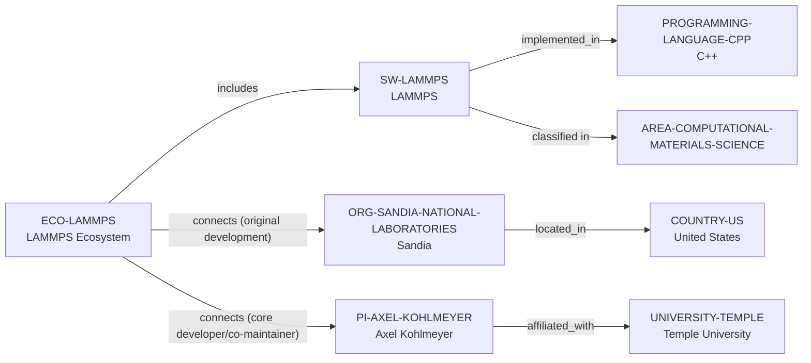

# LAMMPS ecosystem-intelligence vertical slice

> **Status:** reviewed Quality Gate 3 vertical slice, reviewed 2026-07-12.

## Purpose and scope

This slice converts the LAMMPS discovery trail into a bounded canonical
software–ecosystem–Organization path. It adds LAMMPS as a GPLv2 classical
molecular-dynamics software record, the separately modeled LAMMPS ecosystem,
and Sandia National Laboratories as its documented original-development
institution and country endpoint.

## Canonical graph

## QG3 coverage matrix

| Required ecosystem dimension | Canonical evidence in this slice | Boundary |
| --- | --- | --- |
| Purpose and scientific scope | Official documentation describes a classical molecular-dynamics code focused on materials modelling, parallel computation, and extensibility. | No universal capability, performance, or application claim is made. |
| Software and license | The official documentation and public repository identify GPLv2 distribution. | No claim covers every package, potential, interface, release, or derivative. |
| Implementation language | The public repository identifies C++ as its primary language and official developer documentation covers C++ base classes. | This is a software-implementation path, not a group-wide language or individual-skill claim. |
| Institutional context | Official LAMMPS sources identify original Sandia development; Sandia's public page gives its institutional and location context. | This does not establish exclusive current ownership, governance, funding, or staffing. |
| Academic research-leader context | The separately reviewed Temple–Kohlmeyer extension supplies current research-faculty, Computational Materials Science, and core-developer/co-maintainer paths. | It does not establish a complete developer roster, student supervision, openings, or support commitment. |
| Contribution and learning path | Project documentation covers GitHub, pull requests, tests, documentation, review, contribution requirements, and forums. | Public routes do not promise acceptance, review, support, access, mentoring, or career outcomes. |

## Deliberate omissions

- No additional PI, developer, maintainer, contributor, group, package,
  potential, plugin, dependency, interface, publication, funding, event, or
  partner entity is created without a separately reviewed canonical identity
  and relation.
- Sandia's historical origin is not converted into an exclusive current owner,
  host, funder, or employer claim.
- No ranking, opening, supervision, mentoring, admissions, funding, or
  applicant-fit conclusion is made.

## View reachability

The deterministic generator exposes the slice through Global, Research
Software, Research Ecosystem, Research Area, Country, and Organization views.
`discover-software --area AREA-COMPUTATIONAL-MATERIALS-SCIENCE --language
PROGRAMMING-LANGUAGE-CPP` and `discover-ecosystems --software SW-LAMMPS`
return only the documented evidence paths.

The review records are in [LAMMPS ecosystem-intelligence vertical slice
review](../reports/lammps-ecosystem-intelligence-vertical-slice-review.md) and
[Temple–Kohlmeyer–LAMMPS vertical slice review](../reports/temple-kohlmeyer-lammps-vertical-slice-review.md).
