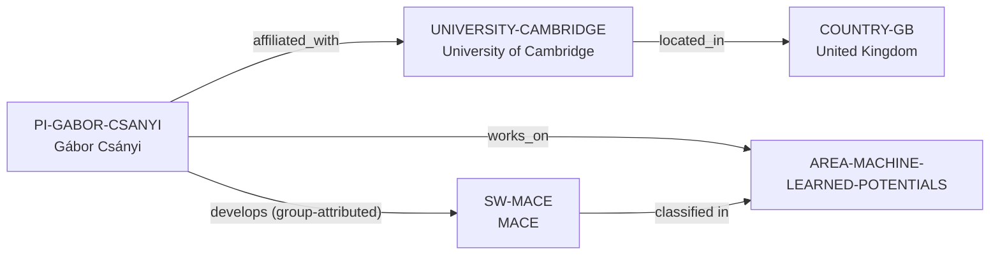

# MACE and University of Cambridge vertical slice

> **Status:** reviewed vertical slice, 2026-07-12.

## Purpose and scope

This slice adds MACE as a canonical open-source machine-learning-interatomic-
potential software record, plus the narrowly supported University of Cambridge,
United Kingdom, and Gábor Csányi context. It records a public
group-attributed MACE development relationship without inventing a separate
lab identity or an individual-maintainer claim.

## Canonical graph

## Evidence and boundaries

| Dimension | Canonical evidence | Boundary |
| --- | --- | --- |
| PI affiliation and topic | Cambridge's public profile identifies Csányi as a Professor of Molecular Modelling and describes ML interatomic-potential work. | It does not establish availability, supervision capacity, or every research activity. |
| University and country | Cambridge's public contact page locates the University in Cambridge, United Kingdom; ISO supplies `GB`. | Geography is a filter, not a quality or mobility conclusion. |
| Research software | MACE’s project-owned repository and documentation describe ML interatomic potentials and the MIT-licensed code. | No performance, complete-model, support, or contributor-roster claim is made. |
| Development relation | The repository credits the group of Gábor Csányi and named contributors for the reference implementation. | The relation is group-attributed; it is not an individual coding, maintenance, governance, or release-role assertion. |

## Deliberate omissions

- No separate research-group, department, ecosystem, model, dataset, funding,
  collaborator, publication, or contributor entity is created without a
  separately reviewed canonical identity and relation.
- No current opening, admission, funding, mentoring, language, or applicant-fit
  claim is made.
- No model-performance, software-quality, university-strength, or PI ranking is
  calculated or implied.
