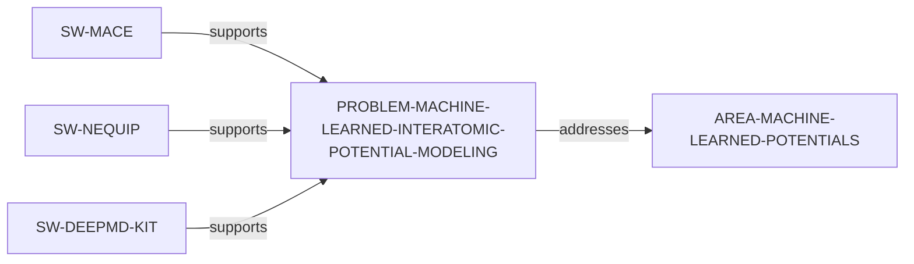

# Machine-Learned Interatomic Potential Modeling problem slice

> **Status:** reviewed evidence-bounded increment, reviewed 2026-07-13.

`PROBLEM-MACHINE-LEARNED-INTERATOMIC-POTENTIAL-MODELING` makes a bounded
atomistic modeling challenge discoverable: constructing and using
machine-learned interatomic-potential models. Official documentation provides
three separate direct software-support paths; it does not establish that the
tools, architectures, datasets, or training procedures are comparable or best.

Run `python3 scripts/research_landscape.py discover-problems` to inspect these
source-identified paths. It is a catalog, not a ranking of importance,
novelty, tractability, methods, software, or researcher fit. The review record
is in the [Machine-Learned Interatomic Potential Modeling problem review](../reports/machine-learned-interatomic-potential-problem-vertical-slice-review.md).
