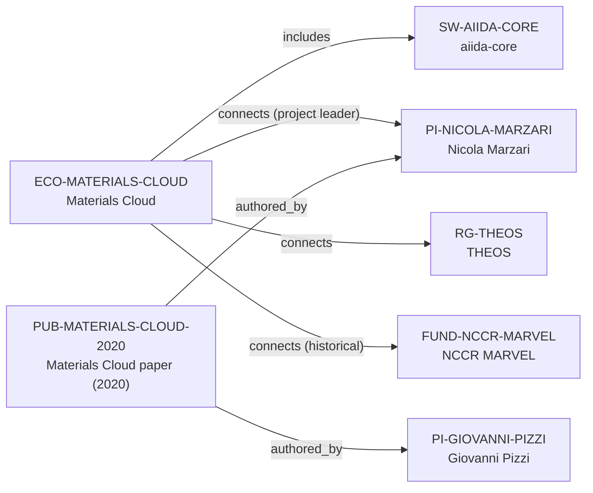

# Materials Cloud ecosystem-intelligence vertical slice

> **Status:** reviewed Quality Gate 3 vertical slice, reviewed 2026-07-12.

## Purpose and scope

This Quality Gate 3 slice deepens the existing Materials Cloud–AiiDA–THEOS–NCCR
MARVEL canonical cluster rather than creating a parallel profile. It adds the
2020 Materials Cloud platform publication and enriches the current ecosystem
record with a research-cycle user journey, moderated data-deposition workflow,
Archive architecture context, and clear historical funding boundary.

The graph remains intentionally sparse. First-party sources support Materials
Cloud's Learn/Work/Discover/Explore/Archive journey, AiiDA-powered provenance
context, public Archive submission and DOI publication, current archive
implementation context, the existing THEOS and project-leader connections, and
the existing historical NCCR MARVEL relation. They do not justify an exhaustive
maintainer, moderator, application, partner, component, dependency, or current
funding graph.

## Canonical graph

## QG3 coverage matrix

| Required ecosystem dimension | Canonical evidence in this slice | Boundary |
| --- | --- | --- |
| Purpose and scientific scope | Materials Cloud describes open computational-materials sharing, data, tools, simulations, education, and provenance-aware dissemination. | This does not establish every hosted resource, domain, scientific result, or user outcome. |
| Architecture | Current Archive documentation describes InvenioRDM, metadata/search/storage services, and archival processes; the 2020 paper documents the broader modular platform design. | These are platform-context descriptions, not new component, deployment, security, or dependency nodes. |
| Programming language | The 2020 paper and Archive page describe technical implementation context. | No `programming_language_ids` value is added: the vNext Language entity contract is absent. |
| Maintainers and core contributors | Existing project-leader, THEOS contribution, AiiDA, and publication-author links stay evidence-bounded. | Archive moderation, paper authorship, and platform association do not establish a complete current maintainer/contributor/governance roster. |
| Institutions and groups | Existing Nicola Marzari, THEOS, EPFL/PSI, AiiDA, and historical NCCR MARVEL records remain separately evidenced. | THEOS is not made the sole host, owner, maintainer, or operator. |
| Key publication | `PUB-MATERIALS-CLOUD-2020` has date, DOI, and reviewed Nicola Marzari/Giovanni Pizzi author relations. | `describes` cannot target a Research Ecosystem, so the platform subject remains evidence-backed prose. |
| Funding | `ECO-MATERIALS-CLOUD → connects → FUND-NCCR-MARVEL` remains a historical 2021 development-context relation. | The NCCR phase ended in April 2026; no current funding or programme eligibility is inferred. |
| Contribution workflow | Archive instructions document registration, data/metadata upload, moderation, DOI activation, and record updates. | This contributor path is record deposition, not a public source-code, review-right, employment, or mentoring pathway. |
| Community and user journey | The public site supports Learn, Work, Discover, Explore, Archive; the Archive adds upload, search, DOI citation, and versioning routes. | No response time, upload acceptance, account availability, or current community-size guarantee is inferred. |
| Career relevance | Canonical sources expose learning surfaces in reproducible computational research, data curation, metadata, DOI publication, AiiDA provenance, browser-facing workflows, and moderated open-science practice. | No employment, admission, contributor-status, supervision, or outcome recommendation is claimed. |
| Dependencies and related ecosystems | Existing `includes → SW-AIIDA-CORE` plus cross-referenced Archive integration context preserves the key relationship. | The frozen schema lacks safe dependency/community entity types and an ecosystem-to-ecosystem predicate, so no speculative edge to AiiDAlab, Archive technologies, or external integrations is added. |

## Typical user journey

The documented upstream path is: learn through training materials; run or access
simulation services; browse, explore, and download data; then register to submit
computational-materials research data and metadata to the moderated Archive.
After review and publication, records receive persistent DOI-based access and
can be updated or versioned according to the Archive rules. This is a source-
backed platform journey, not a guarantee that a submission will be accepted or
that every user will have access to every hosted service.

## Deliberate omissions

- No Programming Language, Community, Archive component, moderator, hosted
  application, API endpoint, dependency, database, workflow, package, external
  contributor, or detailed Maintainer node is created without a canonical entity
  and relationship contract.
- No complete author list, current maintainer/moderator roster, contributor
  list, code-review role, partner list, or employment claim is inferred from a
  paper, Archive page, or deposit workflow.
- No current NCCR MARVEL funding, award amount, opening, mentoring, admissions,
  language, ranking, or applicant-fit conclusion is made.
- No generated view, recommendation, or manual ecosystem ranking is added.

## View reachability

No generated view output is added. The enriched canonical graph supports these
future traversals without copied facts:

| View family | Traversal |
| --- | --- |
| Research ecosystem | `ECO-MATERIALS-CLOUD` → `includes` → `SW-AIIDA-CORE`; → `connects` → THEOS, PI, and historical funding context. |
| Research software | `SW-AIIDA-CORE` ← `includes` ← Materials Cloud; existing group development routes remain separate. |
| Funding | Materials Cloud → `connects` → NCCR MARVEL with the existing dated/historical limitation. |
| Publication | `PUB-MATERIALS-CLOUD-2020` → `authored_by` → Nicola Marzari and Giovanni Pizzi; its ecosystem subject remains evidence-backed prose due to predicate limits. |
| Country and University | Existing group-host and PI-affiliation routes remain derivable without duplicating records. |

The review and validation record is in [Materials Cloud ecosystem-intelligence
vertical slice review](../reports/materials-cloud-ecosystem-intelligence-vertical-slice-review.md).
