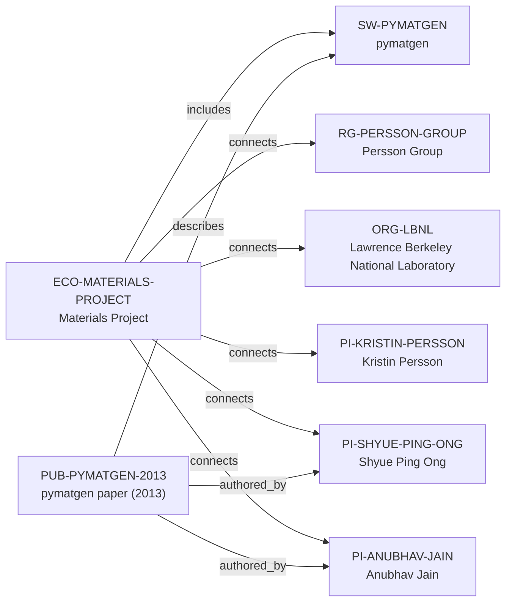

# Materials Project ecosystem-intelligence vertical slice

> **Status:** reviewed Quality Gate 3 vertical slice, reviewed 2026-07-12.

## Purpose and scope

This Quality Gate 3 slice deepens the existing Materials Project and pymatgen
canonical cluster rather than creating a parallel profile. It adds the key 2013
pymatgen publication and enriches the existing canonical ecosystem and software
records with a source-backed platform architecture, API user path, and public
contribution context.

The result remains deliberately sparse. The reviewed sources support Materials
Project's public data-discovery purpose, a high-throughput workflow-to-data-to-
API architecture, pymatgen's role as a distinct library, a public contribution
route, the existing LBNL/Persson context, and two already reviewed authors of a
key technical paper. They do not support an exhaustive current contributor,
maintainer, funder, dependency, or partner graph.

## Canonical graph

## QG3 coverage matrix

| Required ecosystem dimension | Canonical evidence in this slice | Boundary |
| --- | --- | --- |
| Purpose and scientific scope | Materials Project documentation describes a DOE-origin effort to pre-compute material properties and make public data available to accelerate discovery. | This does not establish all applications, all data, or every current service. |
| Architecture | Documentation describes automated `atomate` workflows, pymatgen input sets, parsed task data, MongoDB collections, builders, `emmet` models, and API routes. | These are documented platform components, not newly modeled entities or a deployment/governance claim. |
| Programming language | The documented API client and pymatgen sources identify Python. | No `programming_language_ids` value is added: the vNext Language entity contract remains absent. |
| Maintainers and core contributors | Existing records hold evidence-bounded founder/director, core-contributor, associate-director, and pymatgen lead-developer facts. | The public documentation and repository are not an exhaustive current maintainer or contributor roster. |
| Institutions and groups | Existing, separately reviewed LBNL and Persson Group connections remain canonical. | LBNL is not made the exclusive owner; the cluster is not a complete collaborator inventory. |
| Key publication | `PUB-PYMATGEN-2013` has date, DOI, software description, and two reviewed author relations. | Other paper authors are not created simply to fill an author list. |
| Funding | The platform documentation calls the effort DOE-origin. | No funding edge is added: a reviewed funding-programme identity plus direct award evidence is absent, so neither current nor historical funding is inferred. |
| GitHub and contribution workflow | `SW-PYMATGEN.repository_url`, project site, and repository expose installation/examples, issues, pull requests, forum questions, and discussions. | Public contribution channels do not promise review, acceptance, mentoring, or contributor status. |
| Community and user journey | Documentation supports a path from an account/API key and `mp-api` client to `MPRester`, summary/property queries, and endpoint-specific data; pymatgen adds installable materials analysis and examples. | Account/API-key requirements, endpoints, and current data products can change upstream. |
| Career relevance | Canonical sources expose reproducible learning surfaces in Python, API querying, materials-data analysis, public issue/PR workflows, and documentation improvement. | No employment, admission, contributor-status, or outcome recommendation is claimed. |
| Dependencies and related ecosystems | The Materials Project–pymatgen relationship is a reviewed `includes` assertion; the automation-to-builders-to-API stack is documented in prose. | The frozen schema lacks safe dependency/community entity types and an ecosystem-to-ecosystem predicate, so no speculative dependency or related-ecosystem edge is added. |

## Typical user journey

The documented upstream path is: create an account and obtain an API key; install
the `mp-api` Python client; initialise `MPRester`; search summary or specialized
endpoints by Materials Project ID or property criteria; then use pymatgen for
materials-data representations and analysis. A prospective contributor can use
the public documentation's GitHub edit path or pymatgen's issue, pull-request,
forum, and discussion routes. This is a source-backed product journey, not an
assertion that every user has access to every endpoint or that every proposed
contribution will be accepted.

## Deliberate omissions

- No Programming Language, Community, dependency, API endpoint, database,
  workflow, package, external contributor, or detailed Maintainer node is
  created without the required canonical entity and relationship contract.
- No exhaustive author list, current Materials Project or pymatgen maintainer
  roster, contributor list, code-review role, or employment claim is inferred
  from a paper, repository, or public contribution channel.
- No DOE funding programme, award amount, current funding, opening, mentoring,
  admissions, language, ranking, or applicant-fit conclusion is made.
- No generated view, recommendation, or manual ecosystem ranking is added.

## View reachability

No generated view output is added. The enriched canonical graph supports these
future traversals without copied facts:

| View family | Traversal |
| --- | --- |
| Research software | `SW-PYMATGEN` ← `includes` ← `ECO-MATERIALS-PROJECT`; `PUB-PYMATGEN-2013` → `describes` → software. |
| Research ecosystem | `ECO-MATERIALS-PROJECT` → `includes` → software; → `connects` → group, PIs, and organization. |
| Publication | `PUB-PYMATGEN-2013` → `authored_by` → `PI-SHYUE-PING-ONG` and `PI-ANUBHAV-JAIN`; → `describes` → software. |
| Country and University | Existing group-host and PI-affiliation routes remain derivable without duplicating records. |

The review and validation record is in [Materials Project ecosystem-intelligence
vertical slice review](../reports/materials-project-ecosystem-intelligence-vertical-slice-review.md).
