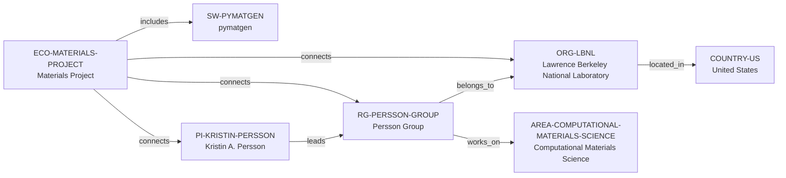

# Materials Project vertical slice

> **Status:** second reviewed vNext vertical slice, reviewed 2026-07-12.

## Purpose and scope

This bounded Quality Gate 1 slice adds a Materials Project–LBNL chain after
the accepted research-group host decision in [ADR 0006](adr/0006-research-group-host-reference.md).
It is a small canonical expansion, not a migration of the existing global
reports or applicant-oriented dossiers.

The slice preserves the platform-versus-software distinction: Materials Project
is a research ecosystem, while `pymatgen` is a distinct research-software
record. It reuses the existing Computational Materials Science area rather than
creating a duplicate topical node.

## Canonical graph

| Role | Canonical record | Scope |
| --- | --- | --- |
| Research ecosystem | [`ECO-MATERIALS-PROJECT`](../entities/ecosystems/materials-project.md) | Materials Project as a public research-data and software ecosystem. |
| Research software | [`SW-PYMATGEN`](../entities/research-software/pymatgen.md) | A distinct software artifact included in the ecosystem. |
| Principal investigator | [`PI-KRISTIN-PERSSON`](../entities/principal-investigators/kristin-persson.md) | Public Berkeley Lab affiliation and group-leadership links. |
| Research group | [`RG-PERSSON-GROUP`](../entities/research-groups/persson-group.md) | The named LBNL-hosted group. |
| Organization | [`ORG-LBNL`](../entities/organizations/lawrence-berkeley-national-laboratory.md) | The non-university direct host for the group. |
| Country | [`COUNTRY-US`](../entities/countries/united-states.md) | Geographic endpoint for LBNL. |
| Research area | [`AREA-COMPUTATIONAL-MATERIALS-SCIENCE`](../entities/research-areas/computational-materials-science.md) | Existing controlled area reused by the group. |

## Contract and evidence checks

| Rule | Result in this slice |
| --- | --- |
| One canonical fact owner | Public facts are placed in the six new entity records or in the existing area record; reports and dossiers retain their existing scope. |
| Accepted direct-host rule | `RG-PERSSON-GROUP` has `organization_id: ORG-LBNL`, no `institution_id`, and an evidence-bearing `belongs_to` assertion to the same Organization record. |
| Typed, one-way relationships | The graph has nine evidence-bearing assertions with no manually entered inverse edge. |
| Evidence before inference | Every reviewed entity and assertion has a record-local `SRC-*` key resolved in that entity's Evidence table. |
| Country as a filter | The group reaches `COUNTRY-US` through `ORG-LBNL`; no group or software is placed in a country hierarchy. |
| Legacy preservation | No v1 record, report-scoped source ID, or dossier identifier is migrated, reused, or reclassified. |

The vNext source-ID convention remains record-local: `SRC-*` is a citation key
inside the entity that uses it, not a graph node or a replacement for
[`reports/global-sources.md`](../reports/global-sources.md).

## Deliberate omissions

- No University of California, Berkeley, department, funding programme, or
  project is created without a separately reviewed identity and relationship.
- The evidence does not support a Pymatgen development, maintenance, or use
  edge for Kristin Persson or the Persson Group, so none is asserted.
- This slice did not create a programming-language record. A later ADR 0007
  implementation adds a separately sourced Python entity and a bounded
  pymatgen `implemented_in` assertion without inferring group-wide language.
- No claim is made about openings, supervision capacity, mentoring, funding,
  admission, working language, or applicant fit.

## View reachability

No generated view output is added. The documented relationships provide
deterministic future traversals:

| View family | Traversal |
| --- | --- |
| Global | Reviewed `ECO-MATERIALS-PROJECT`, `SW-PYMATGEN`, `PI-KRISTIN-PERSSON`, and `RG-PERSSON-GROUP` are available once a generator implements the declared query. |
| Country | `RG-PERSSON-GROUP` → `ORG-LBNL` → `COUNTRY-US`. |
| Research area | `RG-PERSSON-GROUP` → `works_on` → `AREA-COMPUTATIONAL-MATERIALS-SCIENCE`. |
| Research software | `ECO-MATERIALS-PROJECT` → `includes` → `SW-PYMATGEN`; no unsupported group-maintainer edge is inferred. |
| Ecosystems | `ECO-MATERIALS-PROJECT` connects the documented software, PI, group, and Organization nodes. |

The review and validation record is in
[Materials Project vertical slice review](../reports/materials-project-vertical-slice-review.md).
