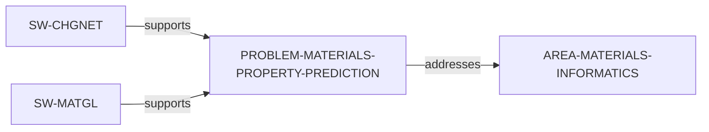

# Materials Property Prediction problem slice

> **Status:** reviewed evidence-bounded increment, reviewed 2026-07-13.

`PROBLEM-MATERIALS-PROPERTY-PREDICTION` makes a bounded atomistic challenge
discoverable: predicting materials properties from atomic structures with
graph-based machine-learning models. CHGNet and MatGL provide separate direct
software-support paths; this is not a comparison of model accuracy, datasets,
or workflows.

Use `python3 scripts/research_landscape.py discover-problems --area
AREA-MATERIALS-INFORMATICS` to inspect the source-identified support paths.
The result is a catalog, not a ranking of importance, novelty, tractability,
models, software, or researcher fit.
