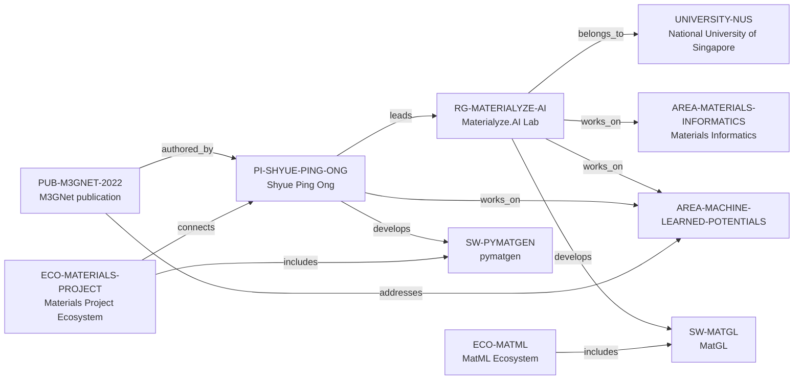

# Materialyze.AI intelligence vertical slice

> **Status:** eighth reviewed Quality Gate 4 Research Group Intelligence slice, reviewed 2026-07-12.

## Purpose and scope

This Quality Gate 4 slice deepens the existing Materialyze.AI Lab record with
first-party group and NUS evidence. It records the lab's stated research
pillars, theory/data/AI methods, open-science and software surface, visible
role categories, and a dated public applicant/onboarding description. It does
not create a second lab, a person roster, a broad software catalog, a project
catalog, or an opportunity feed.

Materialyze.AI frames its work around integration of theory, experiment, and
AI. Its home page names first-principles/phenomenological theory, AI-ready data
generation, physics-informed AI, and translation toward batteries, aerospace
alloys, and advanced semiconductors. It also presents open data, APIs, and
open-source software as a community contribution. The lab's public Join Us
post is dated and process-specific, so it is valuable diligence material but
not proof that an opening, funding, or supervisory capacity exists today.

## Canonical graph

The existing PI-level pymatgen relation remains deliberately distinct from a
group-wide maintenance claim. [`PUB-M3GNET-2022`](../entities/publications/m3gnet-2022.md)
records the public M3GNet article's author and Machine-Learned Potentials for
Materials paths; it does not establish an individual MatGL role. A later
repository-backed review promotes MatGL
to the single supported group-level software path because the lab presents it
as one of its open-source codes and its repository records a Materialyze.AI
collaboration. MatCalc, projects, contributors, and funders remain omitted.

## QG4 coverage matrix

| Required group dimension | Canonical evidence in this slice | Boundary |
| --- | --- | --- |
| Research themes | NUS and group pages describe materials informatics, theory, data, AI, batteries, alloys, semiconductors, and theory/experiment/AI integration; `PUB-M3GNET-2022` supports Ong's ML-potential topic relation. | This is public lab scope, not a complete project inventory or every member's research. |
| Scientific software maturity | The home page presents software frameworks for simulation/lab automation and linked public open-source codes; MatGL is separately reviewed as a canonical group-level software relation. | No maturity score, service-level claim, exclusive ownership, or individual maintainer roster is inferred. |
| Programming stack | The home page identifies pymatgen and MatCalc as Python libraries. | This is a public software-surface statement, not a universal group language policy or a new Language entity. |
| Software ecosystem participation | Existing PI → pymatgen → Materials Project relations remain the canonical graph path; the reviewed group → MatGL path supplies a separate software connection. | Group-wide pymatgen development, Materials Project governance, and ownership are not inferred. |
| Open-source activity | The lab describes open data, open APIs, and open-source software, and its Join Us post names contributions to open-source software, benchmarks, and datasets. | Neither statement proves a particular individual's contributions, license, review outcome, or all projects' openness. |
| Students, postdocs, and staff | The Team page displays research-fellow, postdoctoral, and graduate-student role categories. | It mixes NUS and UCSD context and is not normalized into people entities, a current NUS roster, or headcount. |
| Funding | The reviewed pages do not establish a group-level, current funding record. | No grant, award, budget, capacity, or funding relation is inferred. |
| Infrastructure | The group describes simulation/lab-automation frameworks, data, and AI; the application post names first-principles/MD and experimental-characterization work. | No hardware, lab access, automation deployment, or availability guarantee is inferred. |
| Major projects | The reviewed pages describe research directions and software rather than a bounded project register. | No Project entity or current project assignment is created. |
| International and industry collaboration | The Team page records mixed NUS/UCSD biographical context; the group states it collaborates within and outside the group. | No institutional collaboration, industry-partner, or international-network graph is inferred. |
| Publication patterns | NUS lists selected PI publications, not a bounded group publication register. | No group productivity, quality, citation, or individual-attribution metric is made. |
| Mentorship evidence | The dated public Join Us post describes onboarding, mentors, and continuous-learning opportunities. | This is an advertised process, not an independently verified mentoring-quality or outcome claim. |
| Career outcomes | No reviewed first-party source provides alumni outcomes. | No placement rate, typical destination, causality, or guarantee is inferred. |

## Evidence-bounded research environment

The group's public surface makes a software-and-AI-oriented materials
environment visible without reducing it to a prestige or placement signal.
Theory, data, learning, translation, and community connect first-principles
and molecular-dynamics methods to datasets, foundation-potential/AI work,
open-source tools, and application domains. The records support discovery of a
public research and contribution surface; they do not establish an applicant's
chance of selection or a particular supervisor's availability.

The dated Join Us page is useful as process evidence. It describes theory/AI
and experimental/AI work, applications, interviews, onboarding, mentors, and
learning opportunities. It must be rechecked at the point of contact because
public application pages can change and statements about process do not prove
that any candidate will receive mentoring, admission, support, or an offer.

## Deliberate omissions

- No current team roster, person node, student/postdoc headcount, individual
  project assignment, salary, visa, role availability, or application result is
  created from the dynamic public pages.
- No group-wide claim of pymatgen or Materials Project maintenance, ownership,
  governance, Python policy, licensing, CI, or software quality is made; the
  MatGL relation is limited to documented group-level collaboration/development,
  and the M3GNet publication does not establish an individual MatGL role.
- No funding, collaboration, industry partner, facility, experimental
  capability, publication-quality, alumni, or career-outcome claim is inferred.
- No ranking, admissions advice, mentorship rating, or applicant-fit score is
  calculated from this evidence.

## View reachability

No generated view output is added. The enriched record supports future
evidence-led traversals without copied facts:

| View family | Traversal |
| --- | --- |
| Research group | `RG-MATERIALYZE-AI` → NUS direct host, Materials Informatics, and Machine-Learned Potentials for Materials. |
| Research software/ecosystem | Materialyze.AI context → group-level MatGL collaboration/development → MatML ecosystem; PI-level pymatgen stewardship → Materials Project ecosystem. |
| Research and contribution diligence | Public theory/data/AI, open-source, benchmark, and dataset contribution surfaces. |
| Opportunity and mentorship diligence | Dated public post → stated application/onboarding process, with live status explicitly excluded. |

The review and validation record is in [Materialyze.AI intelligence vertical
slice review](../reports/materialyze-ai-intelligence-vertical-slice-review.md).
