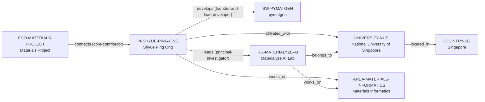

# Materialyze.AI–NUS vertical slice

> **Status:** fifth reviewed vNext vertical slice, reviewed 2026-07-12.

## Purpose and scope

This bounded Quality Gate 1 slice adds the current Materialyze.AI–NUS anchor
chain. It connects the current NUS-hosted group and PI to the existing
`pymatgen` software node and Materials Project ecosystem without duplicating
either platform or treating a historical UC San Diego dossier as a current
canonical affiliation.

The current first-party NUS and Materialyze.AI sources record a 2026– NUS
appointment after 2013–2025 UC San Diego appointments. The legacy dossier is
kept as dated applicant-oriented context and links to the new canonical record;
this slice does not create a University of California San Diego identity from
historical evidence.

## Canonical graph

| Role | Canonical record | Scope |
| --- | --- | --- |
| Research ecosystem | [`ECO-MATERIALS-PROJECT`](../entities/ecosystems/materials-project.md) | Existing ecosystem, extended only with the documented PI contributor relation. |
| Research software | [`SW-PYMATGEN`](../entities/research-software/pymatgen.md) | Existing software artifact, connected by a documented PI-level lead-developer relation. |
| Principal investigator | [`PI-SHYUE-PING-ONG`](../entities/principal-investigators/shyue-ping-ong.md) | Current NUS affiliation, lab leadership, materials-informatics, and software stewardship. |
| Research group | [`RG-MATERIALYZE-AI`](../entities/research-groups/materialyze-ai-lab.md) | The named NUS-hosted lab. |
| University | [`UNIVERSITY-NUS`](../entities/universities/national-university-of-singapore.md) | The direct University host. |
| Country | [`COUNTRY-SG`](../entities/countries/singapore.md) | New geographic endpoint. |
| Research area | [`AREA-MATERIALS-INFORMATICS`](../entities/research-areas/materials-informatics.md) | New controlled area for the lab's stated research identity. |

## Contract and evidence checks

| Rule | Result in this slice |
| --- | --- |
| Current affiliation evidence | NUS and Materialyze.AI sources document the 2026– NUS appointment; earlier UCSD evidence remains historical context only. |
| Accepted direct-host rule | `RG-MATERIALYZE-AI` has `institution_id: UNIVERSITY-NUS`, no `organization_id`, and a matching `belongs_to` assertion. |
| Maintainer versus lab role | PI-level founder/lead-developer evidence supports the `develops` relation to `SW-PYMATGEN`; no unsupported group-level software relation is added. |
| Materials Project connection | `ECO-MATERIALS-PROJECT` connects the PI as an official NUS-documented core contributor without claiming NUS ownership. |
| Evidence before inference | Reviewed records and assertions use record-local `SRC-*` keys resolved in their Evidence tables. |
| Legacy preservation | The UCSD-oriented dossier remains a dated compatibility artifact and visibly defers current public facts to the canonical PI record. |

## Deliberate omissions

- No University of California San Diego record is created from historical
  appointment evidence.
- No Materialyze.AI-to-pymatgen development or maintenance relation is inferred
  from Ong's individual role.
- No NUS ownership, hosting, governance, or exclusive stewardship claim is made
  for pymatgen or Materials Project.
- No current opening, mentoring, admissions, funding, language, ranking, or
  applicant-fit conclusion is drawn from the current sources.
- No Department, project, funding-programme, publication, or additional-person
  record is created without separately reviewed evidence.

## View reachability

No generated view output is added. The documented graph supports these future
traversals without copying profiles into views:

| View family | Traversal |
| --- | --- |
| Global | Reviewed `PI-SHYUE-PING-ONG`, `RG-MATERIALYZE-AI`, `UNIVERSITY-NUS`, and `AREA-MATERIALS-INFORMATICS` are available when a generator implements the declared query. |
| Country and university | `RG-MATERIALYZE-AI` → `UNIVERSITY-NUS` → `COUNTRY-SG`. |
| Research area | PI or group → `works_on` → `AREA-MATERIALS-INFORMATICS`. |
| Software and ecosystem | `PI-SHYUE-PING-ONG` → `develops` → `SW-PYMATGEN`; `ECO-MATERIALS-PROJECT` → `connects` → PI. |

The review and validation record is in
[Materialyze.AI–NUS vertical slice review](../reports/materialyze-ai-vertical-slice-review.md).
