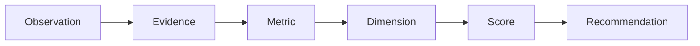

# Evidence model

The evidence pipeline preserves the distinction between what a source says and what the project computes from it:

| Layer | Meaning | Must retain |
| --- | --- | --- |
| Observation | A source-derived statement or value. | Source, excerpt/value, retrieval date, scope. |
| Evidence | An observation assessed for relevance and reliability. | Observation IDs, provenance, confidence, limitations. |
| Metric | A documented transformation of evidence. | Formula/rule, inputs, missing-data treatment. |
| Dimension | A coherent assessment category. | Constituent metrics and aggregation rule. |
| Score | A bounded output from a versioned model. | Model version, coverage, confidence, calculation. |
| Recommendation | Applicant-specific interpretation of scores. | Declared priorities, weights, alternatives, caveats. |

## Epistemic labels

- **Fact:** directly supported by a cited source and stated without analytical extension.
- **Inference:** a reasoned conclusion from facts; it names its rule and uncertainty.
- **Opinion:** a subjective value judgment. It is excluded from metrics and scores.
- **Unknown:** information unavailable, ambiguous, or insufficiently evidenced. It is not zero and is never treated as a negative result.

## Confidence

Confidence concerns the quality and applicability of evidence, not the quality of an entity. **High** means recent, direct, and corroborated or authoritative evidence. **Medium** means direct evidence with a meaningful limitation (age, scope, or corroboration). **Low** means indirect, incomplete, or weakly corroborated evidence. **Unassessed** means evidence has not yet been reviewed. A score is unavailable when required inputs are unknown or conflicts are unresolved.

Evidence must remain traceable from every recommendation back to observations. Automated ingestion may create observations, but human review is required before evidence becomes published.
