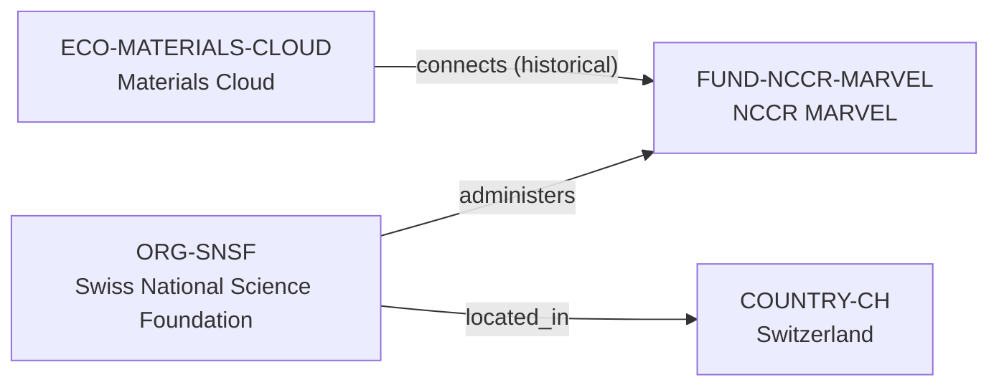

# NCCR MARVEL funding vertical slice

> **Status:** first reviewed Quality Gate 2 vertical slice, reviewed 2026-07-12.

## Purpose and scope

This bounded Quality Gate 2 slice introduces the first canonical funding
programme and its funder context. It records the Swiss National Science
Foundation (SNSF), the NCCR MARVEL National Centre of Competence in Research,
and a historical connection between that programme and the existing Materials
Cloud ecosystem.

The relationship is intentionally historical and time-bounded in interpretation:
NCCR MARVEL publicly described Materials Cloud as developed by the NCCR in
2021, while its cited third and final phase was scheduled through April 2026.
The slice therefore does not claim current funding, exclusive ownership, or an
exhaustive MARVEL participant network.

## Canonical graph

| Role | Canonical record | Scope |
| --- | --- | --- |
| Funder organization | [`ORG-SNSF`](../entities/organizations/swiss-national-science-foundation.md) | SNSF identity, Swiss location, and documented NCCR programme administration. |
| Funding programme | [`FUND-NCCR-MARVEL`](../entities/funding/nccr-marvel.md) | The reviewed NCCR MARVEL programme context and cited final-phase boundary. |
| Research ecosystem | [`ECO-MATERIALS-CLOUD`](../entities/ecosystems/materials-cloud.md) | Existing ecosystem record with a historical, non-exclusive NCCR MARVEL connection. |
| Country | [`COUNTRY-CH`](../entities/countries/switzerland.md) | Existing geographic endpoint reused by the funder record. |

## Contract and evidence checks

| Rule | Result in this slice |
| --- | --- |
| Funding-program identity | `FUND-NCCR-MARVEL` has an official website, a `funder_organization_id` resolving to `ORG-SNSF`, and a stated funding-program kind. |
| Funder relationship | `ORG-SNSF` carries the evidence-bearing canonical `administers → FUND-NCCR-MARVEL` assertion; the funding-program record does not duplicate an inverse assertion. |
| Ecosystem connection | Materials Cloud carries one `connects → FUND-NCCR-MARVEL` assertion with evidence and a note limiting it to historical programme context. |
| Country as a filter | SNSF reaches Switzerland through `located_in`; no funding content is placed below a country directory. |
| Evidence before inference | All reviewed records and new assertions use record-local `SRC-*` keys resolved by their own Evidence tables. |

## Deliberate omissions

- No project record is created. The sources establish programme context and a
  historical Materials Cloud connection, but not the full discrete-project
  identity, participant list, dates, and role-qualified edges required for a
  production-quality project node.
- No claim is made that SNSF was the sole NCCR MARVEL funder or that it funded
  every Materials Cloud activity, contributor, or host.
- No additional MARVEL participant, funder, University, group, software,
  publication, conference, grant amount, current opportunity, or mentoring
  record is inferred from the programme pages.
- No claim is made about current programme eligibility, admissions, funding
  availability, live service status, or applicant fit.

## View reachability

No generated view output is added. The canonical graph supports these future
traversals without copying funding data into views:

| View family | Traversal |
| --- | --- |
| Global | Reviewed `ORG-SNSF` and `FUND-NCCR-MARVEL` are eligible when a generator implements the declared query. |
| Country | `ORG-SNSF` → `located_in` → `COUNTRY-CH`. |
| Research ecosystem | `ECO-MATERIALS-CLOUD` → `connects` → `FUND-NCCR-MARVEL`, carrying its historical limitation. |
| Funding | `ORG-SNSF` → `administers` → `FUND-NCCR-MARVEL`; the funding-program field resolves the same funder endpoint without duplicating its profile. |

The review and validation record is in
[NCCR MARVEL funding vertical slice review](../reports/nccr-marvel-funding-vertical-slice-review.md).
