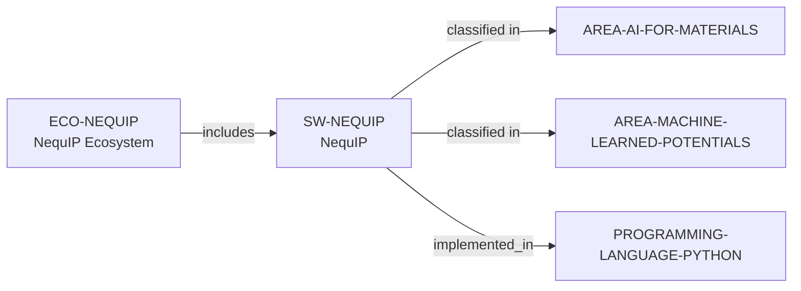

# NequIP ecosystem vertical slice

> **Status:** reviewed vertical slice, reviewed 2026-07-13.

## Scope

This slice adds separate NequIP software and ecosystem records. It reuses the
controlled Python, AI for Materials, and Machine-Learned Potentials records;
it establishes only public E(3)-equivariant interatomic-potential scope, MIT
licensing, Python implementation, and public contribution surfaces.

## Canonical graph

## Evidence boundaries

| Dimension | Canonical evidence | Boundary |
| --- | --- | --- |
| Scope and openness | Official repository and documentation | No assertion about model accuracy, performance, or complete method coverage. |
| License and implementation | Repository displays MIT; documentation exposes Python API | Implementation is a software fact, not a contributor-skill claim. |
| Participation | Public source, issues, discussions, tutorial, and contribution paths | These routes do not promise access, review, response, support, or mentoring. |

## Deliberate omissions

- No external dependency, extension, model, developer, institution, funder, or
  complete community is modeled without a separately reviewed contract.
- No lifecycle, quality, admissions, or applicant-fit claim is inferred.

The review record is in [NequIP ecosystem vertical slice review](../reports/nequip-ecosystem-vertical-slice-review.md).
