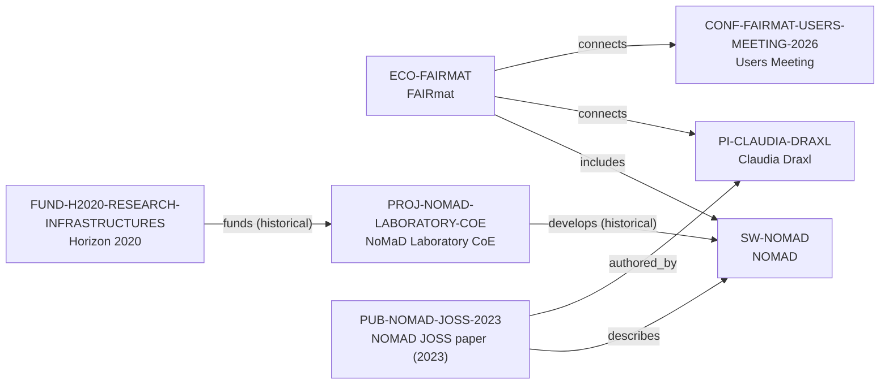

# NOMAD ecosystem-intelligence vertical slice

> **Status:** reviewed Quality Gate 3 vertical slice, reviewed 2026-07-12.

## Purpose and scope

This Quality Gate 3 slice deepens the existing FAIRmat–NOMAD canonical cluster
instead of creating a parallel profile. It adds NOMAD's official 2023 JOSS
publication and enriches the existing software and ecosystem records with
documented architecture, data-management user paths, plugin/Oasis extension
routes, core-contribution context, and a clear NFDI funding boundary.

The graph remains intentionally sparse. First-party sources support NOMAD as a
distributed materials-science research-data-management platform, FAIRmat's
operation and further development of the NOMAD Laboratory, the public
application/worker architecture, and the existing FAIRmat, Claudia Draxl,
historic NoMaD Laboratory project, Horizon 2020, and users-meeting records.
They do not justify an exhaustive maintainer, contributor, dependency, partner,
Oasis, plugin, or current funding graph.

## Canonical graph

## QG3 coverage matrix

| Required ecosystem dimension | Canonical evidence in this slice | Boundary |
| --- | --- | --- |
| Purpose and scientific scope | NOMAD documentation and the JOSS paper describe research-data management for materials science, including storage, processing, discovery, analysis, sharing, and reuse routes. | This does not prove every data domain, service, dataset, or user outcome. |
| Architecture | Documentation describes a container-oriented app/worker split, API, GUI, documentation, parsing/normalization, processing, storage, search, and supporting services. | Components and dependencies remain upstream technical context, not speculative canonical entities or deployment/security claims. |
| Programming language | Documentation describes a Python backend, while the JOSS record supplies the citable technical reference. | No `programming_language_ids` value is added: the vNext Language entity contract is absent. |
| Maintainers and core contributors | The JOSS author list supports a historical Claudia Draxl authorship relation; contribution docs describe public GitHub and account-gated GitLab paths. | Neither establishes a complete current maintainer, core-contributor, review, or governance roster. |
| Institutions and groups | Existing FAIRmat, Claudia Draxl, SOLgroup, HU Berlin, historic project, Horizon 2020, and event records stay separately evidenced. | FAIRmat’s operation and further development of NOMAD is not reframed as exclusive ownership or universal participant maintenance. |
| Key publication | `PUB-NOMAD-JOSS-2023` has a date, DOI, one reviewed author relation, and a direct software description. | The other paper authors are not created merely to complete the author list. |
| Funding | A historical Horizon 2020 → NoMaD Laboratory CoE connection is already canonical; FAIRmat's consortium page states NFDI funding. | The NFDI statement cannot become a typed edge until reviewed funder and programme identities are present; it is not treated as current funding for all NOMAD work. |
| GitHub and contribution workflow | The software record links the public repository; the official contribution guide documents synchronized GitHub/GitLab projects, public issues, and contribution guidance. | Public channels and an account requirement do not promise acceptance, review, mentoring, employment, or access. |
| Community and user journey | Official how-to guides cover GUI/API data management, uploads and publication, plugin development, local Oasis hosting, and core development; the existing Users Meeting preserves dated community/training context. | No current community size, plugin list, deployment roster, or event schedule is inferred. |
| Career relevance | Canonical documentation exposes learning surfaces in FAIR data handling, schema/plugins, Python-based extension, APIs, deployment, and public contribution. | No employment, admission, contributor-status, supervision, or outcome recommendation is claimed. |
| Dependencies and related ecosystems | The historic H2020 project and FAIRmat relationship are separately modeled; architecture documentation names upstream components in prose. | The frozen schema lacks safe dependency/community entity types and an ecosystem-to-ecosystem predicate, so no speculative dependency or related-ecosystem edge is added. |

## Typical user journey

The documented upstream path is: use the graphical interface or API to manage,
explore, analyze, upload, and publish data; extend support through Python-based
plugins or schema packages where needed; host a NOMAD Oasis for a local
installation; or follow the core-development guides and public issue route for
software changes. This describes upstream capabilities and entry points, not a
guarantee of access, compatibility, acceptance, or support.

## Deliberate omissions

- No Programming Language, Community, API endpoint, dependency, parser,
  normalizer, database, workflow, plugin, Oasis, GitLab account, or detailed
  Maintainer node is created without a canonical entity and relationship
  contract.
- No complete publication author list, current maintainer roster, contributor
  list, review role, or employment claim is inferred from an article or public
  contribution guidance.
- No NFDI funding-programme, funder, amount, current award, opening, mentoring,
  admissions, language, ranking, or applicant-fit conclusion is created.
- No generated view, recommendation, or manual ecosystem ranking is added.

## View reachability

No generated view output is added. The enriched canonical graph supports these
future traversals without copied facts:

| View family | Traversal |
| --- | --- |
| Research software | `SW-NOMAD` ← `includes` ← `ECO-FAIRMAT`; `PUB-NOMAD-JOSS-2023` → `describes` → software. |
| Research ecosystem | `ECO-FAIRMAT` → `includes` → software; → `connects` → PI and dated community event. |
| Funding and project | `FUND-H2020-RESEARCH-INFRASTRUCTURES` → `funds` → `PROJ-NOMAD-LABORATORY-COE` → `develops` → software. |
| Publication | `PUB-NOMAD-JOSS-2023` → `authored_by` → `PI-CLAUDIA-DRAXL`; → `describes` → software. |
| Country and University | Existing group-host and PI-affiliation routes remain derivable without duplicating records. |

The review and validation record is in [NOMAD ecosystem-intelligence vertical
slice review](../reports/nomad-ecosystem-intelligence-vertical-slice-review.md).
