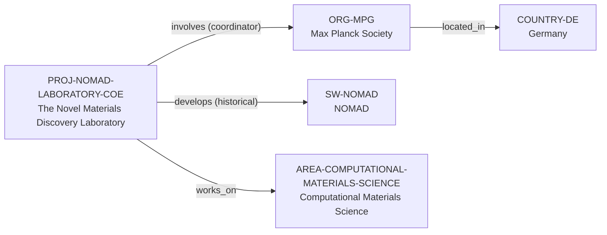

# NoMaD Laboratory project vertical slice

> **Status:** second reviewed Quality Gate 2 vertical slice, reviewed 2026-07-12.

## Purpose and scope

This bounded Quality Gate 2 slice introduces the first canonical Project record:
the completed Horizon 2020 NoMaD Laboratory Centre of Excellence. It adds the
Max Planck Society as the documented coordinating organization and connects the
dated project to the existing NOMAD software and Computational Materials
Science area records.

The project is deliberately kept distinct from current NOMAD and FAIRmat
operations. Its evidence supports a 2015–2018 historical development context,
not current maintainership, funding, governance, or an exhaustive partner list.

## Canonical graph

| Role | Canonical record | Scope |
| --- | --- | --- |
| Project | [`PROJ-NOMAD-LABORATORY-COE`](../entities/projects/nomad-laboratory-coe.md) | Completed 2015–2018 H2020 project with a specific CORDIS identity and coordinator. |
| Coordinating organization | [`ORG-MPG`](../entities/organizations/max-planck-society.md) | Organization-level coordination only, not a proxy for every Max Planck institute. |
| Research software | [`SW-NOMAD`](../entities/research-software/nomad.md) | Existing current software record, connected only through the project's historical development context. |
| Research area | [`AREA-COMPUTATIONAL-MATERIALS-SCIENCE`](../entities/research-areas/computational-materials-science.md) | Existing controlled area reused for the project's documented scope. |
| Country | [`COUNTRY-DE`](../entities/countries/germany.md) | Existing location/filter endpoint for the coordinating organization. |

## Contract and evidence checks

| Rule | Result in this slice |
| --- | --- |
| Project identity | The record has a CORDIS grant identity, title, completed status, start and end dates, and a host-organization endpoint. |
| Coordinator relationship | The project records the canonical `involves → ORG-MPG` assertion with `coordinator` role and the CORDIS date range. |
| Software role separation | The project-to-NOMAD `develops` relationship is explicitly historical. It does not label a current software maintainer or copy the software profile into the project. |
| Research-area normalization | The project reaches the existing Computational Materials Science record through an evidence-bearing `works_on` assertion. |
| One-way storage | No inverse `involves`, `develops`, or `works_on` assertions are entered on target entities. |
| Evidence before inference | Each reviewed record and relationship uses record-local `SRC-*` keys resolved in its Evidence table. |

## Deliberate omissions

- No EU funding-program or European Commission organization record is created.
  The project’s CORDIS grant data is sufficient for this project slice, but a
  reusable funding-program relationship requires its own bounded evidence
  review.
- No participant record is created for the remaining consortium members, and
  no individual coordinator or contributor claim is inferred.
- No current FAIRmat, NOMAD CoE, Max Planck institute, or software-maintainer
  relationship is inferred from the completed project's historical record.
- No claim is made about current funding, opportunity, mentorship, admissions,
  language, ranking, or applicant fit.

## View reachability

No generated view output is added. The canonical graph supports these future
traversals without copying project data into views:

| View family | Traversal |
| --- | --- |
| Global | Reviewed `PROJ-NOMAD-LABORATORY-COE` and `ORG-MPG` are eligible when a generator implements the declared query. |
| Country | `ORG-MPG` → `located_in` → `COUNTRY-DE`. |
| Research area | `PROJ-NOMAD-LABORATORY-COE` → `works_on` → `AREA-COMPUTATIONAL-MATERIALS-SCIENCE`. |
| Research software | `PROJ-NOMAD-LABORATORY-COE` → `develops` → `SW-NOMAD`, retaining the 2015–2018 historical boundary. |
| Project | `PROJ-NOMAD-LABORATORY-COE` → `involves` → `ORG-MPG` with a coordinator role. |

The review and validation record is in
[NoMaD Laboratory project vertical slice review](../reports/nomad-laboratory-project-vertical-slice-review.md).
