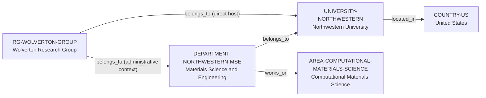

# Northwestern MSE department vertical slice

> **Status:** third reviewed Quality Gate 2 vertical slice, reviewed 2026-07-12.

## Purpose and scope

This bounded Quality Gate 2 slice adds the first canonical Department record:
Northwestern University's Department of Materials Science and Engineering
(MSE). It provides evidence-bounded administrative context for the existing
Wolverton Research Group and normalizes department-level computational-
materials research without changing the group's accepted direct University host.

The Department is not treated as a second host, a duplicate Northwestern
record, or an exhaustive programme, faculty, laboratory, admissions, or
mentorship profile. The direct-host rule remains `institution_id:
UNIVERSITY-NORTHWESTERN` on the group record.

## Canonical graph

| Role | Canonical record | Scope |
| --- | --- | --- |
| Department | [`DEPARTMENT-NORTHWESTERN-MSE`](../entities/departments/northwestern-materials-science-engineering.md) | Department identity, University endpoint, and department-level computational-materials context. |
| Research group | [`RG-WOLVERTON-GROUP`](../entities/research-groups/wolverton-research-group.md) | Existing direct University host plus bounded Department administrative context. |
| University | [`UNIVERSITY-NORTHWESTERN`](../entities/universities/northwestern-university.md) | Existing sole direct host for the group. |
| Research area | [`AREA-COMPUTATIONAL-MATERIALS-SCIENCE`](../entities/research-areas/computational-materials-science.md) | Existing controlled area reused by both group and department. |
| Country | [`COUNTRY-US`](../entities/countries/united-states.md) | Existing geographic endpoint for Northwestern University. |

## Contract and evidence checks

| Rule | Result in this slice |
| --- | --- |
| Department identity | `DEPARTMENT-NORTHWESTERN-MSE` has `university_id: UNIVERSITY-NORTHWESTERN`, an official Department website, and a matching evidence-bearing `belongs_to` assertion. |
| Direct-host preservation | `RG-WOLVERTON-GROUP` retains exactly one direct host: `institution_id: UNIVERSITY-NORTHWESTERN`. Its Department assertion is explicitly administrative context under ADR 0006. |
| Research-area normalization | The Department has a cited `works_on → AREA-COMPUTATIONAL-MATERIALS-SCIENCE` assertion. |
| Evidence boundary | The group-to-Department relation is based on Chris Wolverton's official Department appointment and linked group site; it does not establish a second host or a complete roster. |
| One-way storage | No inverse Department-to-group or University-to-Department assertion is entered. |

## Deliberate omissions

- No McCormick school, programme, degree, centre, faculty, student, laboratory,
  grant, conference, publication, or opening is made into a canonical record.
- No current admissions, supervision, mentoring, funding, language, ranking, or
  applicant-fit claim is made from the Department site.
- No organizational duplicate is created for Northwestern University, and the
  Department does not replace its existing country or University records.
- No conclusion is made about every Wolverton Group member's departmental
  affiliation from the group leader's Department appointment.

## View reachability

No generated view output is added. The canonical graph supports these future
traversals without copying Department data into views:

| View family | Traversal |
| --- | --- |
| Global | Reviewed `DEPARTMENT-NORTHWESTERN-MSE` is eligible when a generator implements the declared query. |
| University | `DEPARTMENT-NORTHWESTERN-MSE` → `belongs_to` → `UNIVERSITY-NORTHWESTERN`. |
| Research area | `DEPARTMENT-NORTHWESTERN-MSE` → `works_on` → `AREA-COMPUTATIONAL-MATERIALS-SCIENCE`. |
| Research group | `RG-WOLVERTON-GROUP` → `belongs_to` → `DEPARTMENT-NORTHWESTERN-MSE`, explicitly distinct from its direct-host relation. |
| Country | Department → University → `COUNTRY-US`, with the University remaining the geographic owner. |

The review and validation record is in
[Northwestern MSE department vertical slice review](../reports/northwestern-mse-department-vertical-slice-review.md).
