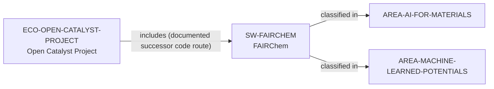

# Open Catalyst Project vertical slice

> **Status:** reviewed Quality Gate 3 vertical slice, reviewed 2026-07-13.

## Purpose and scope

This slice promotes Open Catalyst Project from an evidence trail to a distinct,
source-backed research-ecosystem record. Its public sources establish an
AI-assisted catalyst-discovery collaboration with datasets, baseline code,
leaderboard, and challenge surfaces, plus a later migration of code development
to Fair-Chem. The slice therefore links to the existing FAIRChem software
artifact only as a documented successor code route.

## Canonical graph



The arrow is intentionally one-way and time-bounded: it records the deprecated
Open-Catalyst-Project organization's notice that code development moved to
Fair-Chem and `fairchem.core`. It does not imply the converse, or that all
FAIRChem domains, people, models, data, or governance are part of OCP.

## Evidence boundaries

| Dimension | Canonical evidence | Boundary |
| --- | --- | --- |
| Project purpose | The official site describes an AI catalyst-discovery collaboration between FAIR at Meta and CMU Chemical Engineering, with open OC20/OC22 datasets and baseline code. | No performance, scientific-outcome, or complete collaboration claim follows. |
| Public participation surfaces | The official site describes data, code, leaderboard, and evaluation-server routes; the newer FAIR Chemistry data page documents OCP catalyst datasets. | Public routes do not promise review, acceptance, access, support, or a current challenge cycle. |
| Code migration | The official GitHub organization calls itself deprecated and identifies Fair-Chem / `fairchem.core` as the new code-development location. | This yields only the bounded successor software route, not a merger of OCP and FAIRChem ecosystems. |
| Area reachability | Existing FAIRChem area classifications make the OCP successor route discoverable for AI for Materials and Machine-Learned Potentials. | It does not mean every OCP dataset, historic model, or project activity has those same classifications. |

## Deliberate omissions

- No dataset, model, benchmark, API, demo, leaderboard, challenge, paper,
  person, research group, organization, funding, or university record is
  created from this broad ecosystem evidence alone.
- No current OCP maintainer, contributor, employer, institutional-host, or
  governance role is inferred from the legacy public project surface.
- No claim is made about model quality, data access, software support,
  maintenance, funding, mentorship, openings, admissions, or applicant fit.

## View reachability

The existing public AI-for-Materials and machine-learned-potential ecosystem
queries now display OCP's exact `includes → SW-FAIRCHEM → area` path. A direct
interactive lookup is also available:

```bash
python3 scripts/research_landscape.py discover-ecosystems \
  --area AREA-MACHINE-LEARNED-POTENTIALS \
  --software SW-FAIRCHEM
```

Results remain alphabetically ordered evidence discovery, not a statement of
ecosystem currency, dominance, completeness, technical superiority, or fit.

The review record is in [Open Catalyst Project vertical slice
review](../reports/open-catalyst-project-vertical-slice-review.md).
